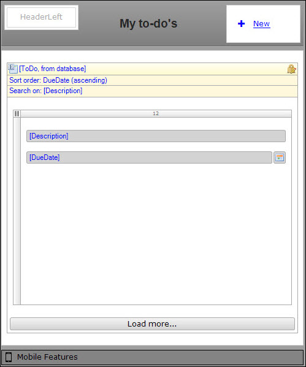
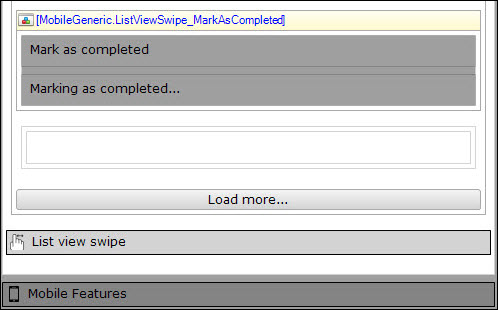
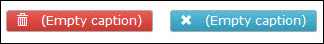
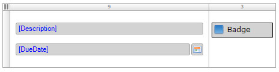

## 1 Introduction

This how-to is helping you to build a to-do app based on the new sample Mobile Quick Starter App. This new sample app was introduced in Mendix 7.2 and helps you to quickly and easily build rich mobile apps with a native look and feel, and include best practices.

The sample app is equiped with new widgets, preconfigured modules, best practices, and an example inspection module to kickstart your mobile development by default.

**This how-to will teach you how to do the following:**

* Create a project that will speed up and simplify your mobile app development
* Build a to-do app
* Configure several widgets to realize a rich mobile app with a native look and feel


## 2 Prerequisites

Before starting this how-to, make sure you have completed the following prerequisites:

* [Mendix Desktop Modeler 7.3 or later](https://appstore.home.mendix.com/link/modeler/)

## 3 Create and Prepare a New Project

The basis for the to-do app is the Mobile Quick Starter App. Follow these steps to create a new app with the Mobile Quick Starter App:

1. Open the **Mendix Desktop Modeler** and log in.
2. Click **Create App**.
3. Go the the **Samples** tab.
4. Click **Mobile Quick Starter App**.
5. Click **Use this starting point >**.
6. Enter the app details and click **Create app**.
7. Open the **Security** settings of your project.
8. Switch the **Securiy level** to **Off** and click **OK**.


<div class="alert alert-warning">
Switching the security level to *Off* is done for fast development. Make sure you change it back to *Production* and configure the security of your app when you are going to use the app in a production environment.
</div>

## 4 Create a New Module
The to-do app will use a separate module, so you can keep all the to-do app documents in one location. Follow these steps to create a new module:

1. Right-click your **ProjectName** in the Project Explorer.
2. Click **Add module** and give it the name **ToDo**.

## 5 Create the Domain Model
The domain for the to-do app is pretty simple. It contains one entity with some attributes. Follow these steps to create the entity and attributes:

1. Open the **Domain Model** in the **ToDo** module.
2. Add a new **Entity** to the Domain Model.
2. Rename the entity to **ToDo***.
3. Add the following three attributes:
  * *Description* (String)
  * *DueDate* (Date and time)
  * *Completed* (Boolean with default value *False*)

  

## 6 Create the Pages
In this chapter you will create the Homepage and NewEdit pages to create and adjust to-do's.

### 6.1 Create the Home Page
The app will use the home page as the landing page when users open the to-do app. It contains a list of their to-do's. Follow these steps to create the home page:

1. Right click your newly created ToDo module and select **Add > Page**.
2. Go to the **Phone Specific** tab and click **Yes** when you're asked to create a new Phone Profile.
3. Name the page **Home_Phone_Default**.
4. Select *Phone_HeaderOnly* as **Navigation layout**.
5. Click **Blank** on the left side and select the *Blank* page template.
6. Click **OK** to create the page.
7. Open your project's **Navigation** and set the **Home_Phone_Default page** in the ToDo module as default home page.

### 6.2 Configure the Home Page
Let's add some content to the home page so it can show a list of to-do's. Follow these steps to add a list view to the home page:

1. Change the page title to **My to-do's** in the **Properties** pane on the right side of the Modeler.
2. Remove the **Layout grid** from the page.
3. Add a **List view** to the page.
4. Right-click the **List view** and select **Select data soure**.
5. Click **Select** and select the **ToDo** entity for the **Entity (path)**.
6. Click **OK** and then **Yes** to automatically fill the content of the list view.
7. Remove the **Completed** attribute.
8. Double-click the **Sort order: (default)** and add the **DueDate** attribute with the **Ascending** sort direction.


You can now see a list of to-do's on your home page. Let's configure a page to create to-do's.

### 6.4 Create and Configure the New and Edit Page
Users also need to be able to add new to-do's to the list, that's why you're going to add a page that lets them do this. Follow these steps to create a new and edit page:

1. Add a **Create button** to the **HeaderRight** placeholder on the page.
2. Select the **ToDo** entity in the pop-up.
3. Right-click the **New** button and select **Generate page**.
4. Select **Form default** and click **OK**.
5. Right-click the **New** button and select **Go to page**.
6. Delete the **Completed** attribute.

  
7. Run the app locally. Click **Save and continue** if you did not save your page(s) yet.
8. Click **Yes** to create a default database if this is asked.
9. Open the **View App** dropdown and select **View Hybrid Mobile App**.
10. Select the **Profile** profile and click the iPhone form factor for **Preview in browser**.
  

This is an easy way to see your app. There is also a way to simulate the touch behavior of a user on a mobile device. This is explained later on in this how-to.


## 7 Improve the Mobile Look and Feel
The following steps improve the mobile look and feel by adding and configuring widgets in your project.

### 7.1 Enhance the Home Page
Follow these steps to improve the look and feel of the home page:

1. Go back to the **Modeler**.
2. Open the **Home_Phone_Default** of the *ToDo* module.
3. Open the properties of the **Description** attribute and change the following settings:
  * On the **General** tab, set **Show label** to **No**
  * On the **Common** tab, add the **text-bold** class.
4. Open the properties of the **DueDate** attribute and change the following settings:
  * Select **Custom** for **Date format**, and set the custom format to **dd-MMM-yyyy**.
  * Set **Show label** to **No**
5. Open the properties of the **List view** and change the following settings:
  * Select **Show a page** for **On click**
  * Select the **ToDo_NewEdit** page and click **Select**
  * Go to the **Data source** tab and add a constraint for the **Completed** attribute that equals **false**.
  * Go to the **Common** tab and change the **Name** to **ToDo**
6. Add a (full) **Layout grid** to the **ToDo** list view.
7. Move the **Description** and **DueDate** attributes into the **Layout grid**. This will create some spacing around the borders of your mobile screen.
8. Open the **Properties** of the **Layout grid** and add the **slide-left** class. This class will activate a page transition and, in this case, slides the page to the left when you hit the **New** button. Look at the **Mobile features** widget in the **Page layout** to see which classes are available for page transitions.
9. Open the properties of **New** button in the top-right corner of the page.
10. Change the following properties:
  * Check **Override page title** and change the title to **Create to do**
  * Use the **plus** icon for the **Icon** option
  * Select **Link** for the **Render mode**
  * Add the **flip-right** class to the **Class** option
11. Click **OK** to save the properties.



### 7.2 Enhance the NewEdit Page
Follow these steps to improve the look and feel of the ToDo_NewEdit page:

1. Open the **ToDo_NewEdit** page.
2. Open the **Properties** of the **< Back** button and add the **flip-left** class.
3. Open the **Properties** of the **Save** button and add the **flip-right** class.
4. Add a (full) **Layout grid** to the **ToDo data view**.
5. Move the **Description** and **DueDate** attributes into the **Layout grid**.

### 7.3 Add the Pull-to-Refresh Widget
Follow these steps to enable pull-to-refresh functionality to your app:

1. Open the **Home_Phone_Default** page.
2. Add the **Pull to refresh** widget above the **ToDo list view**.

This is all you need to do to refresh your list of to-do's. If you want, you can change some messages the widget generates when you pull to refresh on your phone.

### 7.4 Add and Configure the List View Swipe Widget
Follow these steps to add the list view swipe widget to your app:

1. Open the **Home_Phone_Default** page.
2. Add the **List view swipe** widget below the **ToDo list view**, inside the **ToDo data view**.
3. Open the **Properties** of the widget and configure the following settings on the **General** tab:
  * Enter **ToDo** for the **Target list view**
  * Select the **ToDo** entity for the **List view entity**
4. Configure the following settings on the **Swipe to left** tab:
  * On swipe action: **No action**
  * Swipe container left: **Buttons**
  * After swipe left: **Stick to button(s)**
5. Configure the following settings on the **Swipe to right** tab:
  * On swipe action: **Call a microflow**
  * Microflow right: **Select** > **New** > **ACT_ToDo_MarkAsCompleted** (you'll add the logic to the microflow later)
  * Swipe container right: **MarkAsCompleted**
  * Transparent swipe: **yes**
  * Hide container right: **MarkingAsCompleted**
6. Click **OK** to save the properties.

### 7.5 Adding List View Swipe MarkAsCompleted Snippet
Follow these steps to add the MarkAsCompleted snippet to your app:

1. Open the **Home_Phone_Default** page.
2. Expand the **MobileGeneric** module in the Project Explorer.
3. Drag and drop the **ListViewSwipe_MarkAsCompleted** snippet below the **Layout grid**. This is where the **MarkAsCompleted** and **MarkingAsCompleted** in the widget configuration comes from. The containers in the snippet have the same name as the text in it. You can add your own containers with different text, but make sure you set the correct names of the containers in the widget.
4. Add a **Container** below the **ListViewSwipe_MarkAsCompleted** snippet and within the **Todo list view**.
5. Change the name of the container to **Buttons**.

  

### 7.6 Adding a Delete Button
Follow these steps to add a delete button to the list view swipe widget:

1. Add a **Button** to the **Container**.
2. Remove the caption from the button.
3. Add the **trash** to the button.
4. Change the **Button style** to **Danger**.
5. Add an **On click** click event: **Call a microflow** > **New** > **ACT_ToDo_Delete** and click **OK** (you'll add the logic to the microflow later).
6. Click **Edit** for the **Microflow settings**.
7. Set **Ask confirmation** to **Yes** and click **OK**.
8. Add the **btn-lg** class to make the button larger.

### 7.7 Adding a Share Button
Follow these steps to add and configure a share button to the list view swipe widget:

1. Drag and drop a second **Button** in the **Container**.
2. Remove the caption from the button.
3. Add the **remove** icon to the button.
4. Change the **Button style** to **Info**.
5. Change the **Name** of the button to **Share**.
6. Add the **btn-lg** class to make the button larger.
7. Click **OK** to save the properties.

  

### 7.8 Adding the Native Share Widget
Follow these steps to add the native share widget to the page:

1. Open the **App Store** in the Modeler.
2. Search for **share**.
3. Open the **Native Share** widget in the search results and click **Download**.

4. Go back to the **Home_Phone_Default** page.
5. Add the **Native share** widget above the **Delete** and **Share** buttons in the same container.
6. Open the **Properties** of the native share widget.
7. Enter **Share** for **Element name selector**.
8. Set **Hide outside Phonegap** to **No**.
9. Go to the **Data source** tab.
10. Select the **Description** attribute for the **Message**.
11. Click **OK** to save and close the settings.

### 7.9 Adding the Badge Widget
Follow these steps to add the **Badge** widget to your project:

1. Open the **App Store** in the Modeler.
2. Search for **badge**.
3. Open the **Badge** widget in the search results and click **Download**.

4. Go back to the **Home_Phone_Default** page.
5. Add a new column to the right in the layout grid.
6. Open the properties of the left column.
7. Change the weight to **9** and add the **col-xs-9** class.
8. Open the properties of the right column.
9. Change the weight to **3** and add the **col-xs-3** class.
10. Add the **Badge** widget to the right column.
11. Open the **Properties** of the widget.
12. Set the **Default value** of the badge to **Too late!**.
13. Go to the **Display** tab and set the **Badge style** to **Warning**.

  


### 7.10 Adding Conditional Visibility with Client-Side Expressions
Follow these steps to only show the **Badge** when the **DueDate** has passed:

1. Add a **Container** to the right column and drag and drop the **Badge** into it.
2. Open the **Properties** of the **Container**.
3. Click **Edit** and select **based on expression**.
4. Add the following expression: ```$currentObject/DueDate < [%CurrentDateTime%]```. This will make sure the **Badge** shows up when a to-do is overdue.
5. Save and close the settings.
6. Save all your documents.

This is what your page eventually should look like:


## 8 Adding Logic to the Microflows
The **List view swipe** widget has been configured, but you added two microflows that do not have any logic yet. Follow these steps to add some logic and make them execute the behavior we want when they are triggered:

1. Open the **ACT_ToDo_Delete** microflow.
2. Add an **Activity** that deletes the **ToDo** object and refreshes the client.
<iframe width='100%' height='350px' frameborder='0' src='https://modelshare.mendix.com/models/83d0f300-356e-4a6b-9ea3-7625284a6937/act_todo_delete?embed=true' allowfullscreen></iframe>
3. Open the **ACT_ToDo_MarkAsCompleted** microlfow.
4. Add an **Activity** that changes the **Completed** attributed of the **ToDo** object to *true* and set **Commit** to *Yes*.
<iframe width='100%' height='350px' frameborder='0' src='https://modelshare.mendix.com/models/adbe2dd5-2e27-41ab-8f67-3a728917f01b/act_todo_markascompleted?embed=true' allowfullscreen></iframe>
<div class="alert alert-info">
There is no need to refresh in the client due to the *Move out, hide* behavior of the List view swipe widget.
</div>

## 9 Run the App and Simulate Touch Behavior of Mobile Device
The app is now finished. Follow these steps to run the app and view it on a simulated mobile device:

1. Save all changes and run the app locally.
2. Open the **View App** dropdown and select **View Hybrid Mobile App**.
3. Choose the **Profile** navigation profile.
4. Click on the laptop icon under **Preview in browser**.


## 10 Related Content

* [How to Deploy Your First Hybrid Mobile App](deploy-your-first-hybrid-mobile-app)
* [How to Publish a Mendix Hybrid Mobile App in Mobile App Stores](publishing-a-mendix-hybrid-mobile-app-in-mobile-app-stores)
* [Push Notifications](push-notifications)
