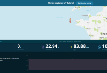
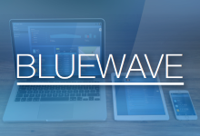

Get off to a flying start with these introductory how-to's.

- [**Mobile To-Do App**](create-a-to-do-app) learns the basics of building an app for a mobile device.
- [**Build an IoT App**](build-an-iot-app) lets you experience how to consume IoT services from an IoT Cloud platform.
- [**Build a simple HRM App**](build-a-simple-hrm-app) learns the basic aspects of development with Mendix.

|  |  |  |
|------ | ----- | ------|
| [Create a Mobile To-Do App](create-a-to-do-app) | [Build an IoT App](build-an-iot-app) | [Build a Simple HRM App](build-a-simple-hrm-app) |

