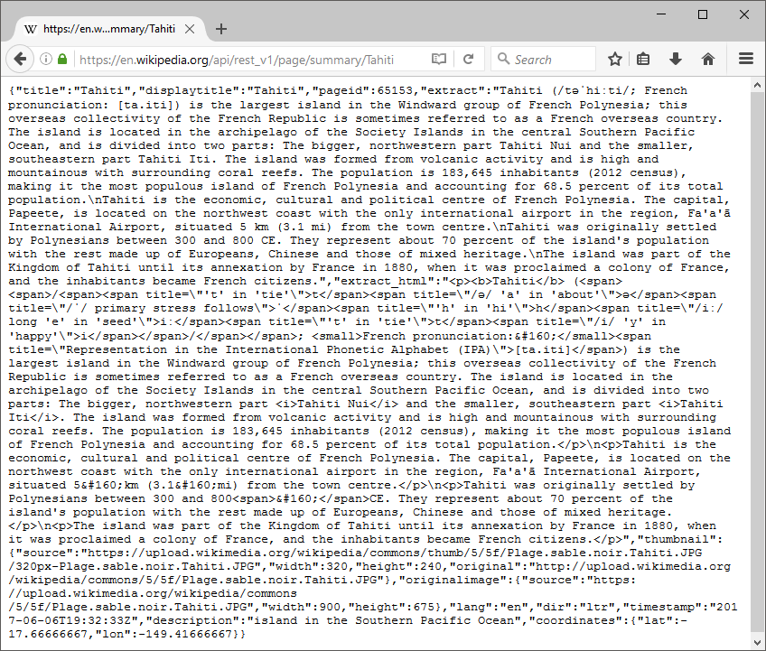
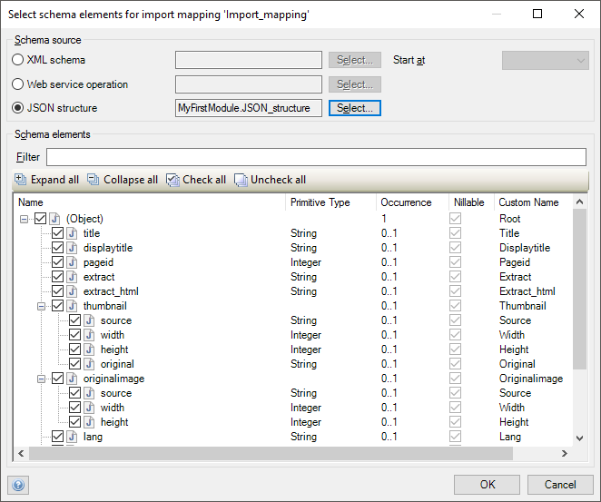
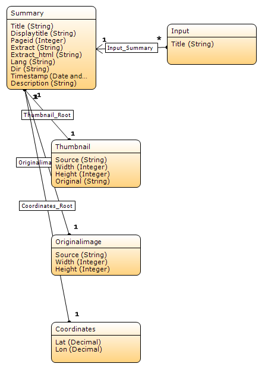
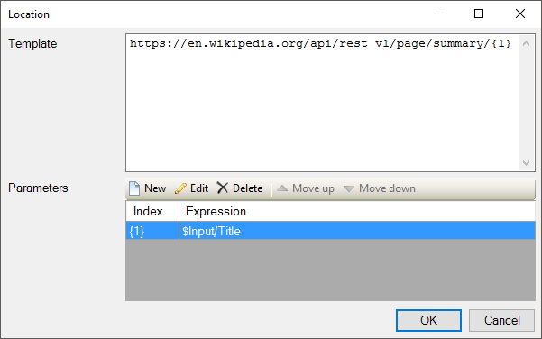
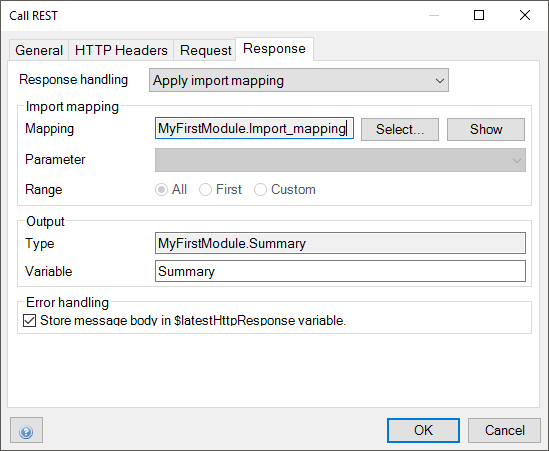
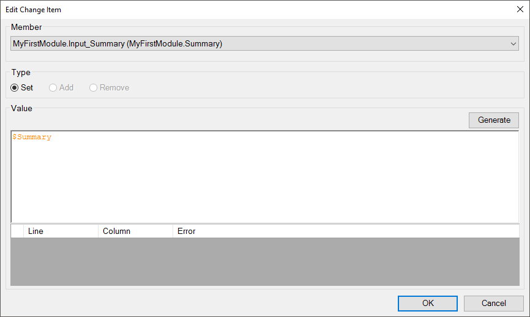
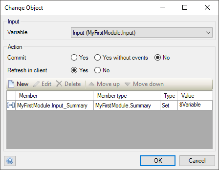
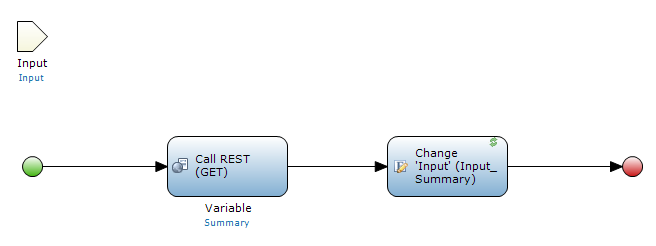
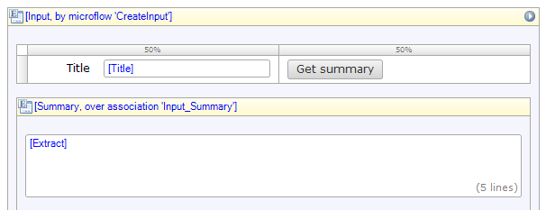

In your Mendix app, you can use information from REST services. This how-to shows you how to do that by following an example. We will create an app that retrieves Wikipedia pages from a REST service. The resulting app is [available for download](attachments/consume-a-rest-service/WikipediaApi.mpk).

## 1 What you need

You will need to have [installed the Modeler](../getting-started/install-the-mendix-desktop-modeler) version 6.6 or higher. If you need to use an older version of the modeler, you can follow the [REST How-To prior to Mendix 6.6](../../howto6/consume-a-rest-service).

## 2 Create a JSON structure

The wikipedia REST service allows us to retrieve the summary of a page. This service can be reached at `https://en.wikipedia.org/api/rest_v1/page/summary/{title}`, where `{title}` is the title of a page.

We will start by giving the Modeler an example of what the REST service returns.

1. Open a browser, and go to https://en.wikipedia.org/api/rest_v1/page/summary/Tahiti
   * This calls the REST service with a GET request. The result is the summary of the [Tahiti page on Wikipedia](https://en.wikipedia.org/wiki/Tahiti), in JSON format.

2. Copy the whole JSON snippet.

3. Add a new **JSON Structure** to your app.
   * A [JSON structure](../../refguide/json-structures) contains sample JSON that we can use in our app.

4. Paste the JSON snippet.

5. Click **Refresh**
   * This analyses the structure of the JSON snippet so we can use later.

6. Click **OK**

## 3 Create an import mapping

An [import mapping](../../refguide/import-mappings) specifies how the JSON relates to [entities](../../refguide/entities). Here we will generate those entities, but generally you can map the JSON to any entity you like.

1. Create a new **Import Mapping**

2. Click the radio button for **JSON structure**

3. Click **Select...**

4. Double-click **JSON_structure**

5. Click **Expand all**

6. Click **Check all**

7. Click **OK**
   * You now see the structure on the right.

8. Click **Map automatically...**. 
   * The Modeler informs you that it has applied some changes. That means that it has generated entities that match the JSON structure.

9. Click **Close**

## 4 Add an Input entity to the domain model

Our sevice takes the title of the page as input. It returns the summary of the page. 

In this step, we create an entity that represents this input, and associate it with its summary.

1. In the **Project Explorer**, double-click the **Domain model**

2. Rename **Root** to **Summary**

3. Create an **Entity** called _Input_ with a string attribute called _Title_, as follows:
   1. From the **Toolbox** drag an **Entity** onto the **Domain model**
   2. Double-click the entity
   3. For **Name**, type _Input_
   4. For **Persistable**, select **No**
   4. Click **New**
   5. For **Name**, type _Title_
   6. Click **OK**
   7. Click **OK**

3. Drag an association from **Input** to **Summary**

## 5 Call the REST service in a microflow

We will now call the REST service in a [microflow](../../refguide/microflows). The microflow takes an **Input** as a parameter and sets the associated **Summary**.

1. Create a new **Microflow**

2. Add an **Input** object as an input parameter

3. From the **Toolbox**, drag a **Call REST service** activity onto the microflow and double-click it

4. Edit the location to `https://en.wikipedia.org/api/rest_v1/page/summary/{1}`, with one parameter `$Input/Title`

5. On the **Response** tab, set **Response handling** to **Apply import mapping** (Or to **Import mapping for the entire response**, depending on your version)

6. Click **Select** and double-click **Import_mapping**

7. For **Name**, type _Summary_

8. Click **OK**

9. From the **Toolbox**, drag a **Change object** activity onto the microflow and double-click it

10. For **Variable**, select **Input (MyFirstModule.Input)**

11. For **Refresh in client**, select **Yes**
    * This makes sure that the summary gets shown on the screen

12. Click **New**

13. Under **Member**, select **MyFirstModule.Input_Summary (MyFirstModule.Summary)**

14. Under **Value**, type _$Summary_

15. Click **OK**
 

16. Click **OK**

There you have it: a microflow that takes the title of an article as input, and associates it with its summary.

The rest of this article turns this microflow into an app. It doesn't deal with consuming REST services anymore, so you only need to follow along if you want to see the REST call in action.

## 6 Create a page

1. Open the **Homepage**

2. Add a **Data view**

3. From the **Connector**, drag the **Input** entity onto to yellow **[Unknown]** bar

4. Select **Microflow**

5. For **Name**, type _CreateInput_
   * When this page loads, it needs a new **Input** object. In the next step we will fill the **CreateInput** microflow that creates this object.

6. Click **OK**

7. From **Container**, add a new **Table** with one row and two columns

8. Drag the **Title** field onto the left column

9. From **Project explorer**, drag **Microflow** onto the right column

10. Set the caption of the button to _Get summary_ (using the **Properties** tab)

11. Add a **Data view** below the table (inside the other data view)

12. From the **Connector**, drag the **Summary** entity onto to yellow **[Unknown]** bar

13. Click **OK**

14. From this data view, delete all fields except **Extract**

15. Double-click **Extract**

16. For **Show label**, choose **No**

17. Click **OK**

18. Delete the **Save** and **Cancel** buttons

## 7 Fill in the CreateInput microflow

Now all that is left is to have the **CreateInput** microflow create a new **Input** object. 

1. In the **Project explorer**, double-click **CreateInput**

2. From the **Toolbox** drag on a **Create object** activity

3. Double-click the activity

4. Click **Select...** and double-click **Input**

5. Click **OK**

6. Double-click the red **End event**

7. Under **Return value**, type _$NewInput_

8. Click **OK**

Congratulations, you can now start your app and get summaries from Wikipedia.

## Related content

* [How to consume a Complex Web Service](consume-a-complex-web-service)
* [How to consume a Simple Web Service](consume-a-simple-web-service)
* [How to export XML Documents](export-xml-documents)
* [How to import XML Documents](importing-xml-documents)
* [How to import Excel Documents](importing-excel-documents)
* [How to expose a Web Service](expose-a-web-service)
* [How to expose Data to BI Tools Using OData](exposing-data-to-bi-tools-using-odata)

