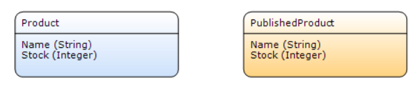
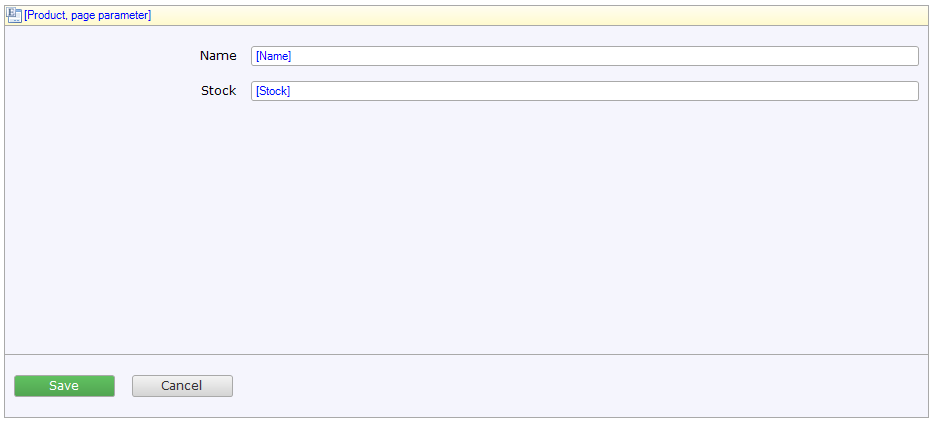
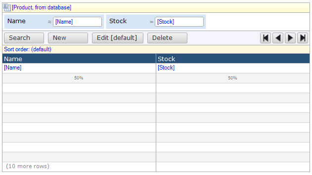
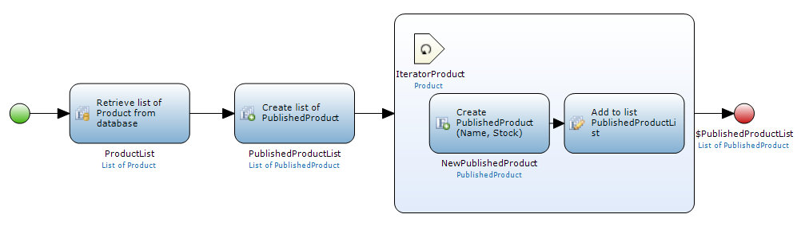

## 1 Introduction

In this how-to we will create an app in which we keep track of the inventory of a shop. This app makes the inventory available for use in other Mendix apps via an app service.

## 2 Creating the domain model

In the domain model, we define the products that we want the save, and how we want to exposed them.

1. In the domain model, create a persistent entity called _Product_ with two attributes: _Name_ (String) and _Stock_ (Integer)

2. Create a non-persistent entity called _PublishedProduct_ with the same attributes

    

## 4 Creating pages

We will now create pages that allows users to create, edit and delete products.

1. Add a new page called **EditUser**
2. Add a **Data view**
3. From the **Connector**, drag the **Product** entity onto to yellow **[Unknown]** bar.
4. A dialog appears; click **OK**

    

5. Open the **Homepage** and add a **Data grid**.
6. From the **Connector**, drag the **Product** entity onto to yellow **[Unknown]** bar.
7. A dialog appears; click **OK**
8. From the **Project Explorer**, drag page **EditUser** onto the **New** button
9. From the **Project Explorer**, drag page **EditUser** onto the **Edit [default]** button

    

## 5 Creating a microflow

We will now create a microflow that retrieves all products from the database and converts them to published products.

1. Add a microflow called **PublishProducts**
2. From the **Toolbox** drag a **Retrieve** activity onto the microflow
3. Double-click the **Retrieve** activity
4. Select **From database**
5. For **Entity**, select **Product**
6. Click **OK**
7. From the **Toolbox** drag a **Create list** activity onto the microflow
8. Double-click the **Create list** activity
9. For **Entity**, select **PublishedProduct**
10. Click **OK**
11. From the **Toolbox** (under **Other**) drag a **Loop** activity onto the microflow
12. Double-click the loop
13. For **Iterate over**, choose **ProductList**
14. Click **OK**
15. From the **Toolbox** drag a **Create** activity onto the loop
16. Double-click the **Create** activity
17. For **Entity**, select **PublishedProduct**
18. Click **New**
19. For **Member**, choose **Name**
20. For **Value**, type _$IteratorProduct/Name_
21. Click **OK**
22. Click **New**
23. For **Member**, choose **Stock**
24. For **Value**, type _$IteratorProduct/Stock_
25. Click **OK**
26. From the **Toolbox** drag a **Change list** activity onto the loop
27. Connect the **Create PublishedProduct** activity to the **Add to list** activity
28. Double-click the **Add to list** activity
29. For **Variable name**, choose **PublishedProductList**
30. For **Value**, type _$NewPublishedProduct_
31. Click **OK**
32. Double-click the red end event
33. For **Type**, choose **List**
34. For **Entity**, select **PublishedProduct**
35. For **Return value**, type _$PublishedProductList_
36. Click **OK**

     

## 6 Creating an app service

We will use the microflow to create an app service that exposes the products to other apps.

1. In **Project explorer**, right-click a module and choose **Add** > **Published services** > **Published app service**
2. For **Name**, type **Shop**
3. Click **Create version**
4. Go to tab **Actions**
5. Click **New**
6. For **Name**, type **Products**
7. For **Microflow**, select **PublishProducts**
8. Click **OK**
9. Go to tab **Settings**
10. For **Authentication**, select **Username and password**
11. Go to tab **General**
12. For **Status**, choose **Consumable**
13. Click **OK**
14. A dialog will ask whether you want to make this version available. Click **OK**

## 7 Securing the app

Before we publish our app, we need to make sure it is protected with username and password

1. In **Project explorer**, double-click **Project** > **Security**
2. For **Security level**, select **Prototype/demo**
3. Click **Edit module security**
4. Go to tab **Page access**
5. Check all checkboxes
6. Go to tab **Microflow access**
7. Check all checkboxes
8. Click **OK**
9. Go to tab **Administrator**
10. Type a password
11. Click **OK**

## 8 Publishing the app service

You can now go ahead and deploy the app. This will publish your app service.

## 9 Related Content

* [How to Expose a Web Service](expose-a-web-service)
* [How to Expose Data to BI Tools Using OData](exposing-data-to-bi-tools-using-odata)
