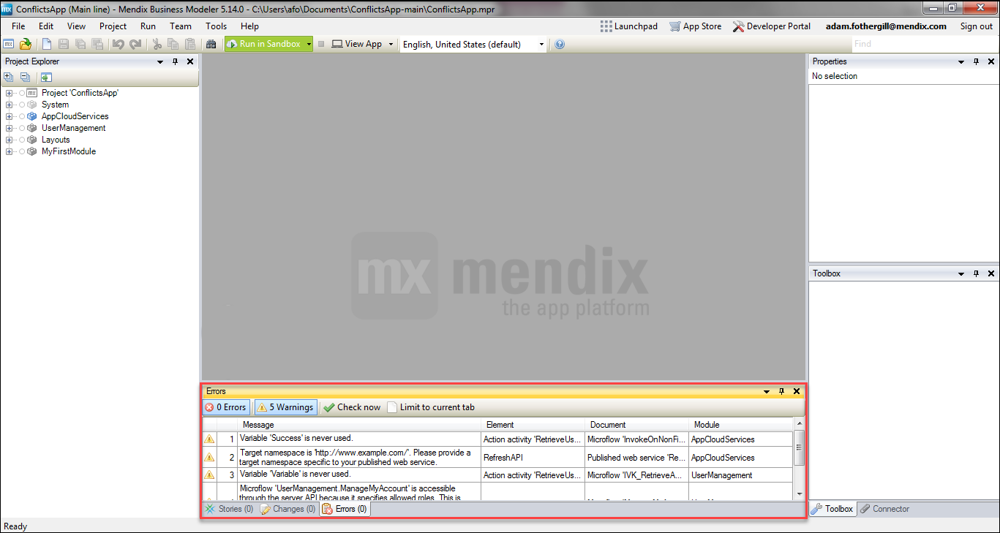
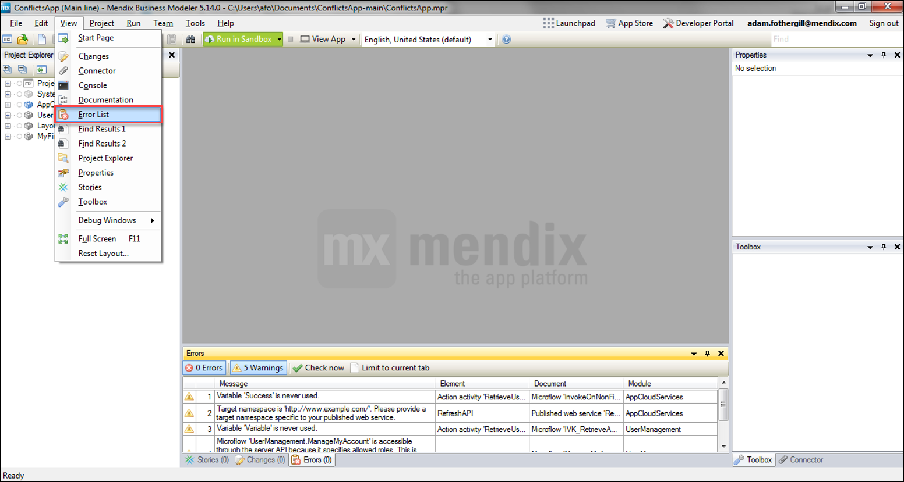

## 1 Introduction

This how-to explains how to eliminate design time warnings. While these warnings will not cause the application to break, it is important to fix them to keep a clean project.

**This how-to will teach you how to do the following:**

* View warning messages
* Clear warning messages

## 2 Viewing Warning Messages

Warning messages can be seen in the **Error List** tab of the Modeler (by default shown at the bottom of the Modeler). Note that the **Warnings** box must be selected for them to display.

If this tab is not visible, it can be displayed via the **View** menu by selecting the **Error List** option:

To get more information, double-click or right-click the warning.

## 3 Common Warnings

[Deprecated] Using the main placeholder contents for pop-ups is deprecated.  This potion will be removed in a future version.  Please use a separate pop-up layout instead.

* This will not affect the project in this version of the Modeler, but it may cause problems when upgrading
* In this example, the pop-up layout must be adjusted in order to no longer use the main placeholder

A flow origination from an error handler should not return to the main flow.

* Once the microflow has split due to an error, the flow that executes due to the error should not merge with the flow that executes when no error occurs

Access rules for entity ‘System.FileDocument’ exist that define access rights for users with module role ‘System.User’.  Note that these access rights apply to all users of your application, including anonymous users (if enabled).  It is recommended it create a specialized entity for each use case and configure access rules for those entities instead.

* The security for the System.FileDocument entity has a default setting that which can cause security loopholes
* This warning suggests creating specialized entities to eliminate such scenarios

Action activity that has a side effect on the client is not recommended here because the microflow is used as a data source for data view ‘dataView1’.

* Data source microflows should not have an effect on the client
* This microflow likely has a show message or show page activity that should be removed

Empty caption. [English, United States] / Empty title. [English, United States]

* The specified caption or title is empty
* This should be populated so that the page will be understood

Empty page title of target page.  Either set the page title of the target page or override it here. [English, United States]

* This should be populated to ensure the page will be understood (similar to the "empty caption" above)

Empty progress message. [English, United States]

* The selected progress message is empty, but it should be populated

Events have no effect inside a non-editable context.

* This context is read-only, but there are events set on the field (either on-change, on-leave, or on-enter) 

Microflow ‘microflowname’ is accessible through the server API because it specifies allowed roles.  This is unnecessary because the microflow is not used from navigation, a page or a published app service.

* There is no need for a microflow that is not accessed through navigation, a page, or a published app service to have security roles allowed
* This can lead to a security problem, and the assigned roles should be removed

Microflow does not do anything.

* This microflow performs no functionality; it should be removed or functionality should be added

Module role is not part of any user role.

* The module role cannot be used by any users
* This module role should either be removed or assigned to a user role so that the proper security is enforced

Property ‘XPath constraint’ on the data grid of the select page has no effect when the page is used for selecting.  Instead, the selection constraints properties of the reference selector can be used to constrain the selectable objects.

* When using a form for a reference selector, the constraint should be set on the reference selector (*not* on the form)

Empty required message while required is true. [English, United States]

* On a page, a field can be set to required
* When the field is set to required, the **Required Message** should be set
* In this case, either the **Required Message** must be set or the field must not be required

Required message is set even though required is set to false. [English, United States]

* This is similar to the previous warning
* If the field is not required, the **Required Message** should be empty
* If the **Required Message** was set with the intention of making the field required, the field should be made required

Target namespace is ‘[http://www.example.com/](http://www.example.com/)’.  Please provide a target namespace specific to your published web service.

* Edit the published web service to include a proper namespace

Variable ‘Variable’ is never used.

* There are multiple potential causes here
* The solution involves removing the variable from the microflow, which could mean deleting the retrieve activity or electing to not use the return value of a microflow call

## 4 Related Content

* [How to Find the Root Cause of Runtime Errors](finding-the-root-cause-of-runtime-errors)
* [How to Test Web Services Using SoapUI](../testing/testing-web-services-using-soapui)
* [How to Monitor Mendix Using JMX](monitoring-mendix-using-jmx)
* [How to Debug Java Actions Remotely](debug-java-actions-remotely)
* [How to Configure Log Levels](log-levels)
* [How to Debug Microflows](debug-microflows)
* [How to Debug Java Actions](debug-java-actions)
* [How to Handle Common Mendix SSO Errors](handle-common-mendix-sso-errors)
* [How to Debug Microflows Remotely](debug-microflows-remotely)

Several warnings relate to improper security. For more information on this, see [Project Security](/refguide/project-security) in the Mendix Reference Guide.
