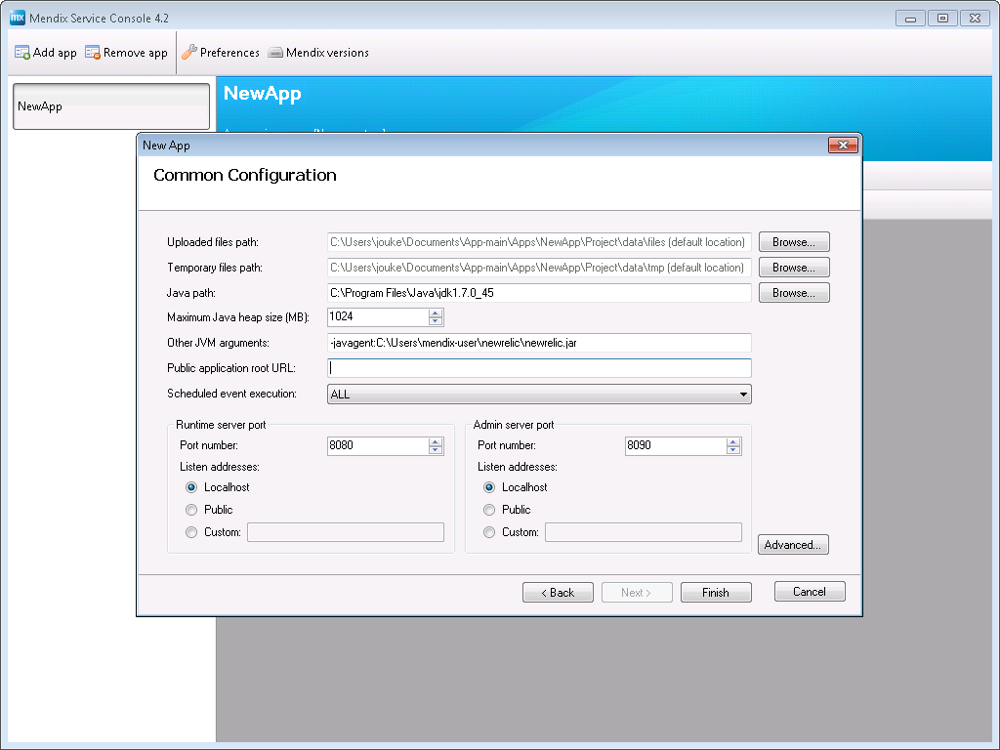

When setting up a Mendix application on-premise, you can set up advanced monitoring with New Relic. This works with both Windows and Linux deployments.

## Preparations

1.  Set up a trial account with New Relic at [https://newrelic.com/](https://newrelic.com/)
2.  Follow the New Relic for Java installation here: [https://docs.newrelic.com/docs/agents/java-agent/installation/java-agent-manual-installation](https://docs.newrelic.com/docs/agents/java-agent/installation/java-agent-manual-installation)
3.  As noted in the guide in step 2: unzip the newrelic.zip into a directory that the user of the Mendix process has access to (i.e. the user home directory)
4.  Check the newrelic.yml file in the unzipped newrelic directory, make sure you read through the settings and that you understand the security implications
5.  Follow the Linux / Windows specific steps below to complete the installation

### Linux specific steps

1.  Add '-javaagent:/PATH/TO/NEWRELIC.JAR' to your java options in the m2ee.yaml file. Make sure to replace the path to the actual path of the newrelic.jar.

The configuration section in m2ee.yaml should look something like this:

```
 javaopts: [
 "-Dfile.encoding=UTF-8", "-XX:MaxPermSize=64M", "-Xmx256M", "-Xms256M",
 "-Djava.io.tmpdir=/path/to/project/data/tmp",
 "-javaagent:/home/mendix-user/newrelic/newrelic.jar",
 ]
```

### Windows specific steps

1.  Add  '-javaagent:/PATH/TO/NEWRELIC.JAR' to your java arguments in the Windows Service Console



<div class="alert alert-info">

After you restart the application your data should show up in New Relic. Note that this requires the application to send data to New Relic servers, so your firewalls should be configured to allow this traffic.

</div>

## Related content

*   [Setting up monitoring with New Relic](setting-up-monitoring-with-new-relic)
*   [Finding the Root Cause of Runtime Errors](../monitoring-troubleshooting/finding-the-root-cause-of-runtime-errors)
*   [Clearing Warning Messages in Mendix](../monitoring-troubleshooting/clear-warning-messages)
*   [Testing web services using SoapUI](../testing/testing-web-services-using-soapui)
*   [Monitoring Mendix using JMX](../monitoring-troubleshooting/monitoring-mendix-using-jmx)
*   [Debugging Java actions remotely](../monitoring-troubleshooting/debug-java-actions-remotely)
*   [Log Levels](../monitoring-troubleshooting/log-levels)
*   [Debugging Java Actions](../monitoring-troubleshooting/debug-java-actions)
*   [Common Mendix SSO Errors](../monitoring-troubleshooting/handle-common-mendix-sso-errors)
*   [Debugging Microflows](../monitoring-troubleshooting/debug-microflows)
