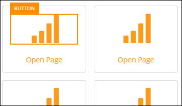
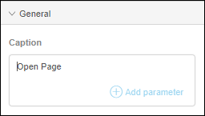
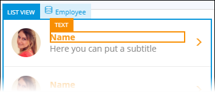
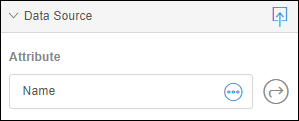
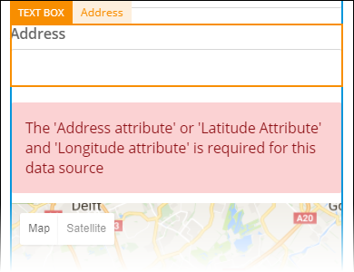

## 1 Introduction

This is the fourth how-to in a series on creating an employee directory in the Web Modeler. In this how-to, you will learn how to add pages to the app.

**This how-to will teach you how to do the following:**

* Create an overview page
* Create a detail page
* Connect pages to a domain model 
* Use the Google Maps Widget

## 2 Prerequisites

Before starting with this how-to, make sure you have completed the following prerequisite:

* Use the third how-to in this series: [How to Build an Employee Directory App Step 3: Publish and View Your App](build-an-employee-directory-app-3-publish-and-view-your-app)

## 3 Adding Pages to the User Interface

Pages define the user interface of your Mendix app. Each page consists of widgets such as buttons, list views, data grids and input elements. For example, the default home page comes with a header and a layout grid.

### 3.1 Adding an Employee Overview Page

Now that you have created a basic dashboard, you need to add a new page that can be opened from a dashboard item that reflects its purpose. To achieve this, follow these steps: 

1. Select the top-left **BUTTON** image:
    
    

2. Click the **Icon** property and change it to **User**:

    

3. Select the top-left **Open Page** button and enter *Employees* for the **Caption** property:

    

4. Select the image you just changed to a user image and set the **On Click Action** property to **Page**:

    

5. Change the page property by clicking **Select page**:

    

6. To create a new page in the **Select Page** dialog box, do the following: 
    a. Click **New page**. 
    b. Change the title of the page to **Employees**. 
    c. Select **Lists** > **Lists Default** for the  template.

    

    Well done — you've created your first page! Let's finish up some things before you start working on the new Employees page.
7. Select the **Home** page by clicking the **Pages** icon in the left menu bar.
8. Select the **Button** with the **Employees** caption.
9. Change the **On Click Action** property of the button by setting it to **Page**.
10. For the **Page** property of this button, select the page named **Employees**.

Great, you're done. Now you're ready to head over to the Employees page!

### 3.2 Editing the New Employees Page

A new page is based on a page template, which in this case is **Lists Default**, which you selected in a previous steps. The page template consists of several widgets for you to change.

To edit the widgets, follow these steps:

1. Open the **Employees** page by using the recent documents option:

    

2. Select the **TEXT** widget with **Title**:

    

3. Change the **Content** property to **Employees**.
4. Delete the **Text** widget with the subtitle.
5. Select the **CONTAINER** where the **Add** button is located:

    

6. Select the parent **Row** using the breadcrumb:

    

7. Change the **Row Layout** to *large left column & small right column*:

    

### 3.3 Switching Building Blocks

If one of the available building blocks is more similar to your requirement than what is provided by default in page templates, you can easily make a replacement.

To switch building blocks, follow these steps:
    
1. Select the **LIST VIEW** widget and delete it:

    

2. Open the **Toolbox** and from **Lists**, drag the **List3** building block into the container.

At this point the page looks pretty nice, so you're ready to connect some data elements to it!

### 3.4 Creating and Connecting an Employee Data Structure to the Page

This page has several widgets to display records from your database. In Mendix, the structure of a database record is defined by an **Entity**.

To create the entity for an employee, follow these steps:

1. Select the **LIST VIEW**, which groups all the user cards together:

    

2. You want to create a new entity, so click the **Entity** property:
    
    

3. To create a new entity in the **Select Entity** dialog box, do the following: 
    a. Click **New Entity**. 
    b. Enter *Employee* for the **Name**.

4. Select the **TEXT** widget of the top user card and clear the **Content** property:

    

5. Click **Add parameter** for the **Content** property:

    

6. Create a new attribute in the **Select your attribute** dialog box (which will be added to the Employee entity) by doing the following: 
    a. Enter *Name* for the attribute **Name**. 
    b. Set the attribute **Type** to **String**.

7. In the subtitle **TEXT** widget, repeat steps 4-6 to add an attribute for **Email [String]**:

    

### 3.5 Adding an Input Employee Page

Now that you have created an entity representing the employees, you also need to populate that entity with data. The quickest way to add data to your app is to create an input page.

To add a page for inputting employees, follow these steps:

1. Select the **Add** button on the **Employees** page:

    

2. Select **Employee** for the **Entity** property of the button:

    
    
3. Click the **Page** property to open the **Select Page** dialog box.
4. Click **New page** and do the following: 
    a. Enter *Employee* for the **Title** of the page. 
    b. Select **Forms** > **Form Vertical** for the template:

    
    
### 3.6 Connecting the Input Page to the Employee Entity

The page you created consists of a set of text box widgets grouped together by a data view (a data view serves as the glue between page widgets and entities).

To connect the text box widgets to the Employee entity attributes, follow these steps:

1. Select the text box widget with the **Name** caption.

2. Click the icon in the data source header to select the containing data view.

    

3. Set the **Entity** property of the related data view to **Employee**.

    

4. Select the text box with the **Name** caption and connect it to the the **Name** attribute of the **Employee** entity.

    

5. Do the same thing for **Email**.
6. Add the following attributes to the entity for the remaining text box widgets:
    * **Phone [String]**
    * **Birthday [Date and Time]**
    * **Bio [String]**

7. Go the **Design** properties category and toggle the **Full Width** property for the **Save** and **Cancel** buttons to improve the user experience:

    

### 3.7 Using the Google Maps widget

You can easily add rich widgets to your pages to greatly benefit the user experience.

To add the Google Maps widget to the page, follow these steps:

1. On the **Employee** page, open the **Toolbox**, make sure **Widgets** is selected, and search for the **Google Maps** widget:

    

3. Drag the **Google Maps** widget from the **Display** properties category onto the page below the **Bio** text box.
4. The Google Maps widget requires an **Address attribute** or both the **Latitude attribute** and **Longitude attribute**. So, search for "Text" in the **Toolbox** and drag the additional **Text Box** widget above the map.
5. Connect the new text box to a new attribute named **Address**:

    

6. Select the Google Maps widget, open the **Data source** properties category, and do the following: 
    a. Set the **Locations Entity** to **Employee**. 
    b. Set the **Address Attribute** to **Address**.

### 3.8 Connecting the List View On Click to a Page

The last thing you have to do is finish up the employees page. To connect a list view to this page, follow these steps:

1. Open the **Employees** page and then select the **LIST VIEW**:

    

2. Set the **On Click Action** to **Page** and select the **Employee** page (like you did for the **Add** button).

You're done! Time to view the effects of all your changes.

## 4 Viewing Your App

Update and view your app, just like you did in [How to Build an Employee Directory App Step 3: Publish and View Your App](build-an-employee-directory-app-3-publish-and-view-your-app).

You can now use your app to add and edit employees!
    
## 5 Viewing the Structure of the Employee Entity

This is the end of the tutorial. Please share your feedback in the [Build an Employee Directory App Survey](https://www.surveymonkey.com/r/XY258CP).

Stay tuned for more!

## 6 Related Content

* [How to Build an Employee Directory App Step 1: Create the App](build-an-employee-directory-app-1-create-the-app)
* [How to Build an Employee Directory App Step 2: Build a Dashboard Page](build-an-employee-directory-app-2-build-a-dashboard-page)
* [How to Build an Employee Directory App Step 3: Publish and View Your App](build-an-employee-directory-app-3-publish-and-view-your-app)
