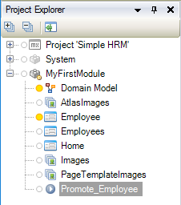

## 1 Introduction

This is the fifth and final how-to in a series on creating an employee directory in the Web Modeler. In this how-to, you will learn how to add a microflow to the app and edit it in the Desktop Modeler.

**This how-to will teach you how to do the following:**

* Create a microflow
* Open the app in the Desktop Modeler
* Edit the microflow in the Desktop Modeler 

## 2 Prerequisites

Before starting with this how-to, make sure you have completed the following prerequisite:

* Use the third how-to in this series: [How to Build an Employee Directory App Step 4: Add Pages to the User Interface](build-an-employee-directory-app-3-publish-and-view-your-app)

## 3 Adding a Promote Button to the User Interface

The part of the app that encodes the real-world business rules that determine how data can be created, stored, and changed is called business logic.
Microflows allow you to express the logic of your application. A microflow can perform actions such as creating and updating objects, showing pages and making choices.

### 3.1 Setting up the UI to trigger a microflow

In pages, microflows are triggered by action buttons. To set up an action button to trigger a microflow, follow these steps:  

1. Make sure you are editing the **Employee** page.
    
2. Click the container which contains the header and delete it:

    

3. Drag a dataview widget to the top of the page.
    a. Set the Data source entity to employee.

4. Drag the **Pageheader Controls** building block, which you can find in the header category, into the dataview content area:

    

5. Select the row of the layoutgrid which containing the Pageheader Controls building block:

    

5. Change the row layout to *large left column & small right column*:

    

6. Change the caption of the title text widget to Employee.

7. Remove the following elements: 
    a. Add button. 
    b. Delete button.

8. Change the Edit button:
    a. Set the caption property to **Promote**.
    b. Set the style property to **Info**.
    c. Set the **On Click Action** to **Microflow**
    d. Create a new microflow for the Microflow property and name it **Promote_Employee**.

    

Great, you've created your first microflow. Continue to learn how to extend the employee entity in the domain model.

### 3.2 Extending the Domain Model for Promote Employee level
In the previous steps, you created the employee entity and its attributes from different widgets. So, you must be thinking, how do I edit them in case I want to change something? Don't worry, you can view and edit your entities in the domain model.

To extend the structure of **Employee** entity, follow these steps:

1. Click the **Domain Models** icon in the left menu:

    

2. Check how your entity looks at this point:

    

3. Select the Employee entity.
    a. Click the **New attribute** button.
    b. Set the name to **Level**.
    c. Set the type to **Enumeration**.
    d. Click the **Enumeration** input field to create a new enumeration.
    e. Set the name to **EmployeeLevel**.
    f. Click new item and set Caption and Name to **Junior**.
    g. Do this again for **Medior** and **Senior**.
    h. Select the Level attribute of the Employee entity and set the default value property to **Junior**.

All set? Continue to learn how to edit the microflow you created earlier in the Desktop Modeler.

### 3.2 Open and Sync the App in the Desktop Modeler

The Desktop Modeler is used to add complex logic and build sophisticated integrations to your app. To open your app in the Desktop Modeler, follow these steps:

1.  Make sure you have downloaded the latest Desktop Modeler [here](https://appstore.home.mendix.com/link/modelers/) and installed it. Note that this tutorial was created with Mendix Desktop Modeler 7.5.0.

2.  Go back to the **Buzz** page of the app in the Mendix Developer Portal.

    

3. Click **Edit App in ** to open your app in the Desktop Modeler.

    

4. Update the local version of your app using the **Sync with Web Modeler** button in the changes dock.
    a. Commit the project first using the commit button in case the project requires this.

    

5.  After synchronizing the project you can inspect the changes in the changes dock. Click the **Finish sync with Web Modeler** button to complete the synchronization.

    

At this point the local version of your app is in sync with the version in the web modeler. Continue with the next step: Edit a microflow in the Desktop Modeler.

### 3.3 Implement the Logic to Promote an Employee

Microflows consist of microflow actions. To implement the promote requirement you need to determine which level the employee has and promote him or her accordingly.

To learn how to edit a microflow so so that it promotes employees, follow these steps:

1. Open the **Promote Employee** microflow:

    

2. Add the **Exclusive Split** microflow action to the flow.
    a. Right-click the arrow.
    b. Select **Insert > Exclusive Split**.
    c. Double click the exclusive split action.
    d. Set the caption to **Level**.
    e. Click the **Expression wizard**. For variable select **Employee** and for attribute select **Level**.
    f. Click the OK button to close the popups.

    

3. Right click the arrow which is now red, and select **Condition value > Senior**. 

4. Hover over the Exclusive split with your mouse pointer and drag a new arrow from the exclusive split to and end event by clicking one of the white circles.
    a. Repeat this two times so that you have three new (red) arrows.

5. Set the remaining condition values on these arrows.

    

6. Add an activity to the arrow with the **Junior** conditon value.
    a. Set the type of action to **Change object**.
    b. Set the variable to **Employee**.
    c. Set **Commit** to **Yes**.
    d. Set **Refresh in client** to **Yes**.
    e. Click **New** and set **Level** for member.
    f. Click the **Generate** button and set the constant to **Medior**.
    g. Click OK to close the popups.

    

7. Add another activity to the right of the change object activity.
    a. Set the activity type to **Show message**.
    b. Set the template to **{1} is promoted to Medior!**.
    c. Add a parameter and set it to **$Employee/Name**. 

    

8. Complete the microflow so that:
    a. employees with a medior level are promoted to senior level.
    b. employees with a senior level only receive a message that senior is the highest level.

    

9. Sync your changes back to the Web Modeler by using the **Sync with Web Modeler** button.

Fantastic, you've created your first business logic! Can't wait to find out if this is working as expected? Return to the Web Modeler and inspect the **Promote_Employee** microflow.

### 3.4 Add Employee level to the UI.
The microflow should function correctly at this point. Let's add a visual indicator on the Employee page.

1. Open the Employee page in the Web Modeler.

2. Select a Dropdown widget from the widgets category in Toolbox.

3. Drag it between the Name and Phone input boxes.

Yes! At this point you're ready to view the app.

## 4 Viewing Your App

Update and view your app, just like you did in [How to Build an Employee Directory App Step 3: Publish and View Your App](build-an-employee-directory-app-3-publish-and-view-your-app).

You can now promote your employees!

Now you perfectly lined up to continue with another tutorial or the introduction course.
This is the end of the tutorial. Tell us how you like this tutorial and your suggestions improve this tutorial, share your feedback in the [Build an Employee Directory App Survey](https://www.surveymonkey.com/r/XY258CP).

## 6 Related Content

* [How to Build an Employee Directory App Step 1: Create the App](build-an-employee-directory-app-1-create-the-app)
* [How to Build an Employee Directory App Step 2: Build a Dashboard Page](build-an-employee-directory-app-2-build-a-dashboard-page)
* [How to Build an Employee Directory App Step 3: Publish and View Your App](build-an-employee-directory-app-3-publish-and-view-your-app)
