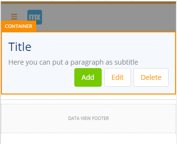
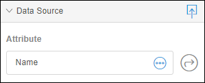

## 1 Introduction

This is the fifth and final how-to in a series on creating an employee directory in the Web Modeler. In this how-to, you will learn how to add a microflow to the app and edit it in the Desktop Modeler.

**This how-to will teach you how to do the following:**

* Create a microflow
* Open the app in the Desktop Modeler
* Edit the microflow in the Desktop Modeler 

## 2 Prerequisites

Before starting with this how-to, make sure you have completed the following prerequisite:

* Use the third how-to in this series: [How to Build an Employee Directory App Step 4: Add Pages to the User Interface](build-an-employee-directory-app-3-publish-and-view-your-app)

## 3 Adding a Promote Button to the User Interface

The part of the app that encodes the real-world business rules that determine how data can be created, stored, and changed is called business logic.
Microflows allow you to express the logic of your application. A microflow can perform actions such as creating and updating objects, showing pages and making choices

### 3.1 Setting up the UI to trigger a microflow

In pages, microflows are triggered by action buttons. To set up an action button to trigger a microflow, follow these steps:  

1. Make sure you are editing the **Employee** page.
    
2. Click the container which contains the header and delete it:

    

3. Drag the **Pageheader Controls** building block, which you can find in the header category, to the top of the page:

    

4. Select the row of the layoutgrid which containing the Pageheader Controls building block:

    

5. Change the row layout to *large left column & small right column*:

    

6. Change the caption of the title text widget to Employee.

7. Remove the following elements: 
    a. Add button. 
    b. Delete button.

8. Change the Edit button:
    a. Set the caption property to **Promote**.
    b. Set the style property to **Info**.
    c. Set the **On Click Action** to **Microflow**
    d. Create a new microflow for the Microflow property and name it **Promote_Employee**.

Great, you've created your first microflow. Continue to learn how to edit this microflow in the Desktop Modeler.

### 3.2 Open the App in the Desktop Modeler

The Desktop Modeler is used to add complex logic and build sophisticated integrations to your app. To open your app in the Desktop Modeler, follow these steps:

1.  Make sure you have downloaded the latest Desktop Modeler [here](https://appstore.home.mendix.com/link/modelers/) and installed it. Note that this tutorial was created with Mendix Desktop Modeler 7.5.0.

2.  Go back to the **Buzz** page of the app in the Mendix Developer Portal.

    

3. Click **Edit App in ** to open your app in the Desktop Modeler.

    

4. Update the local version of your app using the **Sync with Web Modeler** button in the changes dock.

    

### 3.3 Switching Building Blocks

If one of the available building blocks is more similar to your requirement than what is provided by default in page templates, you can easily make a replacement.

To switch building blocks, follow these steps:
    
1. Select the **LIST VIEW** widget and delete it:

    

2. Open the **Toolbox** and from **Lists**, drag the **List3** building block into the container.

At this point the page looks pretty nice, so you're ready to connect some data elements to it!

### 3.4 Creating and Connecting an Employee Data Structure to the Page

This page has several widgets to display records from your database. In Mendix, the structure of a database record is defined by an **Entity**.

To create the entity for an employee, follow these steps:

1. Select the **LIST VIEW**, which groups all the user cards together:

    

2. Click the **Entity** property to create a new entity:
    
    

3. To create a new entity in the **Select Entity** dialog box, do the following: 
    a. Click **New Entity**. 
    b. Enter *Employee* for the **Name**.

4. Select the **TEXT** widget of the top user card and clear the **Content** property:

    

5. Click **Add parameter** for the **Content** property:

    

6. Create a new attribute in the **Select your attribute** dialog box (which will be added to the Employee entity) by doing the following: 
    a. Enter *Name* for the attribute **Name**. 
    b. Set the attribute **Type** to **String**.

7. In the subtitle **TEXT** widget, repeat steps 4-6 to add an attribute for **Email [String]**:

    

The Desktop Modeler is required for editing image widgets. You will do this later in another how-to.

### 3.5 Adding an Input Employee Page

Now that you have created an entity representing the employees, you also need to populate that entity with data. The quickest way to add data to your app is to create an input page.

To add a page for inputting employees, follow these steps:

1. Select the **Add** button.
2. Select **Employee** for the **Entity** property of the button:

    
    
3. Click the **Page** property to open the **Select Page** dialog box.
4. Click **New page** and do the following: 
    a. Enter *Employee* for the **Title** of the page. 
    b. Select **Forms** > **Form Vertical** for the template:

    
    
### 3.6 Connecting the Input Page to the Employee Entity

The page you created consists of a set of text box widgets grouped together by a data view (a data view serves as the glue between page widgets and entities).

To connect the text box widgets to the Employee entity attributes, follow these steps:

1. Select the text box widget with the **Name** caption.

2. Click the icon in the data source header to select the containing data view.

    

3. Set the **Entity** property of the related data view to **Employee**.

    

4. Select the text box with the **Name** caption and connect it to the the **Name** attribute of the **Employee** entity.

    

5. Do the same thing for **Email**.
6. Add the following attributes to the entity for the remaining text box widgets:
    * **Phone [String]**
    * **Birthday [Date and Time]**
    * **Bio [String]**

7. Go the **Design** properties category and toggle the **Full Width** property for the **Save** and **Cancel** buttons to improve the user experience:

    

### 3.7 Using the Google Maps widget

You can easily add rich widgets to your pages to greatly benefit the user experience.

To add the Google Maps widget to the page, follow these steps:

1. On the **Employee** page, open the **Toolbox**, make sure **Widgets** is selected, and search for the **Google Maps** widget:

    

3. Drag the **Google Maps** widget from the **Display** properties category onto the page below the **Bio** text box.
4. The Google Maps widget requires an **Address attribute** or both the **Latitude attribute** and **Longitude attribute**. So, add an additional text box to the page, and connect it to a new attribute named **Address**.

    

5. Select the Google Maps widget, open the **Data source** properties category, and do the following: 
    a. Set the **Locations Entity** to **Employee**. 
    b. Set the **Address Attribute** to **Address**.

### 3.8 Connecting the List View On Click to a Page

The last thing you have to do is finish up the employees page. To connect a list view to this page, follow these steps:

1. Open the **Employees** page and then select the **LIST VIEW**:

    

2. Set the **On Click Action** to **Page** and select the **Employee** page (like you did for the **Add** button).

You're done! Time to view the effects of all your changes.

## 4 Viewing Your App

Update and view your app, just like you did in [How to Build an Employee Directory App Step 3: Publish and View Your App](build-an-employee-directory-app-3-publish-and-view-your-app).

You can now use your app to add and edit employees!
    
## 5 Viewing the Structure of the Employee Entity

In the previous steps, you created the employee entity and its attributes from different widgets. So, you must be thinking, how do I edit them in case I want to change something? Don't worry, you can view and edit your entities in the domain model.

To view the structure of **Employee** entity, follow these steps:

1. Click the **Domain Models** icon in the left menu:

    

2. Check how your entity looks at this point:

    

This is the end of the tutorial. Please share your feedback in the [Build an Employee Directory App Survey](https://www.surveymonkey.com/r/XY258CP).

Stay tuned for more!

## 6 Related Content

* [How to Build an Employee Directory App Step 1: Create the App](build-an-employee-directory-app-1-create-the-app)
* [How to Build an Employee Directory App Step 2: Build a Dashboard Page](build-an-employee-directory-app-2-build-a-dashboard-page)
* [How to Build an Employee Directory App Step 3: Publish and View Your App](build-an-employee-directory-app-3-publish-and-view-your-app)
