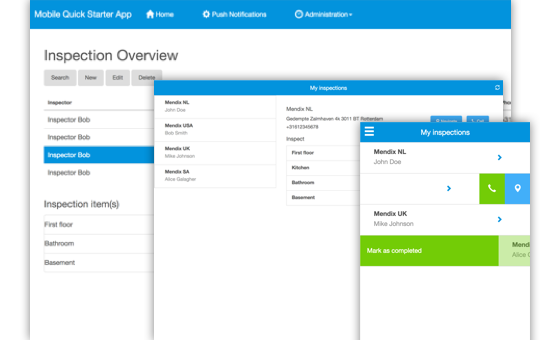
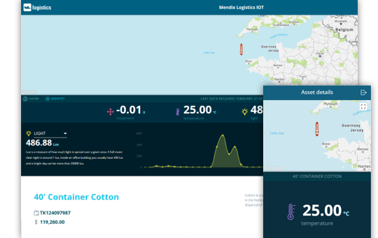
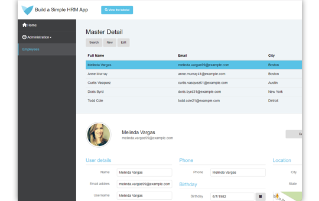

These tutorials will teach you how to build various apps:

|  | [Create a Mobile To-Do App](create-a-to-do-app) This how-to teaches the basics of building an app for mobile devices. You'll make use of the Mobile Quick Starter app and use handy widgets to add swipe gestures and use native device capabilities like sharing, taking a picture, and more. |
|------|:-----|
|  | **[Build an IoT App](build-an-iot-app)  Lets you experience how to consume IoT services from an IoT Cloud platform.** |
|  | **[Build a Simple HRM App](build-a-simple-hrm-app)  Learn the basics of app development with Mendix by building a simple HRM app.** |
