## 1 Introduction

The new Web Modeler offers you a lot of new features. This document will explain these features as you build a simple event app.

**This how-to will teach you how to do the following:**

* Create an app, pages, entities, and attributes
* Add headers, buttons, and building blocks
* Configure text and building block content
* Build microflows
* Publish your app

## 2 Prerequisites

Before starting with this how-to, make sure you have completed the following prerequisite:

* Create a [Mendix account](https://www.mendix.com/try-now/?utm_source=documentation&utm_medium=community&utm_campaign=signup)

## 3 Creating a New App

To create a new app in the Web Modeler, follow these steps:

1. Go to the [Developer Portal](http://home.mendix.com) and click **Create App** in the top-right of the screen.
2. Select the **Blank App** Atlas UI theme.
3. Click **Use this app**.
4. Enter *Event App* for the name of the new app, and then click **Create App**.
5. After your new app has been created, click **Edit App** on the **Buzz** page. This will open your new app in the Mendix Web Modeler.

    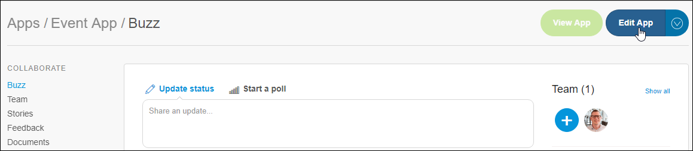

## 4 Adding a Header

When the Web Modeler opens, you will see a blank page with a default header. To add a new header to the page, follow these steps:

1. Select the **LAYOUT GRID** of the header:

    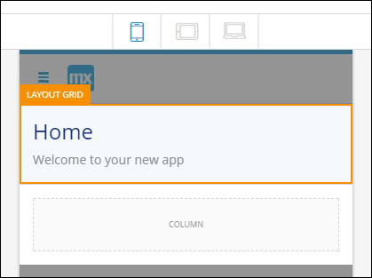

2. Click **Delete** in the bottom-right of the screen.
3. Drag **HeroHeader1** from **Toolbox** > **Building Blocks** > **Headers** onto the **CONTAINER**.
4. Select the title of the header and enter *My Event App* in **Content** in the **Properties**:

    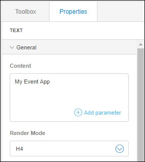

## 5 Updating the Text Design

In the **Properties** on the right side fo the Web Modeler, you can find various options for styling your text. To update the text design, follow these steps to change the styling of the subtitle:

1. Select the subtitle of the header and enter *September 18-20 2017* in **Content**.
2. Under **Design**, set the **Color** to **Warning**.
3. Under **Design**, set **Transform** to **Uppercase**.

    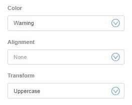

## 6 Adding Layout Rows in the Device Viewer

On the **Home** page, below the header, add four **Action Cards** to open new pages by following these steps:

1. Select the **COLUMN** in the layout grid below the header: 

    

    The layout grid is a widget that gives structure to your pages. A layout grid contains one or more rows, and each row can contain up to twelve columns.
    
   

2. Change it to four columns under **Row Layout** > **Desktop**.
3. Select four blocks for **Tablet** and **Phone**:

    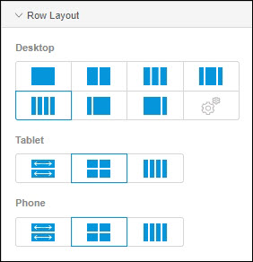

4. Switch between the device profiles to preview the layout by clicking the device icons at the top of the main Web Modeler window:

    

## 7 Adding Action Cards

Now that the rows are set, it's time to add action cards to the columns that will serve as buttons to navigate to other pages. Follow these steps to add the action cards to the **Home** page:

1. Return to the phone view and open **Toolbox** > **Building Blocks** > **Cards**:

    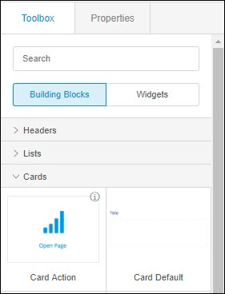

2. Drag the **Card Action** to all four empty columns:

    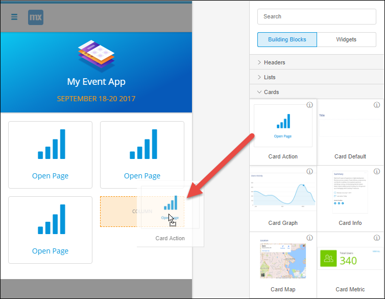

4. Select the **Open Page** button for the first card and enter *Program* for its **Caption**.
5. Select the signal icon **Button** and in **General** > **Icon**, change the icon to **List alt**.
6. Set the **On Click Action** to **Page**. If the user clicks this card, a new page will be opened. You will create the page that will be opened in the next chapter.

    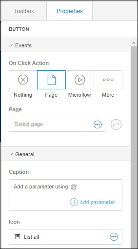

The **Home** page is now finished!

   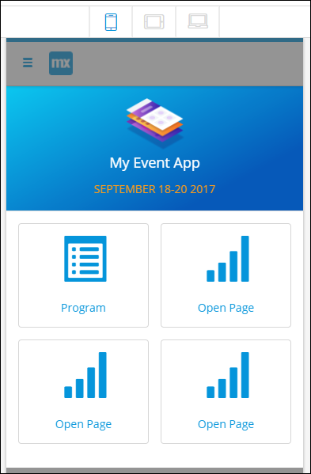

## 8 Adding a New Page

Now that the action cards are set, they must be configured to open new pages. Follow these steps to create a new page that will be opened when the **Program** card is clicked:

1. Select the list alt icon **BUTTON** and under **Events** > **Page**, click **Select page**.
2. In the **Select Page** dialog box, click **New page**.
3. Enter *ProgramList* for the **Title** of the new page.
4. Select **Dashboards** > **Dashboard Timeline** for the template, and then click **Create**.

    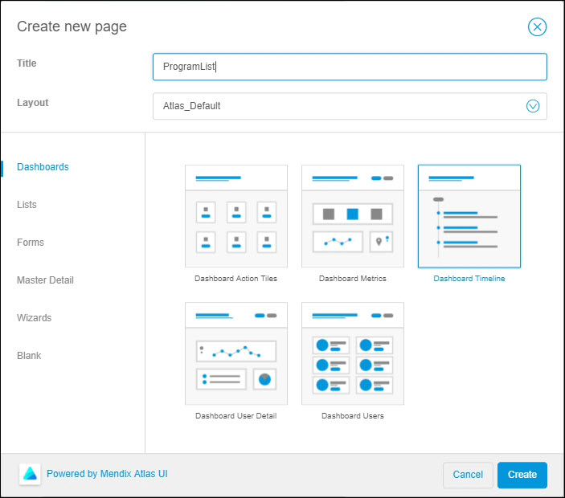 

    

    
    If you create a page in **Pages** (in the left navigation panel), make sure that the action card on the **Home** page refers to it in the **On Click Action**.
    
    

5. Replace the header with the **Heroheader1**, like you did for the **Home** page.
6. Enter *Program List* for the the header **Title**.
7. Enter *Upcoming events* for the subtitle, and change the color to **Warning**.
8. Delete the **New** button and its container.

## 9 Adding Entities and Attributes to a Building Block

The **ProgramList** page is coming along nicely. The timeline will need to display a list of events, so follow these steps to add entities and attributes to the list view:

1. Click to the right of the **Today** text to select the **List View**:

    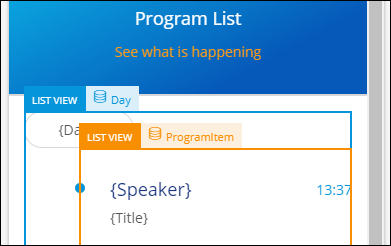

2. In **Properties** > **Data Source** > **Entity**, click **Select an entity**:

    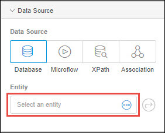

3. In the **Select Entity** dialog box, click **New Entity** to create a new entity.
4. In the **Create New Entity** dialog box, enter *Day* for the **Name** and click **Create**.
5. Select the **Today** text widget and delete the **Today** text fron the **Content**.
6. Click **Add parameter** and in the **Select your attribute** dialog box, click **New Attribute**.
7. Enter *Date* for the **Name** of the new attribute and select **String** as the type.
8. Click **Create** to add the attribute.

The timeline is now connected to the **Day** entity in your domain model.

## 10 Viewing Your Domain Model, Creating an Entity, and Setting Associations

After adding new entities and attributes to a page, it's always good to verify them in the domain model. You can also use the domain model editor to set the associations between the entities.

Follow these steps to create a new entity with several attributes and associate the new entity with the **Day** entity:

1. Click **Domain Models** in the left menu and then click **MyFirstModule**. The **Day** entity you created on the Program List page is already there.
2. Drag and drop a **New Entity** into the editor:

    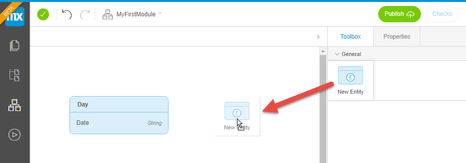

3. Name the new entity *ProgramItem* and click **Create**.
4. Click **New attribute** to add a new attribute.
5. Name the attribute *Speaker* and click **Create**.
6. Add three more attributes: 
    a. **Title** 
    b. **Description** 
    c. **Address**
7. Select the **ProgramItem** entity and click on the arrow to set an association.
8. Select the **Day** entity and click **Select**.

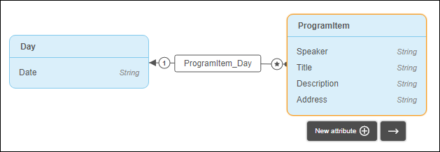

## 11 Adding the ProgramItem Entity to the List View

The **ProgramItem** entity contains four attributes that you can use on the **ProgramList** page. Follow these steps to apply these attributes to the list view elements on that page:

1. Open the **ProgramList** page.
2. Click the white space just below the **{Date}** text to select the inner list view.

    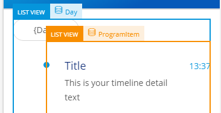

3. In **Data Source** > **Entity**, click **Select an entity** and then select the **ProgramItem** entity.
4. Select the **Title** text widget and delete its **Content**.
5. Type *@* to get a list of available attributes you can use for this widget.

    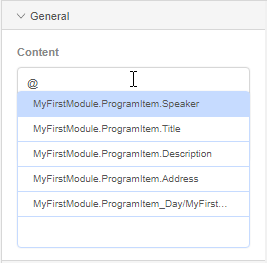

6. Select **Speaker**. This text widget will now show the speaker for an event.
7. Select the **This is your timeline detail text** text widget and replace the content with the **Title** attribute.

## 12 Changing the On Click Actions

Now that you've expanded the domain model, the details of new items on the **ProgramList** page need to be shown on a separate page. Follow these steps to add another page to show the item details:

1. Open the the **ProgramList** page.
2. Click the inner list view and set the **On Click Action** to **Page**:

    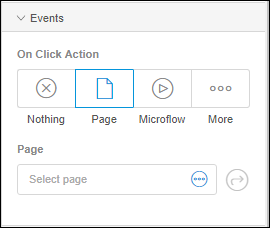

3. Click **Select page**.
4. Create a new **Blank** page and name it *ItemDetail*.

The **Program List** page is now finished!

   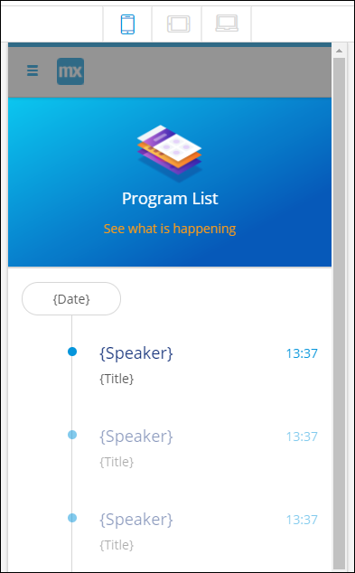

## 13 Building the ItemDetail Page

The **ItemDetail** page will contain two items next to each other and another item below that. This means that you need two more rows.

To build the **ItemDetail** page, follow these steps:

1. In **Toolbox** > **Data Containers**, add a **Data View** to the page.
2. In **Properties** > **Data Source**, click **Select an entity** and select the **ProgramItem** entity.
2. Drag the **LAYOUT GRID** into the **DATA VIEW CONTENT** block.
3. Select the **LAYOUT GRID** and click **Add Row** three times to add three new rows.

    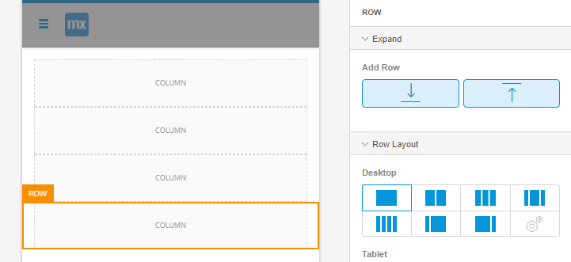

4. Open the Toolbox and enter *Text* in the search box.
5. Drag and drop the **Text** widget onto the first column.

    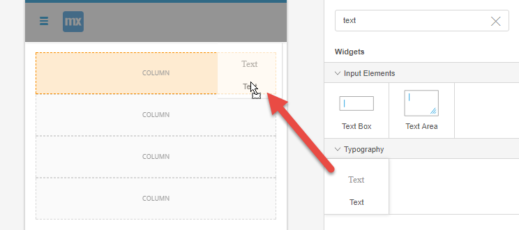

6. Change **Text** into *Details* in **Content**.
7. Configure the following properties: 
    a. **Render mode**: **H2** 
    b. **Weight**: **Bold** 
    c. **Color**: **Header color** 
    d. **Alignment**: **Center**

    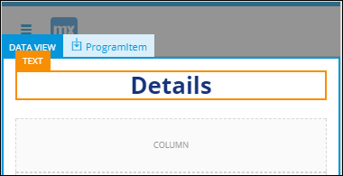

## 14 Adding Content from the Modeler and the App Store

You can find elements for your pages by looking in the **Building blocks** and **Widgets** tabs in the **Toolbox**, but you can also search for additional content in the Mendix App Store. The Mendix App Store contains different custom themes, modules, and widgets created by Mendix as well as the Mendix community.

To download a widget from the Mendix App Store and add it to your page, follow these steps:

1. Add a **Flex Container Left** to the second column on the **ItemDetail** page.
2. Add a **Call Microflow** button to the container on the right and name it *Book seat*.
3. Change the **Render Mode** for the button to **Link**.
4. Change the **On Click Action** to *Nothing*.

    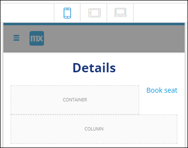

5. Search for *progress bar* and click the download icon in the top-left of the **Progress Bar** widget to download it from the Mendix App Store:

    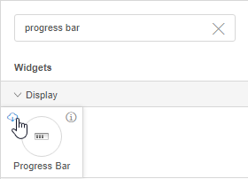

6. Add the **Progress Bar** widget to the left container of the second column
7. Under **Properties** > **Data source** > **Progress Attribute**, for the progress bar, click **Select an attribute**.
8. Create a new attribute called *Progress*.
9. Under **Appearance**, set the **Bar Style** to **Info**.
10. Add the **Card Map** widget to the third column.

    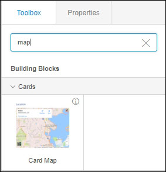

11. Add the **Card User** widget to the bottom column.
12. Remove the **Details** button and its **CONTAINER** from the **Card User** widget.
13. Add a **Close Page** button widget to the **DATA VIEW FOOTER** with the following properties: 
    a. **Caption**: **Back** 
    b. **Icon**: **Chevron left** 
    c. **Full Width**: on

The **ItemDetail** page is now finished!

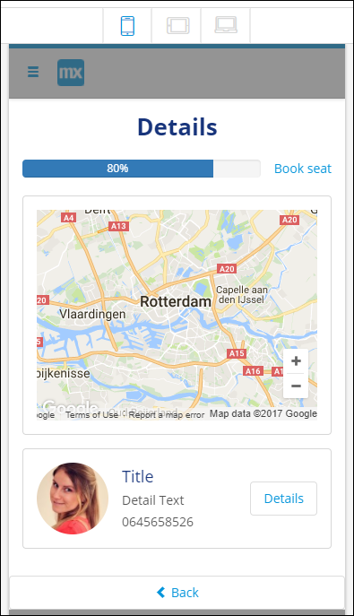

## 15 Adding Logic to the App with Microflows

Now that everything on the **ItemDetail** page is set, the **Book seat** button needs to have an action.

Follow these steps to add logic with microflows:

1. Select the **Book seat** button.
2. set the **On Click Action** to **Microflow**, then click **Select microflow**.
3. Create a new microflow and name it *BookSeat*. Notice that the microflow already has the **ProgramItem** parameter, which is set to the **ProgramItem** entity.
4. For the **Caption** of the **Annotation**, enter *This microflow will book a seat for users of the event app.*.

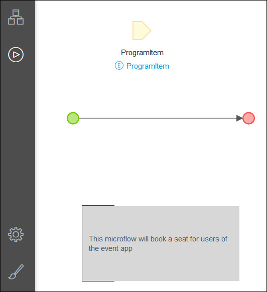

To expand the logic of the microflow, you will have to edit the microflow in the Desktop Modeler. For more information on working with the Web Modeler and Desktop Modeler, see [Syncing the Web Modeler with the Desktop Modeler](/refguide/desktop-webmodeler).

## 16 Publishing and Viewing Your App

You app is now finished! Follow these steps to view your app in the browser:

1. Click **Publish**, then **Update**.
2. Click **View on mobile device**.

    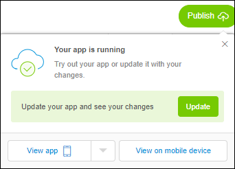

3. Scan the QR-code with your **Mendix Mobile** app (get it for [iOS](https://itunes.apple.com/nl/app/mendix/id458058946?l=en&mt=8) or [Android](https://play.google.com/store/apps/details?id=com.mendix.SprintrMobile&hl=en).

    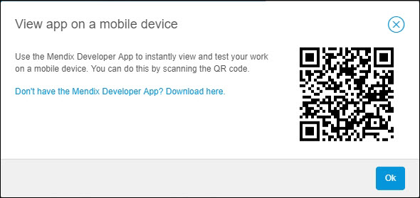

Congratulations! You have successfully built an event app in the Web Modeler.

## 18 Related Content

* [Web Modeler](/refguide/web-modeler)
* [Syncing the Web Modeler with the Desktop Modeler](/refguide/desktop-webmodeler)
