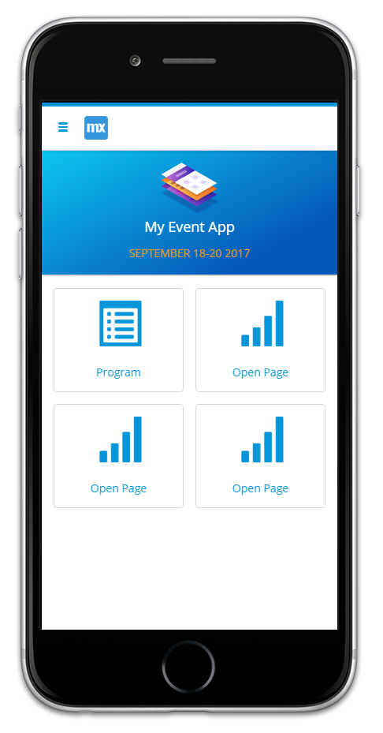

## 1 Introduction

The new Web Modeler offers a lot of new features. This document will explain these features while you build a simple event app.

**This how-to will teach you how to do the following:**

* Create an app, pages, entities, and attributes
* Add headers, buttons, and building blocks
* Configure text and building blocks content
* Build microflows
* Publish your App

## 2 Create a new App

1. Go to the [Developer Portal](http://home.mendix.com).
2. Click **Create App** in the top right corner of the screen.
4. Select the **Blank App** AtlasUI theme.
5. Click **Use this app**.
6. Name your new app *Event App* and click **Create App**.
7. When you're new app has been created, click **Edit App** on the **Buzz** page. This will open your new app in the Mendix Web Modeler.

    

## 3 Add a Header

When the Web Modeler has opened, you will see a blank page with a default header. Follow these steps to add a new header to the page:

1. Select the layout grid of the header.

    

2. Click **Delete** in the bottom right of the screen.
3. Drag and drop **HeroHeader1** from the **Building Blocks** in the **Toolbox** tab onto the container.
4. Select the title of the header and change the **Caption** to *My Event App* in the **Properties**.

    

## 4 Update the Text Design

In **Properties** you can find various options to style your text. Follow these steps to change the styling of the subtitle:

1. Change the subtitle of the header to *September 18-20 2017*.
2. Set **Color** to *Warning*.
3. Set **Transform** to *Uppercase*.

    

## 5 Add Layout Rows in the Device Viewer

On the Home page, below the header, add four **Action Cards** to open new pages by following these steps:

1. Select the **Column** in the layout grid below the header.



The layout grid is a widget that gives structure to your pages. A layout grid contains one or more rows and each row contains one to twelve columns.



2. Change it to four rows under the **Row layout** for Desktop.
3. Select four blocks for Tablet and Phone.

    

3. Switch between the devices profiles to preview the layout by clicking on the **device icons** at the top of the Web Modeler.

    

### 6 Add Action Cards

Now that the rows are set, it's time to add **Action Cards** to the columns that will serve as buttons to navigate to other pages. Follow these steps to add the action cards to the Home page:

1. Open the **Toolbox** and select **Building Blocks**
2. Open the **Cards** section.

    

3. Drag and drop the **Card Action** to all four empty columns.

    

4. Select the **Open page** button for the first card and change its **Caption** to *Program*.
5. Select the **Signal** button and change to icon to *List alt*.
6. Set the **On Click Action** to **Page**. If the user clicks this card, a new page will be opened. You will create the page that will be opened in the next chapter.

    

The Home page is now finished!

   

## 7 Add a New Page

Now that the **Action Cards** are set, they must be configured to open new pages. Follow these steps to create a new page that will be opened when the Program card is clicked:

1. Select the **List alt** button and click **Select page**.
2. Click **New page** in the dialog window that opens up.
2. Name the new page *ProgramList*.
3. Select the **Dashboard Timeline** template and click **Create**.

    



If you create a page in **Pages** (in the left navigation panel), make sure that the Action Card on the Home Page refs to it in the **On Click Action**.



4. Replace the header with the **Heroheader1** like you did on the Home page.
5. Change the header title to *Program List*.
6. Change the subtitle to *Upcoming events*, and color to *Warning*.
7. Delete the **New** button and its container.

## 8 Add Entities and Attributes to a Building Block

The program list page is coming along nicely. The timeline will need to display a list of events, so follow these steps to add entities and attributes to the list view:

1. Click to the right of the **Today** text to select the **List view**.

    

2. In the **Properties**, click **Select an entity**.

    

3. Click **New Entity** to create a new entity.

3. Name the entity *Day* and click **Create**.
4. Select the *Today* text widget .
5. Delete the *Today* text fron the **Content**.
6. Click **Add parameter** and then **New Attribute**.
7. Name the new attribute *Date* and select *String* as type.
8. Click **Create** to add the attribute.

The timeline is now connected to the Day entity in your domain model.

## 9 View Your Domain Model, Create an Entity, and Set Associations

After adding new entities and attributes to a page, it's always good to verify them in the domain model. You can also use the domain model editor to set the **associations** between the entities. Follow these steps to create a new entity with several attributes, and associate the new entity with the Day entity:

1. Click **Domain Models** in the sidebar on the and click **MyFirstModule**. The **Day** entity you created on the Program List page is already there.
2. Drag and drop a **New Entity** into the editor.

    

3. Name the new entity *ProgramItem* and click **Create**.
4. Click **New attribute** to add a new attribute.
5. Name the attribute **Speaker** and click **Create**.
6. Add three more attributes:
    a. Title
    b. Description
    c. Address
7. Select the **ProgramItem** entity and click on the arrow to set an association.
8. Select the **Day** entity and click **Select**.

## 10 Add the ProgramItem Entity to the List View

The ProgramItem entity contains four attributes that you can use on the Program List page. Follow these steps to apply these attributes to the list view elements on the Program List page:

1. Open the **ProgramList** page.
2. Click on the white space just below the **{Date}** text to select the inner list view.

    

3. Click **Select an entity** and select the **ProgramItem** entity.
4. Select the **Title** text widget and delete its content.
5. Type *@* to get a list of available attributes you can use for this widget.

    

6. Select **Speaker**. This text widget will now show the speaker for an event.
7. Select the **This is your timeline detail text** widget and replace the content with the *Title* attribute.

## 11 Publish and View Your App

You've already completed 10 chapters, so it's time to publish your app and see what it looks like when it's deployed. Follow these steps to deploy your app:

1. Click **Publish** in the top right corner.
2. Click **Update** to deploy the latest changes.
3. Click **View app** when the update has completed. Your app will now open in a new browser tab.

The app is running, but doesn't have a lot of functionality yet. Continue with the next chapters to add more content, pages, and functionality.

## 12 Change the On Click Actions

Now that you've expanded the domain model looks, the details of new items of the ProgramItem page need to be shown on a separate page. Follow these steps to add another page to show the item details:

1. Open the the **ProgramItem** page.
2. Click on the inner list view and set the **On Click Action** to **Page**.

    

3. Click **Select page**.
4. Create a new **blank** page and name it *ItemDetail*.

The Program List page is now finished!

   

## 13 Build the ItemDetail Page

The ItemDetail page will contain two items next to each other and another item below that. This means that you need two more rows.

1. Add a **Data View** to the page.
2. Click **Select an entity** and select the *ProgramItem* entity.
2. Move the layout grid into the **DATA VIEW CONTENT** block.
3. Select the layout grid and click **Add Row** three times to add three new rows.

    

4. Open the Toolbox and search for *Text*.
5. Drag and drop the **Text** widget onto the first column.

    

6. Change **Text** into *Details* and configure the following properties:
    a. Render mode: H2
    b. Weight: Bold
    c. Color: Header color
    d. Alignment: Center

    

## 14 Add Content from the Modeler and the App Store

You can find elements for your pages by looking in the **Building blocks** and **Widgets** tab, but you can also search for additional content in the **Mendix App Store**. The Mendix App Store contains many custom themes, modules, and widgets, created by Mendix as well as the Mendix community. Follow these steps to download a widget from the Mendix App Store and add it to your page:

1. Add the **Flex Container Left** to the second column on the **ProgramItem** page.
2. Add a **Call Microflow** button to the container on the right and name it *Book seat*.
3. Change the **Render Mode** to **Link**.
4. Change the **On Click Action** to *Nothing*.

    

5. Search for *progress bar* and click in the top left corner of the **Progress Bar** widget to download it from the App Store.

    

6. Add the **Progress Bar** widget to the left container.
7. Click ** Select an attribute** for the **Progress Attribute**.
8. Create a new attribute called *Progress*.
7. Set the **Bart Style** to *Info*.
8. Add the **Card Map** widget to the third column.

    

9. Add the **Card User** widget to the bottom column.
10. Remove the **Details** button and its container from the **Card User** widget.
11. Add a **Close Page** button widget to the **DATA VIEW FOOTER** with the following properties:
    a. Caption: Back
    b. Icon: Chevron left
    c. Full Width: on

The ItemDetail page is now finished!

## 17 Add Logic to the App with Microflows

Now that everything on the Item Detail page is set, the *Book seat* button has to have an action:

1. Select the **Book seat** button.
2. Click **Select microflow**.
3. Create a new microflow and name it *BookSeat*.
4. Add a **Parameter** to the microflow.
5. Click **Select an entity** and select it to *ProgramItem* entity.
6. Change the caption of the **Annotation** to *This microflow will book a seat for users of the event app.*.

## 18 Publish and View Your App

You app is now finished! Follow these steps to view your app in the browser:

1. Click **Publish**, then **Update**.
3. Click **View on mobile device**

    

4. Scan the QR-code with your Mendix App (Get it here for [iOS](https://itunes.apple.com/nl/app/mendix/id458058946?l=en&mt=8) or [Android](https://play.google.com/store/apps/details?id=com.mendix.SprintrMobile&hl=en).

    
