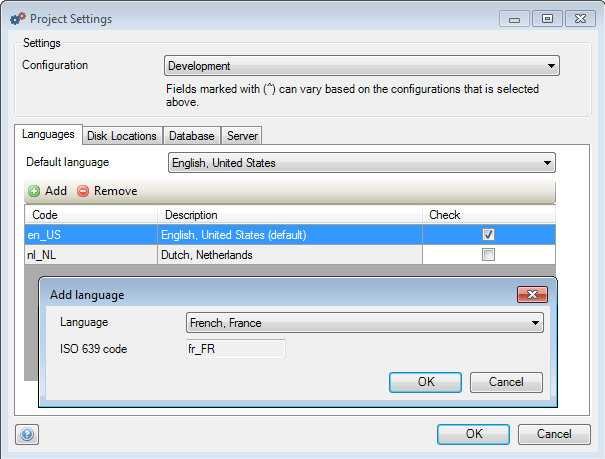

## Description

This section will explain how you can add a new language to your project. The related reference guide article can be found [here](https://world.mendix.com/pages/releaseview.action?pageId=10420280).

## Instructions

 **Open the Project Settings by double-clicking on 'Settings' in the Project Explorer.**

 **In the 'Languages' tab, press the 'Add' button.**

 **Select the language you want to add in the new menu and press 'OK'.**

[(Back to Top)](Add+a+new+language+to+your+project)