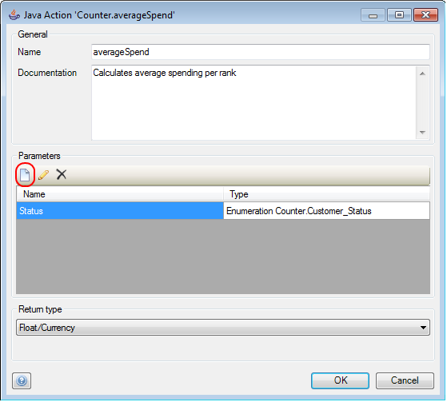
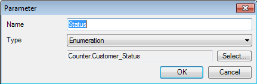

## Description

This section describes how to add a Java action to your project and then configure it. The related reference guide article can be found [here](https://world.mendix.com/pages/releaseview.action?pageId=9208539).

## Instructions

 **Add the Java action to your project. If you do not know how to add documents to your project please refer to [this](https://world.mendix.com/display/howto25/Add+documents+to+a+module) article.**

 **Double-click on the Java action in the Project Explorer.**

 **In the menu that appears you can change the name of the Java action if you wish. Documentation is optional text you can add to explain the purpose of the Java action but which will not appear anywhere in the client.**

 **In the 'Parameters' section you can configure what variables or objects should be passed to the Java action. You can add parameters by clicking on the 'Add' button. In the menu that appears you can then enter a name for the parameter, the type, as well as the variable or object which will be passed to the Java action.**

 **Finally at 'Return type' you can use the drop-down menu to configure what type of variable or object (if any) the Java action will return.**

[(Back to Top)](Add+and+configure+a+Java+action)