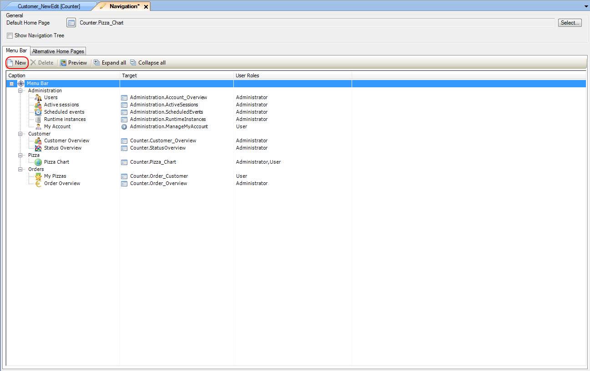
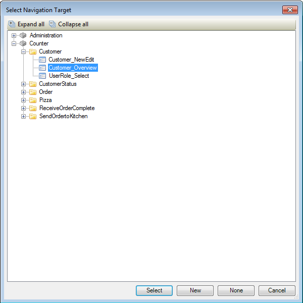
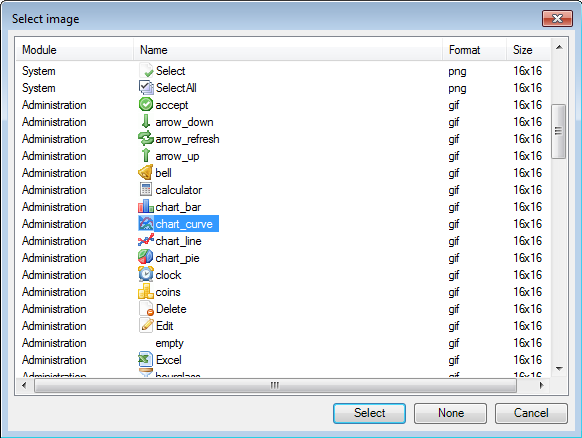

## Description

This section explains how to add new menus to the navigation, and fill these with items linked to forms or microflows. The related reference guide article can be found [here](https://world.mendix.com/pages/releaseview.action?pageId=13238662).

## Instructions

 **Open the Navigation menu by double-clicking on 'Navigation' in the Project Explorer.**

 **Highlight 'Menu Bar' (or the menu you want to add a submenu to) and press the 'New' button**

 **Highlight the newly created item and press F2 to edit the name, or alternatively edit the 'Caption' in the Properties window.**

 **You can now populate the new menu with items using the above steps.**

 **To link an item to a form or microflow, right-click on it and choose 'Select target...' or press the '...' button next to the 'Target' entry in the Properties window.**

In the new menu, select the form or microflow you want to link the navigation item to and press the 'Select' button. Alternatively, you can also click on the microflow or form you want to link to in the Connector window, hold the left mouse button, and drag it to the navigation item.

 **To add an icon to an item, right-click on it and choose 'Select image...' or press the '...' button next to the 'Target' entry in the Properties window.**

In the new menu, select the icon you would like the item to have from the list and press the 'Select' button.

[(Back to Top)](Create+a+new+navigation+menu+item)