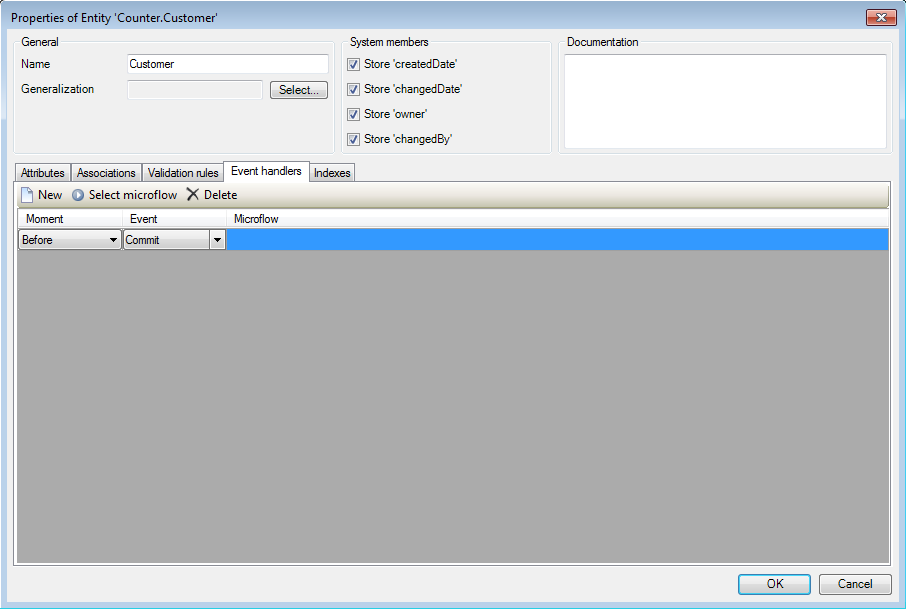
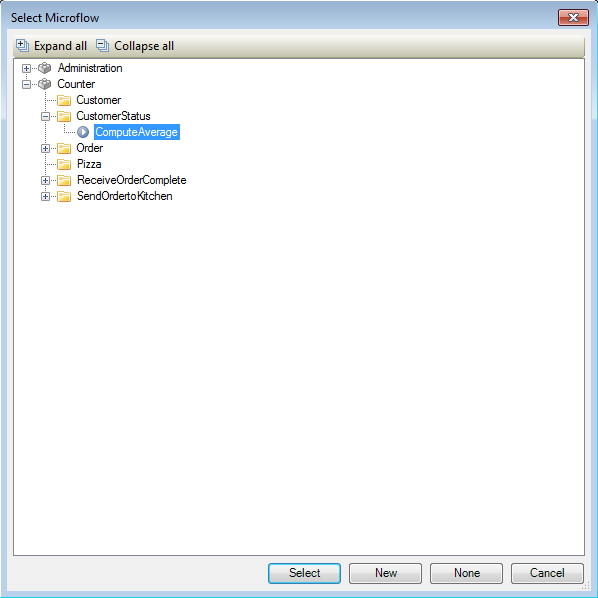
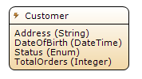

## Description

This section describes how to add an event handler to an entity and configure it. The related reference guide article can be found [here](https://world.mendix.com/pages/releaseview.action?pageId=9699431).

## Instructions

 **Double-click on the entity.**

 **Click on the 'New' button in the 'Event handlers' tab.**

 **Now choose when you want the event handler to perform its action. Event handlers can be triggered by four different object events, and can be chosen to have the action performed before or after the event takes place.**

For example choosing 'Before' and 'Commit' will have the selected microflow executed before an instance of this entity is committed, whereas choosing 'After' and 'Delete' would have the microflow executed after an instance of this entity is deleted.

 **Press the 'Select microflow' button and in the menu that appears choose the microflow you want to have executed whenever the event handler is triggered. Finish by pressing the 'Select' button.**

 **The domain model will now indicate that the entity has an event handler.**

[(Back to Top)](add-an-event-handler)