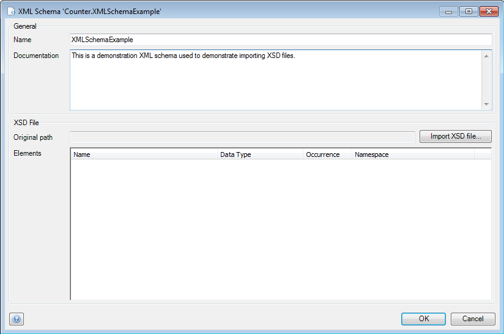
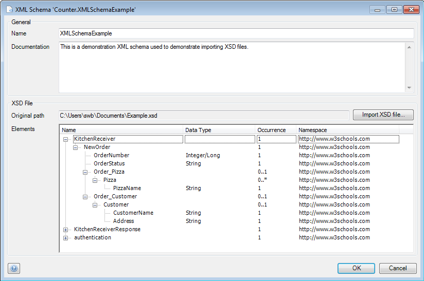

## Description

This section describes how to add an XML schema to your project and then configure it. The related reference guide article can be found [here](https://world.mendix.com/display/refguide4/XML+Schemas).

## Instructions

 **Add an XML schema to your project. If you do not know how to add documents to your project, please refer to [this](https://world.mendix.com/display/howto25/Add+documents+to+a+module) article.**

 **Double-click on the XML schema in the Project Explorer to start configuring it.**

 **In the menu that appears, you can optionally change the name of the XML schema at 'Name' and add text explaining its purpose at 'Documentation'.**

 **Click on the 'Import XSD file...' button to select the XSD file you want to use for this XML schema.**

 **The 'Elements' section will now be filled with the elements of the XML schema, read from the XSD file.**

[(Back to Top)](add-and-configure-an-xml-schema)