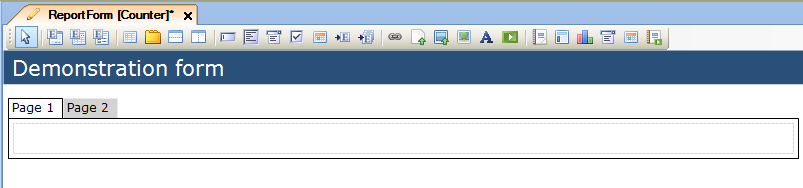
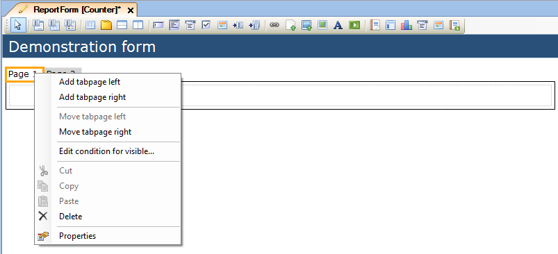
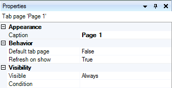

## Description

This section describes how to add tab pages to a form and then configure them.

## Instructions

 **Add a tab container to your form. If you do not know how to add widgets to a form please refer to [this](add-a-widget-to-a-form) article.**

 **If you need additional tab pages, right-click on the tabs and choose 'Add tabpage left' or 'Add tabpage right'**

 **If you want to change the position of tabpages, right-click on the tabs and use the 'Move tabpage left' or 'Move tabpage right' commands.**

 **Change the text on the tabpages by selecting them and then changing the 'Caption' property in the Properties window.**

 **You can set a tabpage to be the default page (which is opened when opening the form) by changing the 'Default page' property to 'True' in the Properties window.**

 **By default, tabpages will refresh when opened. You can change this behavior by setting the 'Refresh on show' to 'False'.**

 **After setting up the tab pages, add content to them using tables and content widgets.**
