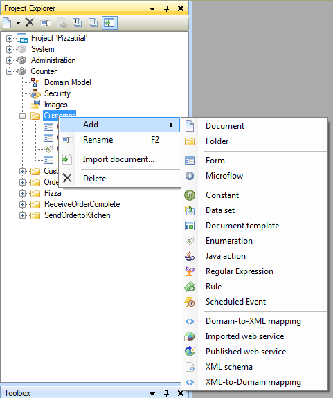
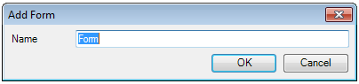
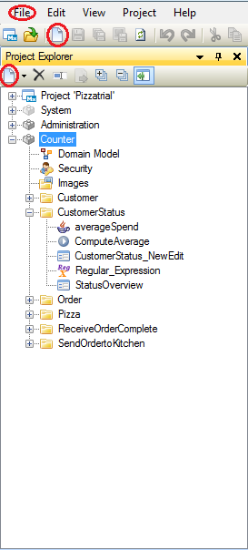
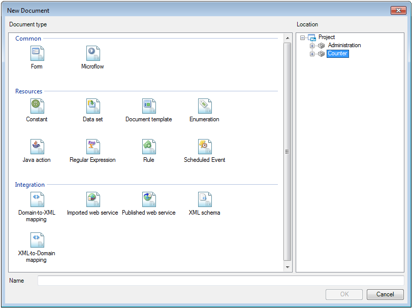

## Description

This section will explain how to add a new document to your project. The related reference guide article can be found [here](https://world.mendix.com/display/NRG/Modules).

## Instructions

### Method 1

 **Right-click on the module or folder you want to add a document to in the Project Explorer.**

Choose 'Add' and select the document type you want to add.

 **Enter a name for the new document.**

For some document types an additional menu will open after this, allowing further configuration.

### Method 2

 **Choose the 'New Document' option.**

This can be done in several locations:

*   Under the 'File' menu.
*   In the toolbar.
*   In the toolbar of the Project Explorer while a module or folder is selected.
*   In the 'Add' menu from method 1.
*   By pressing Control + N.

 **Choose the document type and location in the new menu.**

 **Enter a name for the new document.**

For some document types an additional menu will open after this, allowing further configuration.

