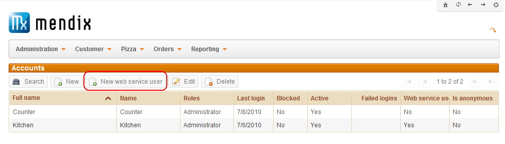
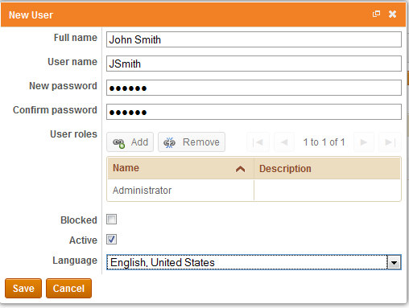

## Description

This section describes how to add web service users to your application, allowing the consumption of an exposed web service. The related reference guide article can be found [here](https://world.mendix.com/display/NRG/Published+Web+Services).

## Instructions

 **Click the 'Run' button to run your application, and then press the 'Open Browser' button or navigate to [localhost:8080](http://localhost:8080).**

 **Log in with the MxAdmin account.**

 **Use the 'Administration' menu to navigate to the 'Users' form.**

 **Click on the 'New web service user'.**

 **In the form that appears, enter the full name of the web service user, as well as the user name and password.**

 **Use the reference set selector to add user roles for the web service user, and use the drop-down menu at 'Language' to configure their language.**

 **Finally press the 'Save' button to store the new web service user.**

