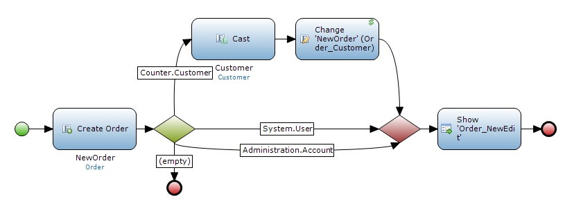
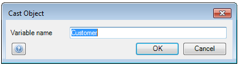

## Description

This section describes cast an object in a microflow. The related reference guide article can be found [here](https://world.mendix.com/pages/releaseview.action?pageId=11437403).

## Instructions

 **Create the microflow with inheritance split. If you do not know how to add activities to a microflow, please refer to [this](https://world.mendix.com/display/howto25/Add+an+activity+to+a+microflow) article.**

 **Add the 'Cast object' activity to the sequence flow directly behind the inheritance split.**

In the above microflow, a new 'Order' object is created. If the user is of the type 'Customer' (a specialization of System.User), the 'Customer' object is cast and then used to set the association between 'Order' and 'Customer'. On the other hand if the user is not a 'Customer', the microflow only creates an 'Order' object and then opens a form.

 **Double-click on the 'Cast object' activity and enter the variable name you want the object you are casting to be identified with in the microflow.**

