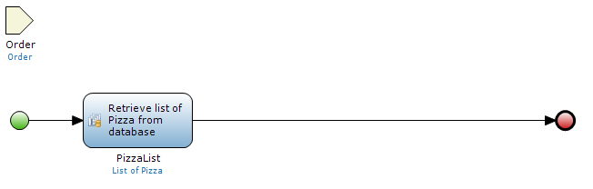
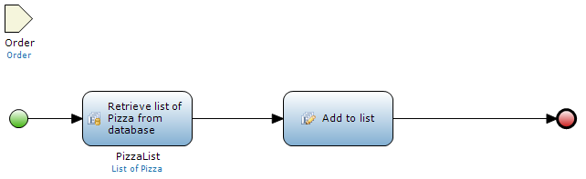
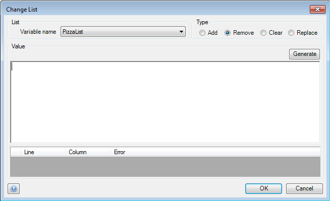
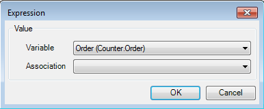

## Description

This section describes how to use a 'Change list' activity to perform operations on a list in a microflow. The related reference guide article can be found [here](https://world.mendix.com/pages/releaseview.action?pageId=11437369).

## Instructions

 **Open the microflow, or if necessary create a new one. If you do not know how to add documents to your project, please refer to [this](https://world.mendix.com/display/howto25/Add+documents+to+a+module) article.**

A list should be created in this microflow; 'Create list' and 'Retrieve' are activities that can do this.

 **Add a 'Change list' activity to the microflow. If you do not know how to add activities to a microflow please refer to [this](https://world.mendix.com/display/howto25/Add+an+activity+to+a+microflow) article.**

 **Double-click on the 'Change list' activity to start configuring it.**

 **Under 'List', select the list you want to perform operations on.**

 **Choose the type of operation you want to perform in the 'Type' section.**

'Add' will add objects to the list, 'Remove' will remove objects, 'Clear' will completely empty the list and 'Replace' will empty the list and then add new objects to it.

 **In the 'Value' section, enter the microflow expression which will result in an object or list of objects of the same entity as the list.**

You can enter the expression manually, or use the 'Generate' button to have the modeler construct a basic expression.

