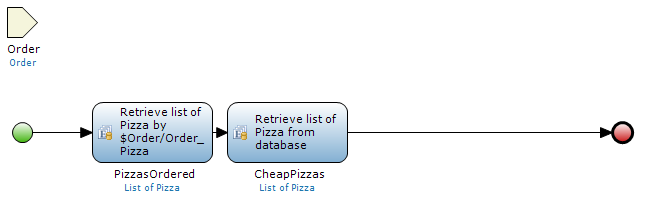
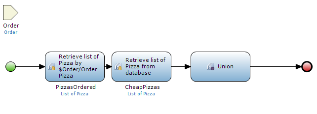
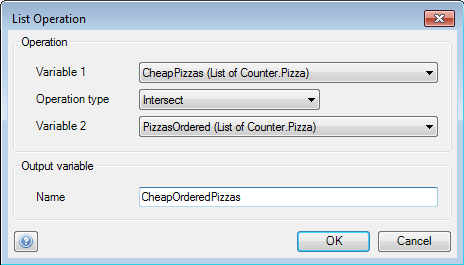

## Description

This section describes how to configure a 'List operation' activity in a microflow.

## Instructions

 **Open the microflow, or if necessary create a new one. If you do not know how to add documents to your project, please refer to [this](add-documents-to-a-module) article.**

A minimum of two lists of the same entity should be created in this microflow; 'Create list' and 'Retrieve' are activities that can do this. In the screenshot 'PizzasOrdered' is a list of 'Pizza' objects associated to the 'Order' object passed to the microflow, whereas 'CheapPizzas' is a list of all the Pizzas which cost less than ten euros.

 **Add a 'List operation' activity to the microflow. If you do not know how to add activities to a microflow please refer to [this](add-an-activity-to-a-microflow) article.**

 **Double-click on the 'List operation' activity to start configuring it.**

 **At 'Variable 1' and 'Variable 2', you can use the drop-down menus to select the lists you want to use for the list operation.**

Note that which list is chosen to be 'Variable 1' and which list is chosen to be 'Variable 2' has an impact on the result of some of the list operations.

 **Use the drop-down at 'Operation type' to choose the list operation you want to perform. The return from the list operation depends on which operation type you chose.**

 **If you chose 'Union', 'Intersect' or 'Subtract', a list operation will be carried out with a new list as return.**

For example in the screenshot an 'Intersect' operation with 'PizzasOrdered' and 'CheapPizzas' (In this case it does not matter which list is 'Variable 1' and which is 'Variable 2'.) will result in a new list with all 'Pizza' objects associated to the 'Order' object that cost less than 10 euros.

 **If you choose 'Contains' or 'Equals', the return will be a boolean.**

For example using 'Contains' with 'CheapPizzas' as 'Variable 1' and 'PizzasOrdered' as 'Variable 2' will check if 'CheapPizzas' contains all the 'Pizza' objects in 'PizzasOrdered', in other words if all the ordered pizzas cost less than 10 euros, and return the result as boolean.

 **At 'name' you can specify the name for the output variable from the list operation.**
