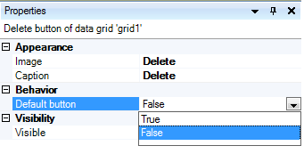
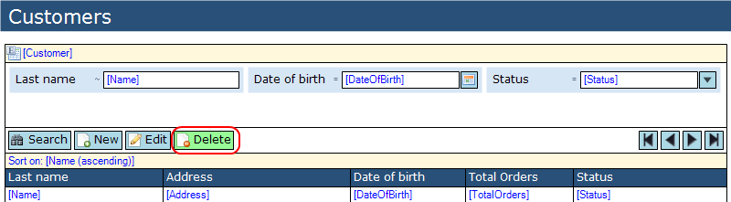
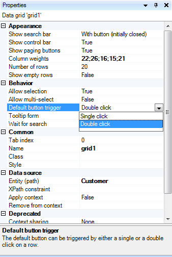

## Description

This section describes how to configure the default button of a data grid.

## Instructions

 **Open the form containing the data grid, and select the button you'd like to use as default button.**

 **In the Properties window, change the 'Default button' property to 'True' using the drop down menu.**

 **The button will now change its background color to indicate it's the default button.**

 **You can change the default button trigger by selecting the data grid, and changing the 'Default button trigger' property in the Properties menu.**

