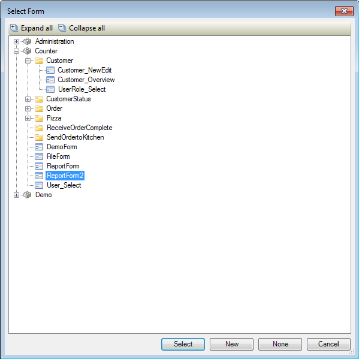
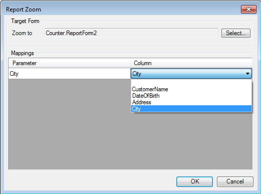

## Description

This section describes how to configure zooming for a basic report. The related reference guide article can be found [here](https://world.mendix.com/pages/releaseview.action?pageId=12387630).

## Instructions

 **Open the form with the report pane containing the basic report.**

 **Select the basic report, then click the '...' button next to 'Zooming' in the Properties window.**

 **In the menu that appears, choose the form you want to open when double-clicking in the report.**

If the form which is opened contains another report, the columns of the current report can be mapped to the parameters of the report in the other form..

