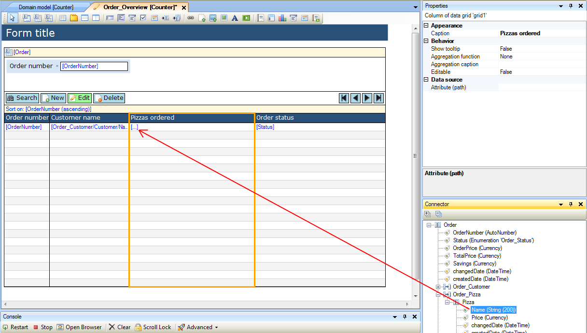
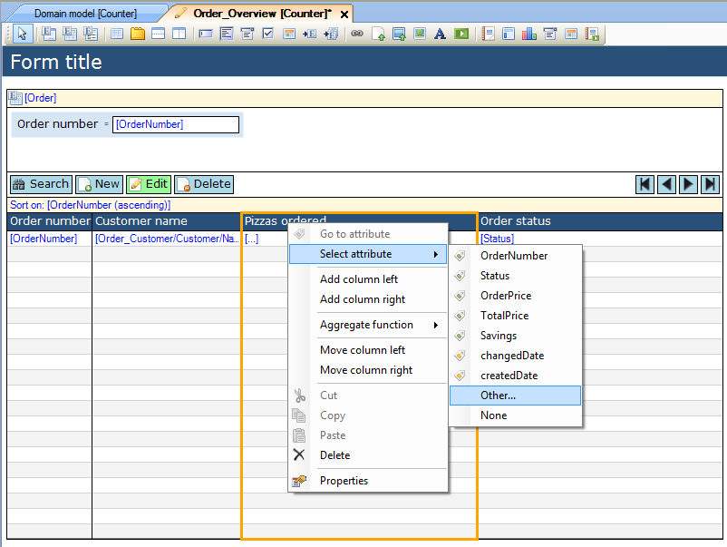
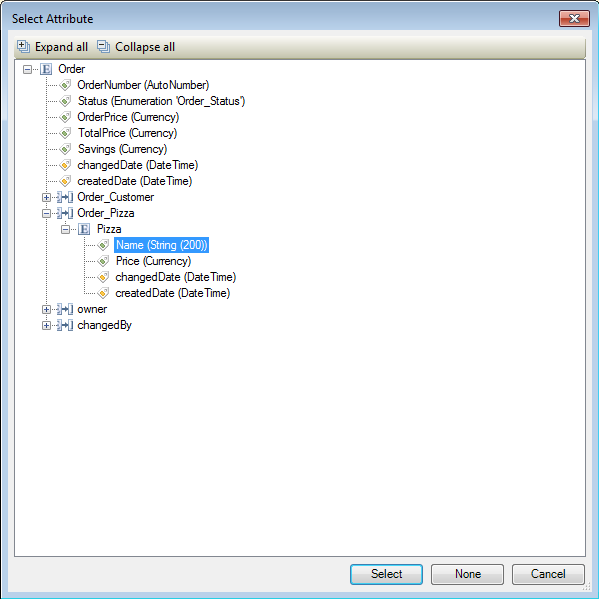

## Description

This section describes how to connect an attribute of an entity to a column of a data grid. The related reference guide article can be found [here](https://world.mendix.com/pages/releaseview.action?pageId=9699841).

## Instructions

### Method 1

 **Open the form and select the column to which you want to connect the attribute.**

 **In the Connector menu, look up the attribute of the grid entity or of an associated entity.**

 **Click on the attribute and drag it to the column you want to connect it to.**

### Method 2

 **Open the form and select the column to which you want to connect the attribute.**

 **Right-click on the column, and select the attribute from the 'Select attribute' menu. If you can not find the attribute you'd like to connect in the menu, choose 'Other...'. Alternatively you can click the '...' button next to the 'Attribute (path)' property in the Properties window.**

 **If you chose the 'Other...' option or pressed the '...' button in the Properties window, a new menu will now appear. In this menu you can select the attribute you want to connect to the column.**

