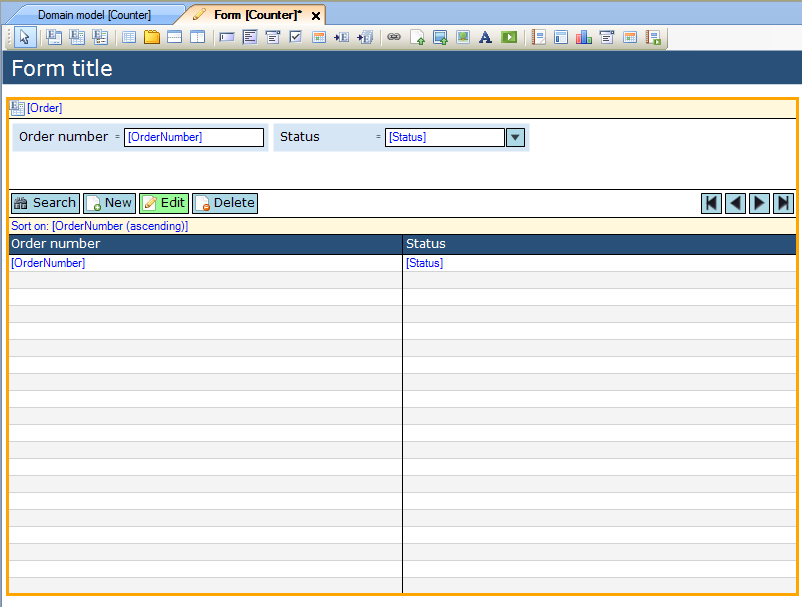
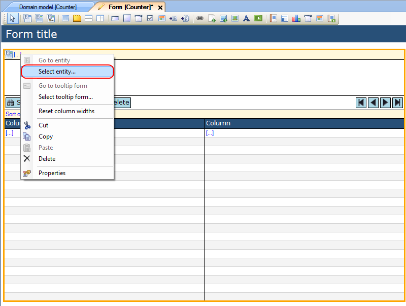
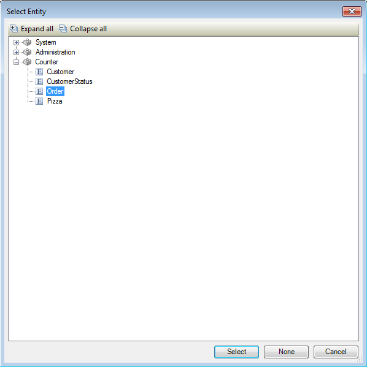

## Description

This section describes how to connect an entity to a data grid. The related article can be found [here](https://world.mendix.com/pages/releaseview.action?pageId=9699364).

## Instructions

 **Add the data grid to your form. If you do not know how to add widgets to a form, please refer to [this](add-a-widget-to-a-form) article.**

### Method 1

 **Select the data grid. Look up the entity you want to connect to it in the Connector window, click on it and drag it to the yellow header of the data grid.**

 **You will be asked if you want to have the Modeler fill the data grid based on the attributes of the entity. If you choose 'Yes', the Modeler will automatically create columns and connect them to the attributes of the entity; if you choose 'No' the entity is connected to the data grid, but you have to add the columns and connect them to the attributes yourself.**

### Method 2

 **Select the data grid and right-click on it. Choose 'Select entity...' from the menu that appears. Alternatively you could click the '...' next to the 'Entity (path)' property in the Properties window.**

 **In the menu that appears, choose the entity you want to connect to the data grid.**

 **You will be asked if you want to have the Modeler fill the data grid based on the attributes of the entity. If you choose 'Yes', the Modeler will automatically create columns and connect them to the attributes of the entity; if you choose 'No' the entity is connected to the data grid, but you have to add the columns and connect them to the attributes yourself.**

