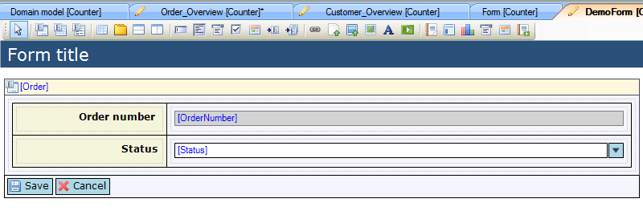
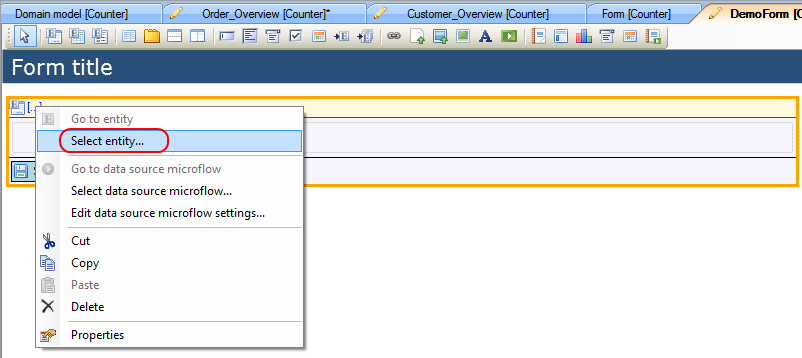
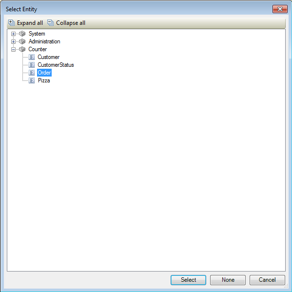

## Description

This section describes how to connect an entity to a data view. The related reference guide article can be found [here](https://world.mendix.com/pages/releaseview.action?pageId=9699362).

## Instructions

 **Add the data view to your form. If you do not know how to add widgets to a form, please refer to [this](https://world.mendix.com/display/howto25/Add+a+widget+to+a+form) article.**

### Method 1

 **Select the data view. Look up the entity you want to connect to it in the Connector window, click on it and drag it to the yellow header of the data grid.**

 **You will be asked if you want to have the Modeler fill the data view based on the attributes of the entity. If you choose 'Yes', the Modeler will automatically create content widgets and labels and connect them to the attributes of the entity. If you choose 'No' the entity is connected to the data view, but you have to add the content widgets and labels and connect them to the attributes yourself.**

### Method 2

 **Select the data view and right-click on it. Choose 'Select entity...' from the menu that appears. Alternatively you could click the '...' next to the 'Entity (path)' property in the Properties window.**

 **In the menu that appears, choose the entity you want to connect to the data view.**

 **You will be asked if you want to have the Modeler fill the data view based on the attributes of the entity. If you choose 'Yes', the Modeler will automatically create content widgets and labels and connect them to the attributes of the entity. If you choose 'No' the entity is connected to the data view, but you have to add the content widgets and labels and connect them to the attributes yourself.**

[(Back to Top)](connect-an-entity-to-a-data-view)