## Description

This section describes how to consume a web service in your project. The related reference guide article can be found [here](/refguide4/imported-web-services).

## Instructions

 **Add an Imported web service to your project. If you do not know how to add documents to your project, please refer to [this](add-documents-to-a-module) article.**

 **Double-click on the imported web service in the Project Explorer to start configuring it.**

 **You can change the name of the published web service at 'Name', whereas 'Documentation' allows input of text describing the design purpose of the web service.**

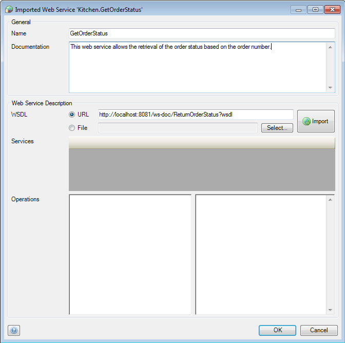

 **At 'WSDL' under 'Web service description', choose the WSDL to be used for this imported web service. You can either choose to use a URL, or load a file from your harddisk. After this, click on the 'Import' button to fetch the services and operations in the WSDL.**

 **You can now review the services and operations available to the imported web service in the bottom sections of the window.**

 **Create the microflow which you will use to call the imported web service.**

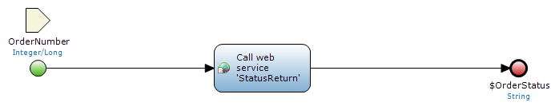

Make sure the microflow either creates the variables required as arguments for the web service call, or has those passed to it.

 **Add the 'Call web service activity to the microflow, and double-click on it to start configuring it. If you do not know how to add activities to a microflow, please refer to [this](add-an-activity-to-a-microflow) article.**

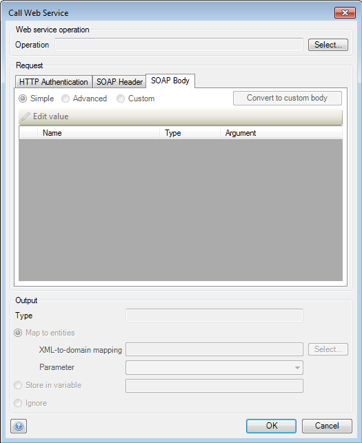

 **Press the 'Select...' button next to 'Operation' to bring up a window allowing you to choose the operation you want to use for this web service call.**

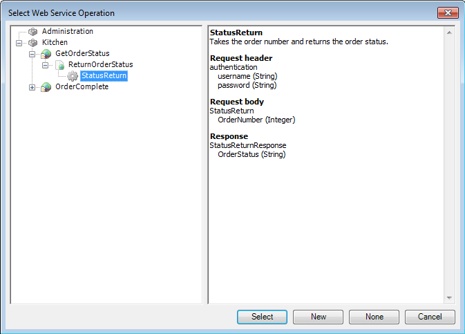

 **In the 'Request' section, you can configure the SOAP body, which contains the parameters needed to execute the web service request. The radio buttons allow you to choose the type of SOAP body to use. Use the 'Edit value' button to change the Domain-to-XML mapping or the variables from the microflow used as input arguments.**

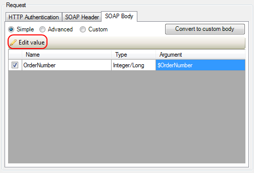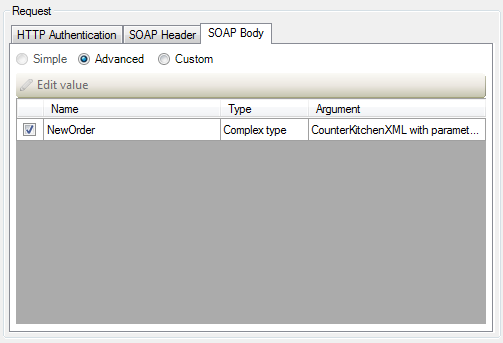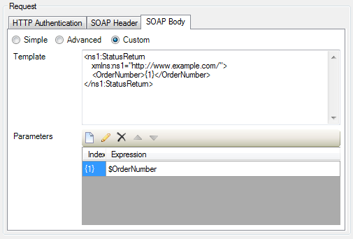

Use the 'Simple' option if the imported web service requires only primitive arguments. If the web service call needs a list of objects, or if domain model entities need to be mapped to XML elements, the 'Advanced' setting can be used. Finally, 'Custom' allows for the definition of a custom XML body with parameters.

 **If the imported web service requires authentication, use the 'SOAP Header' tab to enter the authentication information using the 'Edit value' button.**

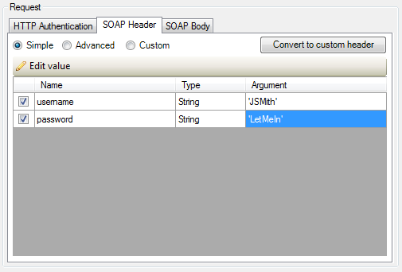

Again there are three input options. The 'Simple' option can be used if only static values or variables from the microflow need to be passed to the imported web service. If a Domain-to-XML mapping is needed for authentication, the 'Advanced' option should be used. Finally, the 'Custom' option allows for the definition of a custom XML header with the possibility to specify parameters.

 **Use the 'HTTP Authentication' tab to enter HTTP authentication information if the Mendix Business Server should use this before calling the web service.**

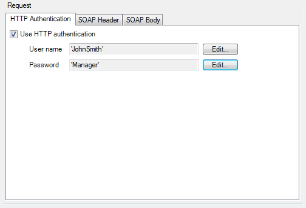

 **Finally, in the 'Output' section, you can configure the handling of the return from the web service call. If the return is a primitive, you can store it in a variable which you can name at 'Store in variable'. If the return is a complex XML structure, you can use an XML-to-Domain mapping to map the XML elements to domain model entities. You can also choose to ignore the return.**

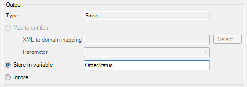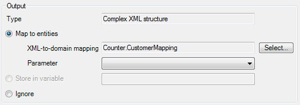

 **Your imported web service is now ready to be used in your application.**
