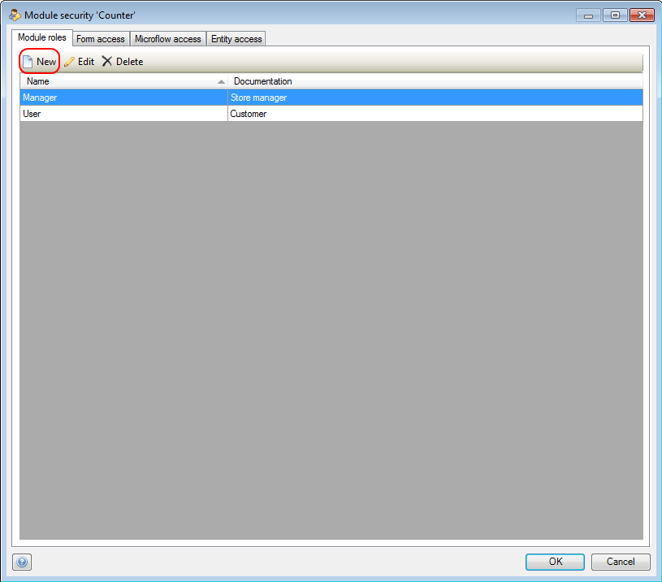
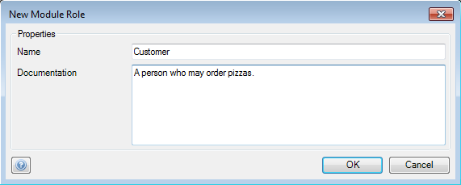

## Description

This section explains how to add a new module user role to a module. The related reference guide article can be found [here](https://world.mendix.com/pages/releaseview.action?pageId=9208549).

## Instructions

 **Open the module security menu by double-clicking on 'Security' in the Project Explorer, under the module you want to configure.**

 **Press the 'New' button in the 'Module roles' tab.**

 **Enter the name for the new module role, and optionally add documentation describing the new role.**

[(Back to Top)](create-a-module-role)