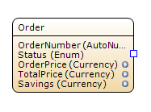
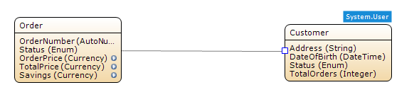
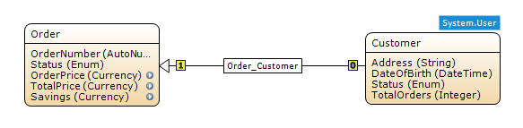
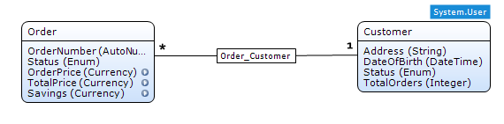
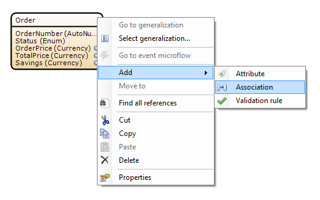
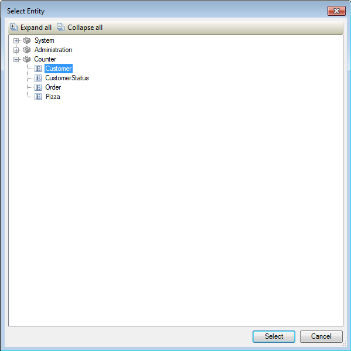

## Description

This section describes how to create an association between two entities. The related reference guide article can be found [here](https://world.mendix.com/pages/releaseview.action?pageId=9208493).

## Instructions

### Method 1

 **Move the mouse pointer over the edge of the entity you would like to have as parent in this association.**

 **Once a blue square appears, press the left mouse button and hold it.**

 **Hold the left mouse button and move the pointer to the edge of the entity you want to be the child in this association.**

 **Once a blue square appears, release the button.**

 **The association will now be created.**

The above screenshots show the same association; the first shows it using hierarchical notation, whereas the second shows it using UML notation, which was added in version 2.5.1\. You can switch between these modes using the Edit > Preferences menu.

### Method 2

 **Right-click on the entity you intend to have as parent in this association.**

 **Go to the 'Add' menu and choose 'Association'.**

 **In the menu that appears, select the entity you want to be the child in this association, and press the 'Select' button.**

 **The association will now be created.**

The above screenshots show the same association; the first shows it using hierarchical notation, whereas the second shows it using UML notation, which was added in version 2.5.1\. You can switch between these modes using the Edit > Preferences menu.

