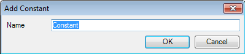
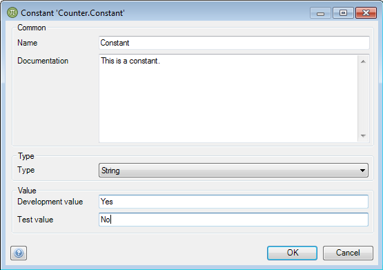

## Description

This section describes how to add a constant to your module and configure it. The related reference guide article can be found [here](https://world.mendix.com/pages/releaseview.action?pageId=9208527).

## Instructions

 **Add a constant to the module of your choice. If you do not know how to add documents to a project, please refer to [this](https://world.mendix.com/display/howto25/Add+documents+to+a+module) article.**

 **Enter a name for the new constant.**

 **In the new menu, you can optionally add documentation describing the constant, choose its type, and choose its values, depending on the configuration.**

For example you might want a constant which contains the location of a web service, having different values depending on whether the application is run in a development or test configuration.

[(Back to Top)](create-and-configure-a-constant)