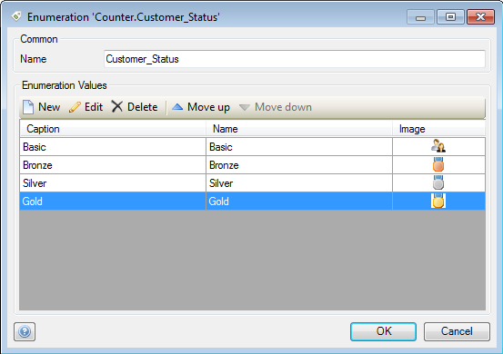
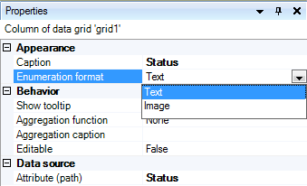
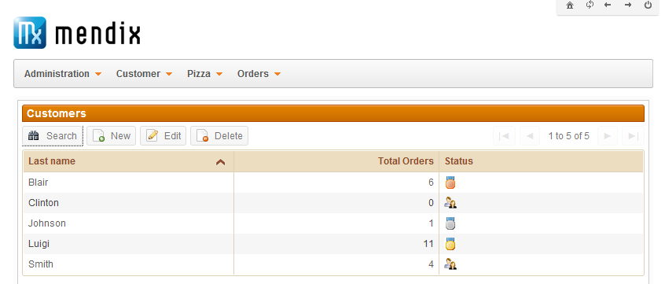

## Description

This section describes how you can display icons for enumeration values in a data grid column, rather than their captions. The related reference guide article can be found [here](https://world.mendix.com/pages/releaseview.action?pageId=9699841).

## Instructions

 **Make sure the values of the enumeration you are using have an image attached. If you do not know how to configure an enumeration, please refer to [this](create-a-multi-language-enumeration) article.**

 **Select the column of the data grid to which the enumeration attribute is connected.**

 **In the Properties window, use the drop down menu to set the 'Enumeration format' property to 'Image'.**

 **The enumeration values will now be displayed as icons instead of captions.**

