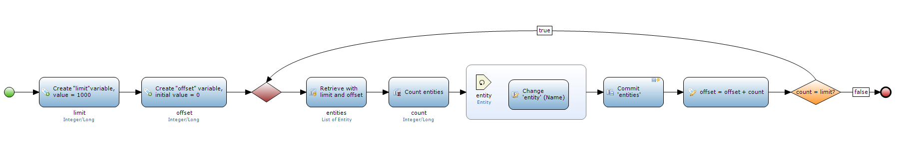

## Description

This section describes how to retrieve batches of objects, manipulate them and commit them in an efficient way using version 4 features. In version 3 you would have to write quite some Java code to accomplish the same (e.g. batches, retrieving with limit and offset).

## Instructions

 Create a microflow and create two variables, one for limit and one for offset. Initialize limit on the size you would like the batches to have. Initialize offset on zero.

 Create a while loop by first putting a merge and then a split which returns to the merge as long as there are batches of objects to process.

 Put the meat of the microflow between the merge and the split. Retrieve a batch of objects using the defined limit and offset variables. Afterwards manipulate the objects by changing, committing or deleting them.



When deleting batches of objects the offset should always be equal to zero as all retrieved objects are removed from the table they are in, which means the next batch starts at zero again.



 All done! See the picture below for an example.

