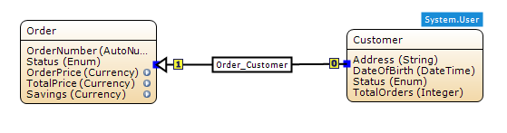
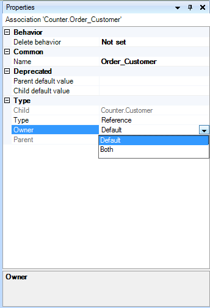
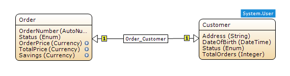
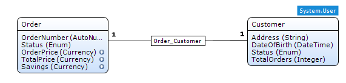

## Description

This section describes how you can change the properties of an association to make both entities its owner.

## Instructions

 **Create the association if it does not exist yet. If you do not know how to do this, refer to [this](create-an-association) article.**

 **Select the association.**

 **In the Properties window, use the drop down menu next to 'Owner' to set it to 'Both'.**

 **Both entities are now owner of the association; this is indicated in the domain model.**

The above screenshots show the same association; the first shows it using hierarchical notation, whereas the second shows it using UML notation, which was added in version 2.5.1\. You can switch between these modes using the Edit > Preferences menu.

