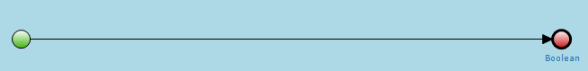
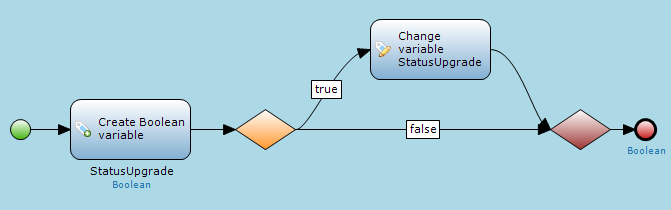
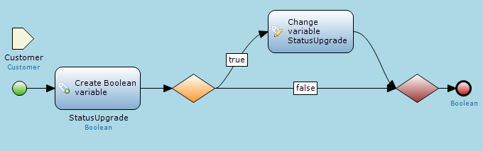
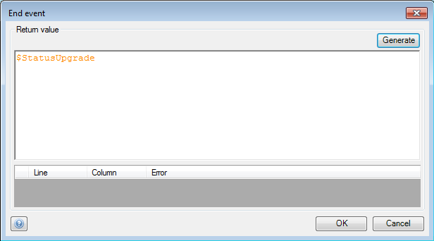
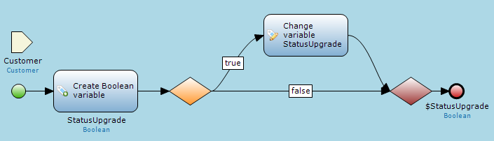

## Description

This section describes how to configure a rule. The related reference guide article can be found [here](https://world.mendix.com/pages/releaseview.action?pageId=9208525).

## Instructions

 **Add a new rule to your project. If you do not know how to add documents to your project, please refer to [this](https://world.mendix.com/display/howto25/Add+documents+to+a+module) article.**

 **Add activities to the rule; this is done in the same way as for microflows. If you do not know how to do this, please refer to [this](https://world.mendix.com/display/howto25/Add+an+activity+to+a+microflow) article.**

Note that for rules you cannot use activities that change data in the database, interact with the client, call web services, generate documents or import XML.

 **Add the parameters you need for the execution of the rule. These parameters will be passed to the rule by the exclusive split.**

 **Set the variable (either a boolean or enumeration value) which will be returned to the exclusive split. Double-clicking on the End event will bring up a window you can use to enter a microflow expression for the variable.**

You can change the return type of the rule in the Properties window when no sequence flow or activity is selected using the drop-down menu at 'Return type'.

 **Your rule should now be fully configured for use in an exclusive split.**

[(Back to Top)](set-up-a-rule)