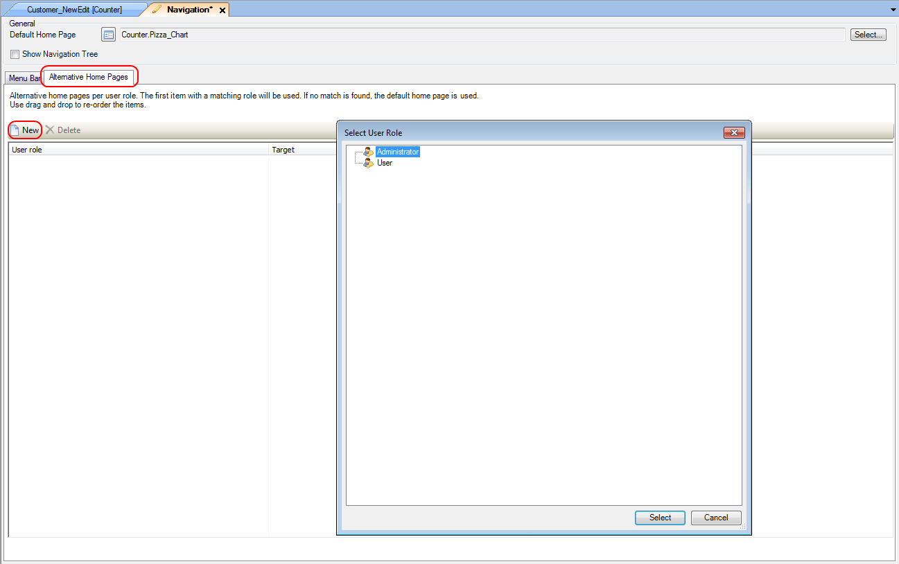
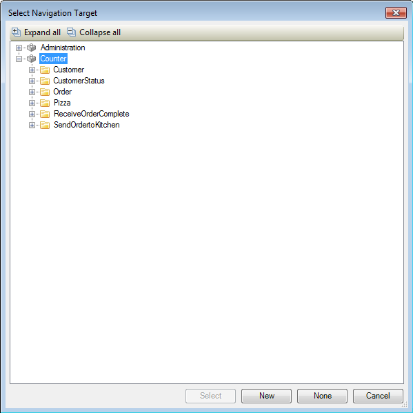

## Description

This section describes how you can configure your application to display different home pages based on the project user role of the user that logged in.

## Instructions

 **Open the Navigation menu by double-clicking on 'Navigation' in the Project Explorer.**

 **Go to the 'Alternative Home Pages' tab. Press the 'New' button here and in the menu that appears choose the project user role for which you'd like to add the alternative home page.**

 **Select the newly created entry, right-click and choose 'Select Target...'. In the new menu select the form you'd like to set as alternative home page and press 'Select'.**

Alternatively you could open the same menu by pressing the '...' button next to 'Target' in the Properties window. A third option would be to click on the form you want to set as alternative home page in the Connector window, hold the left mouse button and drag it to the newly created entry.
