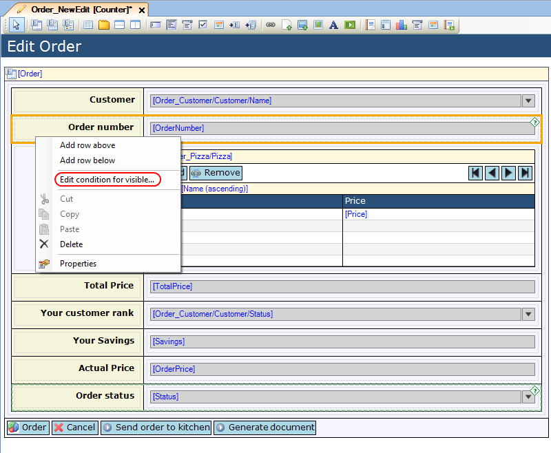
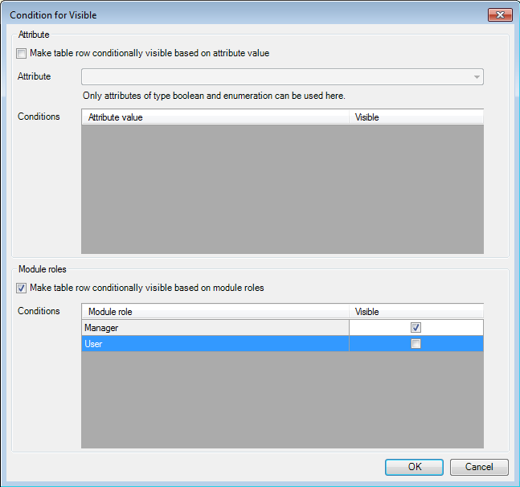

## Description

This section describes how you can configure widgets to be visible based on the user's module role.

## Instructions

 **Select the row for which you want to set the conditional visibility.**

 **Right-click on the row and choose 'Edit condition for visible...'. Alternatively you could click the '...' button next to 'Visible' in the Properties window.**

 **Put a check mark next to 'Make table row conditionally visible based on module roles'.**

 **You will now be able to put check marks next to the available module roles to indicate whether or not the row should be visible for that role.**

