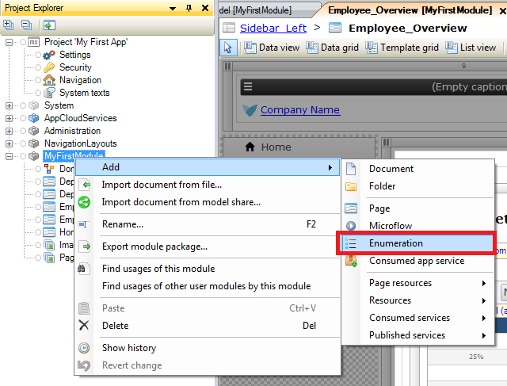
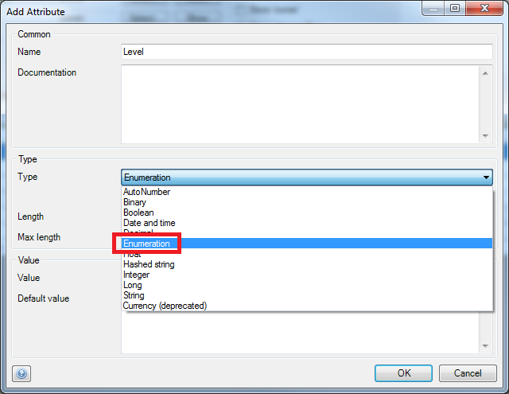
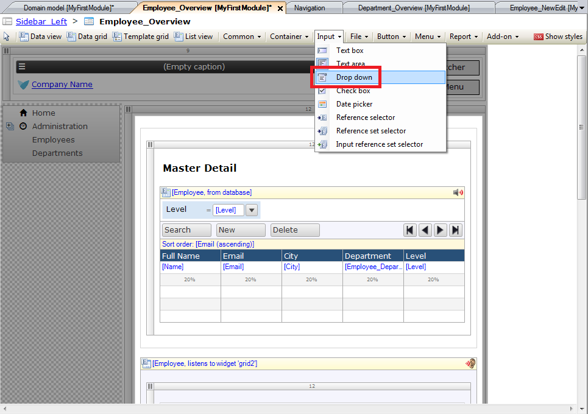
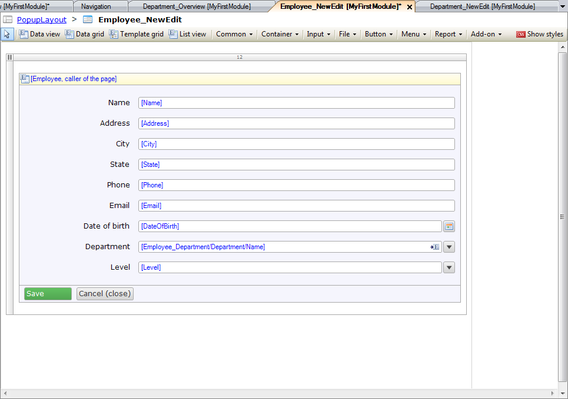
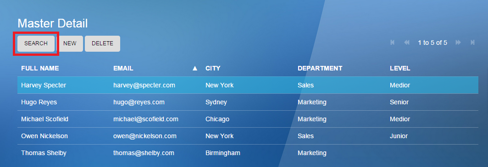
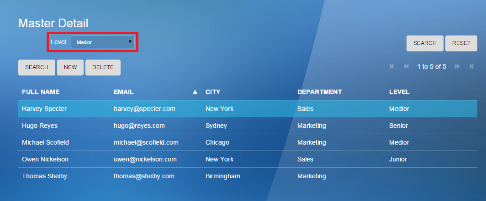
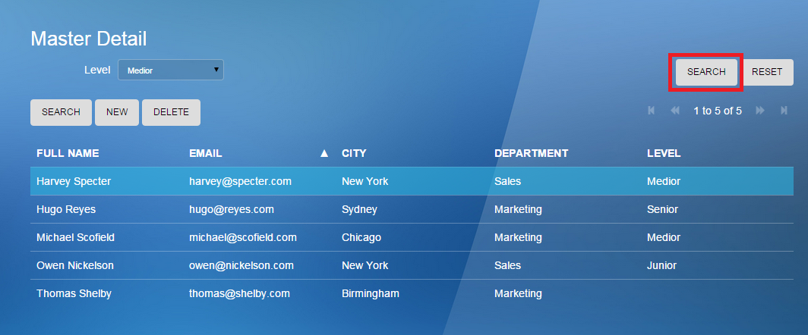
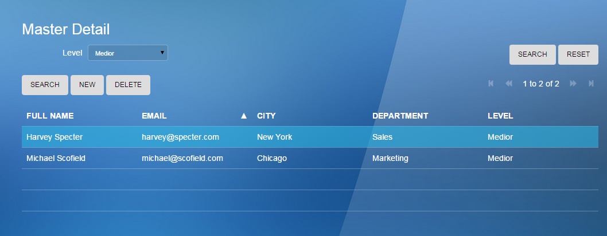

# Build a simple HRM app 4: Enrich the GUI with Filter Options 

<table><thead><tr><th class="confluenceTh">Mendix Version</th><th class="confluenceTh">Create Date</th><th colspan="1" class="confluenceTh">Modified Date</th></tr></thead><tbody><tr><td class="confluenceTd">5</td><td class="confluenceTd">Aug 18, 2015 14:13</td><td colspan="1" class="confluenceTd">Oct 14, 2015 09:54</td></tr></tbody></table>

This how-to is based on the video "Build a simple HRM app: Enrich the GUI with Filter Options", which is part of the [Getting Started videos](http://gettingstarted.mendixcloud.com/link/courses/gettingstarted).

This is the fourth how-to in a series of five on how to create a simple HRM application. In this how-to you will enrich the user interface by adding filter options.

**After completing this how-to you will know:**

*   How to create an enumeration
*   How to build a search field

## 1. Preparation

Before you can start with this how-to, make sure you have completed the following prerequisites.

*   [Build a simple HRM app 3: Show related data in the GUI](14091713)

## 2\. Enrich the user interface

Let's assume that you want to divide your employees into three different levels: Junior, Medior and Senior. To achieve this you need to use enumerations.

### 2.1 Create an enumeration

1.  Right-click on the **MyFirstModule** module.
2.  Click on **Add > Enumeration**. Click [here](/refguide5/Enumerations) to learn more about enumerations.
     
3.  Enter _Level_ in the **Name** field.
     
4.  Click **OK**.
5.  Click **New** to add a new enumeration value.
    
6.  Enter _Junior_ in the **Caption** field.
     
7.  Click **OK**.
8.  Repeat steps 5 through 7 for enumeration values _Medior_ and _Senior_.
    
9.  Click **OK.**

### 2.2 Add a new attribute with type enumeration

1.  Open the **Domain Model** of the MyFirstModule module.
2.  Open entity **Employee**. 
3.  Click on **New** to add a new attribute.
4.  Enter _Level_ in the **Name** field.
5.  Select **Enumeration** in the **Type** drop down.
     
6.  Select enumeration **Level** of the MyFirstModule module.
    
7.  Click **Select**.
8.  Click **OK**.
9.  Click **OK**.

### 2.3 Add new attribute to the overview page

1.  Open the page **Employee_Overview** of the MyFirstModule module.
2.  Right-click on the **Department **column.
3.  Click on **Add column right**.
4.  Change the caption of the column to _Level_.
5.  Drag-and-drop the attribute **Level** of the entity Employee from the connector to the Level column on the data grid.
6.  Right-click on the Master Detail data grid.
7.  Click on **Reset column widths**.
    

### 2.4 Add a search field 

1.  Right-click on the **search bar**.
2.  Click on **Add search field > Drop-down**.
     
3.  Change the **caption** of the new search field to _Level_.
4.  Drag-and-drop the attribute **Level** of the entity Employee from the connector to the new search field.
     

### 2.5 Add a drop-down input field

1.  Click on **Input**.
2.  Click on **Drop down**.
     
3.  Add the drop down beneath the department field in the user details container.
     
4.  Drag-and-drop the attribute **Level** of the entity Employee from the connector to the new drop down.
     
5.  Open the page **Employee_NewEdit** of the MyFirstModule module.
6.  Repeat steps 1 through 4 on this page.
     

## 3\. View your app

1.  Click on **Run in Sandbox**.
2.  Click on the **Save and continue** button.
3.  Click on **View App**.
4.  Click on **Employees** in the navigation list.
5.  Click on **NEW** to add a new employee.
6.  Enter _Owen Nickelson_ in the **Name** field.
7.  Enter _owen@nickelson.com_ in the **Email** field.
8.  Enter _New York_ in the **City** field.
9.  Select _Sales_ in the **Department** dropdown.
10.  Select _Junior_ in the **Level** dropdown.
11.  Click on **SAVE**.
12.  Repeat steps 4 till 10 with the following details:

    <table><thead><tr><th class="confluenceTh">Name</th><th class="confluenceTh">Email</th><th class="confluenceTh">City</th><th class="confluenceTh">Department</th><th colspan="1" class="confluenceTh">Level</th></tr></thead><tbody><tr><td class="confluenceTd">Harvey Specter</td><td class="confluenceTd">harvey@specter.com</td><td class="confluenceTd">New York</td><td class="confluenceTd">Sales</td><td colspan="1" class="confluenceTd">Medior</td></tr><tr><td class="confluenceTd">Hugo Reyes</td><td class="confluenceTd">hugo@reyes.com</td><td class="confluenceTd">Sydney</td><td class="confluenceTd">Marketing</td><td colspan="1" class="confluenceTd">Senior</td></tr><tr><td colspan="1" class="confluenceTd">Michael Scofield</td><td colspan="1" class="confluenceTd">michael@scofield.com</td><td colspan="1" class="confluenceTd">Chicago</td><td colspan="1" class="confluenceTd">Marketing</td><td colspan="1" class="confluenceTd">Medior</td></tr></tbody></table>
13.  Click on **SEARCH** to open the search bar.
     

14.  Select level **Medior**.
    
15.  Click on **SEARCH**.
    

    
    Only the employees with level Medior will be shown. Click [here](14091778) to go the fifth how-to on how to create a simple HRM application and learn how to smarten up your app with business logic.

## 4\. Related content

*   [Build a simple HRM app 1: Create, manage and deploy the app](/howto50/Build+a+simple+HRM+app+1%3A+Create%2C+manage+and+deploy+the+app)
*   [Build a simple HRM app 1: Create, manage and deploy the app](/howto6/Build+a+simple+HRM+app+1%3A+Create%2C+manage+and+deploy+the+app)
*   [Build a simple HRM app 2: First steps in building a rich GUI](/howto50/Build+a+simple+HRM+app+2%3A+First+steps+in+building+a+rich+GUI)
*   [Build a simple HRM app 2: First steps in building a rich GUI](/howto6/Build+a+simple+HRM+app+2%3A+First+steps+in+building+a+rich+GUI)
*   [Build a simple HRM app 3: Show related data in the GUI](/howto50/Build+a+simple+HRM+app+3%3A+Show+related+data+in+the+GUI)
*   [Build a simple HRM app 3: Show related data in the GUI](/howto6/Build+a+simple+HRM+app+3%3A+Show+related+data+in+the+GUI)
*   [Build a simple HRM app 4: Enrich the GUI with Filter Options](/howto50/Build+a+simple+HRM+app+4%3A+Enrich+the+GUI+with+Filter+Options)
*   [Build a simple HRM app 4: Enrich the GUI with Filter Options](/howto6/Build+a+simple+HRM+app+4%3A+Enrich+the+GUI+with+Filter+Options)
*   [Build a simple HRM app 5: Smarten up your app with business logic](/howto50/Build+a+simple+HRM+app+5%3A+Smarten+up+your+app+with+business+logic)
*   [Build a simple HRM app 5: Smarten up your app with business logic](/howto6/Build+a+simple+HRM+app+5%3A+Smarten+up+your+app+with+business+logic)

Learn more about this topic using the following helpful links:

*   [Enumerations](/refguide5/Enumerations)
*   [Search Bar](/refguide5/Search+Bar)