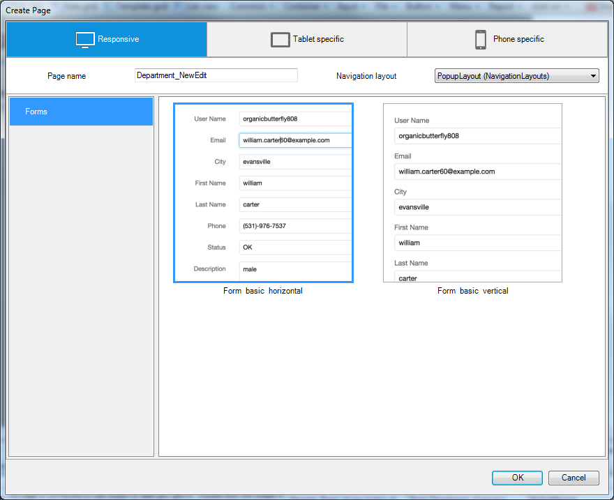
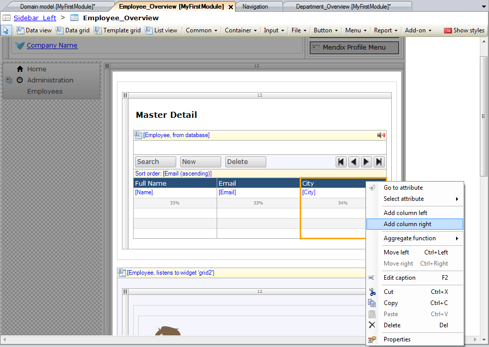
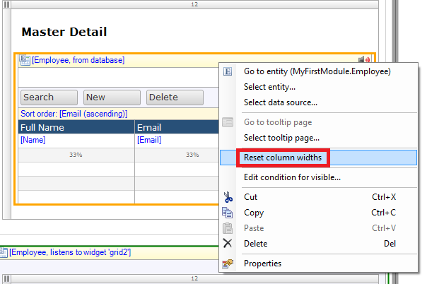
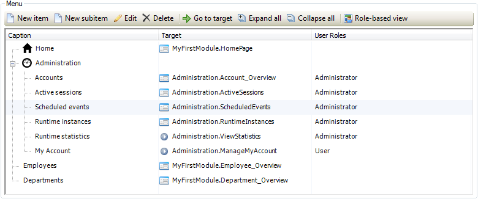
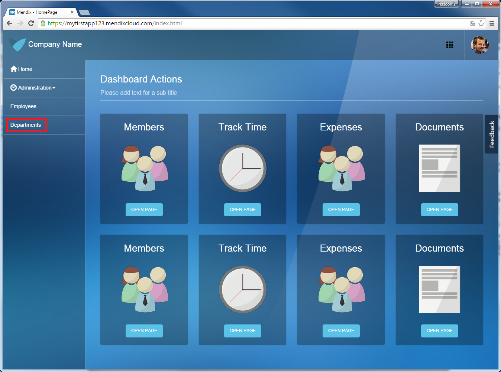
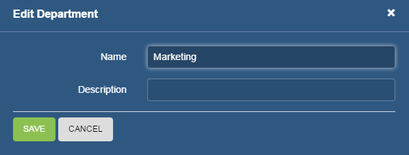
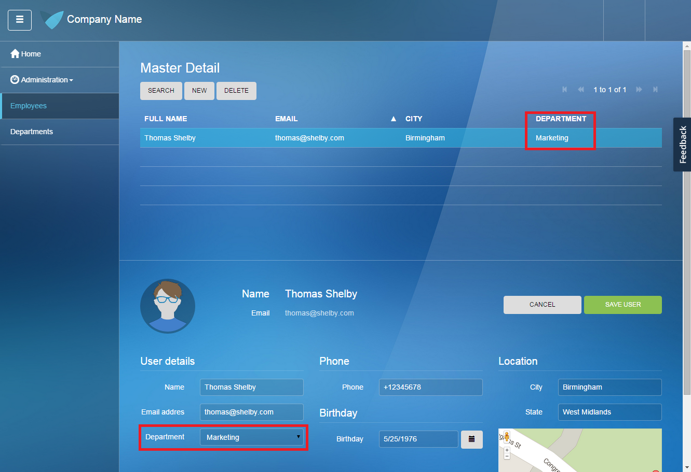

# Build a simple HRM app 3: Show related data in the GUI 

<table><thead><tr><th class="confluenceTh">Mendix Version</th><th class="confluenceTh">Create Date</th><th colspan="1" class="confluenceTh">Modified Date</th></tr></thead><tbody><tr><td class="confluenceTd">5.18+</td><td class="confluenceTd">Aug 18, 2015 10:00</td><td colspan="1" class="confluenceTd">Oct 14, 2015 09:53</td></tr></tbody></table>

This how-to is based on the video "Build a simple HRM app: Show related data in the GUI", which is part of the [Getting Started videos](http://gettingstarted.mendixcloud.com/link/courses/gettingstarted).

This is the third how-to in a series of five on how to create a simple HRM application. In this how-to you will expand your app with management pages for departments and devide employees into departments.

**After completing this how-to you will know:**

*   How to create a relation between two entities

## 1. Preparation

Before you can start with this how-to, make sure you have completed the following prerequisites.

*   [Build a simple HRM app 2: First steps in building a rich GUI](Build+a+simple+HRM+app+2+First+steps+in+building+a+rich+GUI)

## 2\. Expand your app

In this chapter you will create an association between two entities and use the attributes of one entity in the pages of another entity.

### 2.1 Create an entity

1.  Open the **Domain Model** of the MyFirstModule module.
2.  Click on **Entity** to create a new entity.
3.  Enter _Department_ in the **Name** field.
4.  Click on **New** to add a new attribute.
5.  Enter _Name_ in the **Name** field.
6.  Select **String** as the **Type** dropdown.
7.  Click **OK**.
8.  Repeat steps 4 through 7 for the following attribute:

    <table><thead><tr><th class="confluenceTh">Name</th><th class="confluenceTh">Type</th></tr></thead><tbody><tr><td class="confluenceTd">Description</td><td class="confluenceTd">String</td></tr></tbody></table>

    The entity will look like this:

    

### 2.2 Create an association

1.  Click on the border of the **Employee** entity.
2.  Drag a line to the **Department** entity.

    

    This creates an association between the two entities so they can use each others data. Click [here](/refguide5/Associations) to learn more about associations. 

### 2.3 Create pages for the Department entity

1.  Right-click on the **MyFirstModule** module.
2.  Click on **Add > Page**.
3.  Enter _Department_Overview_ in the **Page name** field.
4.  Click on **Grids**.
5.  Select **Datagrid basic**.
6.  Select _Sidebar_Left_ in the **Navigation layout** dropdown.
    

7.  Click **OK**.
8.  Select the data grid.
9.  Drag-and-drop the **Department **entity from the connector to the data grid.
     
10.  Select the **Auto-Fill** option.
11.  Click **OK**.
12.  Right-click on the **New** button.
13.  Click on **Generate page**.
14.  Enter _Department_NewEdit_ in the **Page name** field.
15.  Select **Form basic horizontal**.
16.  Select _PopupLayout_ in the **Navigation layout** dropdown.
     

17.  Click **OK**.

### 2.4 Add department attributes to the employee overview page

1.  Open the page **Employee_Overview** of the Responsive module.
2.  Right-click on the **City** column.
3.  Click on **Add column right**.
    
4.  Change the caption of the column to _Department_.
5.  Expand the association **Employee_Department** in the connector.
6.  Expand the entity **Department**. 
7.  Drag-and-drop the **Name** attribute of the entity Department from the connector to the Department column on the data grid.
     
8.  Right-click on the Master Detail data grid.
9.  Click on **Reset column widths**.
     
10.  Click on **Input**.
11.  Click on **Reference selector**.
     
12.  Add the reference selector below the email field in the user details container.
    
13.  Drag-and-drop the attribute **Name** of the entity Department from the connector to the new reference selector.
    
    The reference selector now allows you to select a department while editing an employee.
14.  Open the page **Employee_NewEdit** of the Responsive module. 
15.  Click on **Input**.
16.  Click on **Reference selector**.
17.  Add the reference selector beneath the DateOfBirth field.
     
18.  Drag-and-drop the attribute **Name** of the entity Department from the connector to the new reference selector.
    

    The reference selector now allows you to select a department while creating an employee.

### 2.5 Add the department overview page to the navigation

To view a page in your app, you need to add a menu item so you can navigate to the page.

1.  Open the **Navigation** of the project.
2.  Click **New item** to add a new menu item.
3.  Enter _Departments_ in the **Caption** field.
4.  Select the **Department_Overview** page of the MyFirstModule module.
5.  Click **Select**.
6.  Click **OK**.
      

## 3\. View your app

1.  Click on **Run in Sandbox**.
2.  Click on the **Save and continue** button.
3.  Click on **View App**.

    At the left side of your app the menu item _Departments_ is shown.
     
4.  Click on **Departments**.
5.  Click **NEW** to add a new department.
     
6.  Enter _Marketing_ in the **Name** field.
    
7.  Click **SAVE**.
8.  Repeat steps 5 through 7 for department _Sales_.
    
9.  Click on **Employees** in the navigation list.
10.  Click on **NEW** to add a new employee.
11.  Click on the **department** dropdown.
    
    The created departments are shown.
12.  Select **Marketing**.
13.  Enter the following data in the other fields:

    <table><thead><tr><th class="confluenceTh">Name</th><th class="confluenceTh">Address</th><th class="confluenceTh">City</th><th class="confluenceTh">State</th><th colspan="1" class="confluenceTh">Phone</th><th colspan="1" class="confluenceTh">Email</th><th colspan="1" class="confluenceTh">Date of birth</th></tr></thead><tbody><tr><td class="confluenceTd">Thomas Shelby</td><td class="confluenceTd">50 Pinfold St</td><td class="confluenceTd">Birmingham</td><td class="confluenceTd">West Midlands</td><td colspan="1" class="confluenceTd">+12345678</td><td colspan="1" class="confluenceTd">thomas@shelby.com</td><td colspan="1" class="confluenceTd">5/25/1976</td></tr></tbody></table>
14.  Click **SAVE**.
    
    You can now see the selected department in the Employee Overview page.

Click [here](Build+a+simple+HRM+app+4+Enrich+the+GUI+with+Filter+Options) to go the fourth how-to on how to create a simple HRM application and enrich the GUI with Filter Options.

## 4\. Related content

*   [Build a simple HRM app 1: Create, manage and deploy the app](Build+a+simple+HRM+app+1+Create+manage+and+deploy+the+app)
*   [Build a simple HRM app 2: First steps in building a rich GUI](Build+a+simple+HRM+app+2+First+steps+in+building+a+rich+GUI)
*   [Build a simple HRM app 4: Enrich the GUI with Filter Options](Build+a+simple+HRM+app+4+Enrich+the+GUI+with+Filter+Options)
*   [Build a simple HRM app 5: Smarten up your app with business logic](Build+a+simple+HRM+app+5+Smarten+up+your+app+with+business+logic)

Learn more about this topic using the following helpful links:

*   [Entities](/refguide5/Entities)
*   [Associations](/refguide5/Associations)