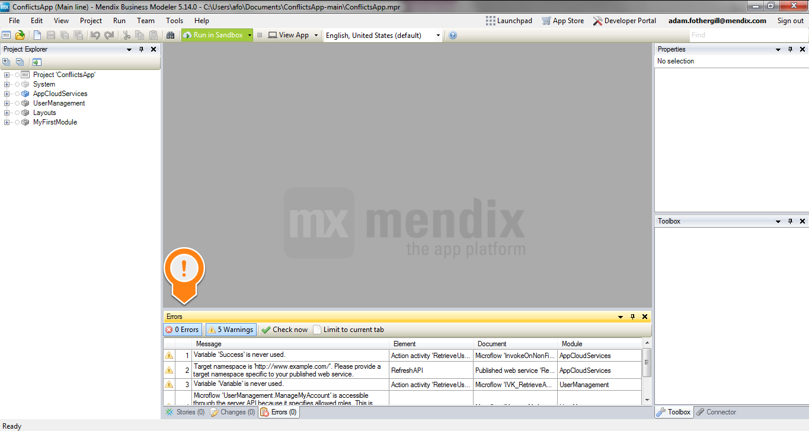
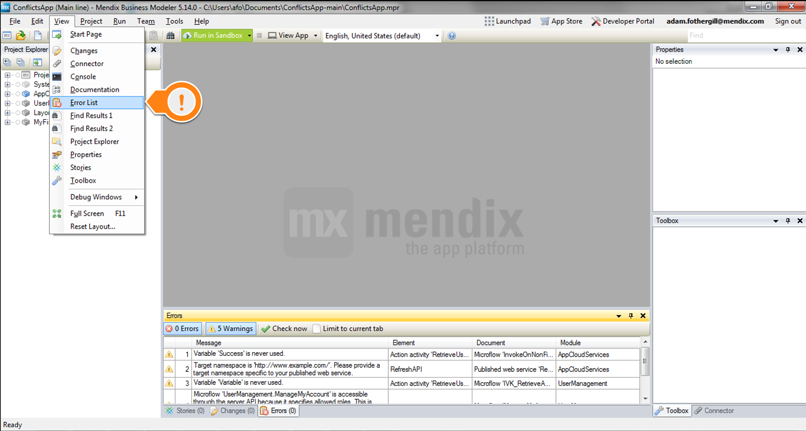

# Clearing Warning Messages in Mendix

<table><thead><tr><th class="confluenceTh">Mendix Version</th><th class="confluenceTh">Author</th><th class="confluenceTh">Create Date</th><th colspan="1" class="confluenceTh">Last Modified By</th><th colspan="1" class="confluenceTh">Modified Date</th></tr></thead><tbody><tr><td class="confluenceTd">5</td><td class="confluenceTd"><a href="    /~adam.fothergill
" class="url fn confluence-userlink" data-username="adam.fothergill" rel="nofollow">Adam Fothergill</a></td><td class="confluenceTd">Mar 11, 2015 23:46</td><td colspan="1" class="confluenceTd"><a href="    /~jan
" class="url fn confluence-userlink" data-username="jan" rel="nofollow">Jan de Vries</a></td><td colspan="1" class="confluenceTd">Sep 03, 2015 13:54</td></tr></tbody></table>

This how-to explains how to eliminate design time warnings.  While these warnings will not cause the application to break, it is important to fix them to keep a clean project.

# Table of contents

## 1. Viewing Warnings

Warnings can be seen in the ‘Error List’ tab.  By default, this is shown in the bottom of the modeler.  Note that the ‘Warnings’ box must be selected for them to display.

If this tab is not visible, it can be shown via the 'View' menu, by selecting the 'Error List' option.

The warning can be double clicked or right-clicked to get more information.

## 2\. Common Warnings



**[Deprecated] Using the main placeholder contents for pop-ups is deprecated.  This potion will be removed in a future version.  Please use a separate pop-up layout instead.**



*   This will not affect the project in this version of the modeler, but may cause problems upgrading.  In this example, the pop-up layout must be adjusted to no longer use the main placeholder.



**A flow origination from an error handler should not return to the main flow.**



*   Once the microflow has split due to an error, the flow that executes due to the error should not merge with the flow that executes when no error occurred. 



**Access rules for entity ‘System.FileDocument’ exist that define access rights for users with module role ‘System.User’.  Note that these access rights apply to all users of your application, including anonymous users (if enabled).  It is recommended it create a specialized entity for each use case and configure access rules for those entities instead.**



*   The security for the entity 'System.FileDocument' has a default setting, which can cause security loopholes.  This warning suggests creating specialized entities to eliminate such scenarios. 



**Action activity that has a side effect on the client is not recommended here because the microflow is used as a data source for data view ‘dataView1’.**



*   Data source microflows should not have an effect on the client.  This microflow likely has a 'Show Message'  or 'Show Page' activity which should be removed. 



**Empty caption. [English, United States]**

**Empty title. [English, United States]**



*   The specified caption or title is empty.  This should be populated, so the page will be understood.



 **Empty page title of target page.  Either set the page title of the target page or override it here. [English, United States]**



*   Similar to the 'Empty Caption' above, this should be populated to ensure the page will be understood.



 **Empty progress message. [English, United States]**



*   The selected progress message is empty, but should be populated.



 **Events have no effect inside a non-editable context.**



*   This context is read only, but there are events set on the field - either on-change, on-leave, or on-enter.  



 **Microflow ‘microflowname’ is accessible through the server API because it specifies allowed roles.  This is unnecessary because the microflow is not used from navigation, a page or a published app service.**



*   There is no need for a microflow which is not accessed through navigation, page, or published app service to have security roles allowed.  This can lead to a security problem, and the assigned roles should be removed.  



 **Microflow does not do anything.**



*   This microflow performs no functionality.  It should either be removed or functionality should be added. 



 **Module role is not part of any user role.**



*   The module role cannot be used by any users.  This module role should either be removed or assigned to a user role, so the proper security is enforced.



 **Property ‘XPath constraint’ on the data grid of the select page has no effect when the page is used for selecting.  Instead, the selection constraints properties of the reference selector can be used to constrain the selectable objects.**



*   When using a form for reference selector, the constraint should be set on the reference selector  - _not_ the form



 **Empty required message while required is true. [English, United States]**



*   On a page, a field can be set to required.  When the field is set to required, the 'Required Message' should be set.  Here, either the 'Required Message' must be set, or the field must not be required. 



 **Required message is set even though required is set to false. [English, United States]**



*   This is similar to the previous warning.  If the field is not required, the 'Required Message' should be empty.  If the 'Required Message' was set with the intention of making the field required, the field should be made required. 



 **Target namespace is ‘[http://www.example.com/](http://www.example.com/)’.  Please provide a target namespace specific to your published web service.**



*   Edit published web service to include a proper namespace



 **Variable ‘Variable’ is never used.**



*   There are multiple potential causes here.  The solution involves removing the variable from the microflow.  This could mean deleting the retrieve activity or electing to not use the return value of a microflow call.

## 3\. Related content

*   [Finding the Root Cause of Runtime Errors](/howto50/Finding+the+Root+Cause+of+Runtime+Errors)
*   [Clearing Warning Messages in Mendix](/howto50/Clearing+Warning+Messages+in+Mendix)
*   [Finding the Root Cause of Runtime Errors](/howto6/Finding+the+Root+Cause+of+Runtime+Errors)
*   [Clearing Warning Messages in Mendix](/howto6/Clearing+Warning+Messages+in+Mendix)
*   [Testing web services using SoapUI](/howto6/Testing+web+services+using+SoapUI)
*   [Testing web services using SoapUI](/howto50/Testing+web+services+using+SoapUI)
*   [Debugging Microflows](/howto50/Debugging+Microflows)
*   [Common Mendix SSO Errors](/howto50/Common+Mendix+SSO+Errors)
*   [Monitoring Mendix using JMX](/howto50/Monitoring+Mendix+using+JMX)
*   [Debugging Java Actions](/howto50/Debugging+Java+Actions)

Several warnings relate to improper security.  To read more on this, please view the documentation [here](/refguide5/Project+Security).