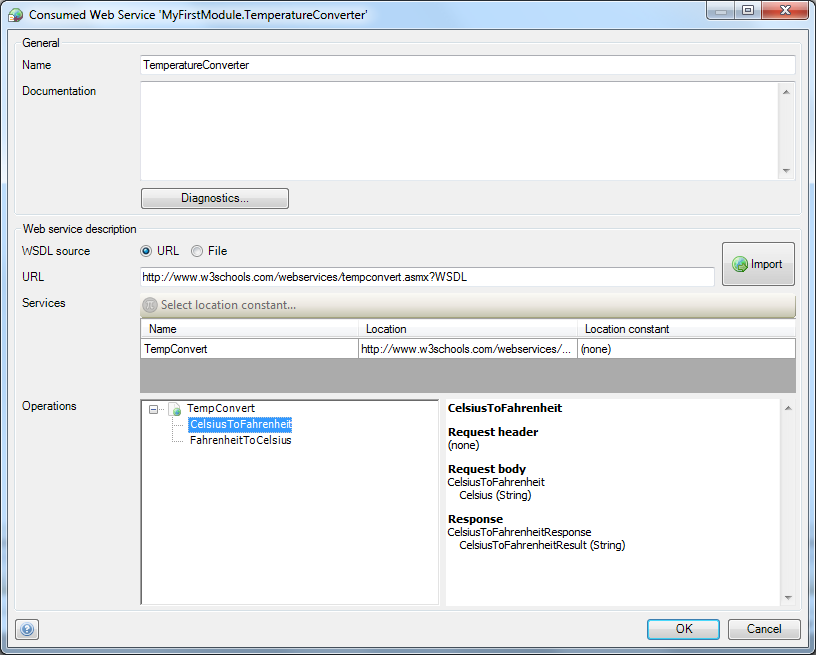
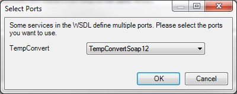
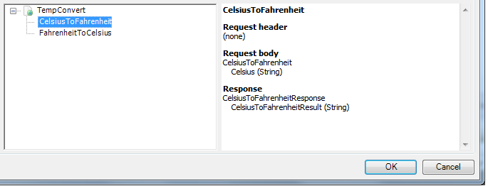
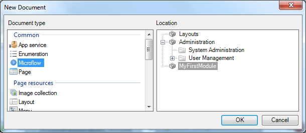
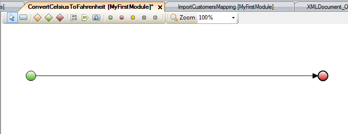
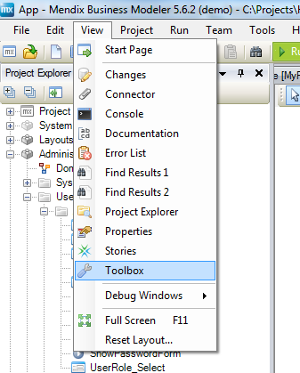
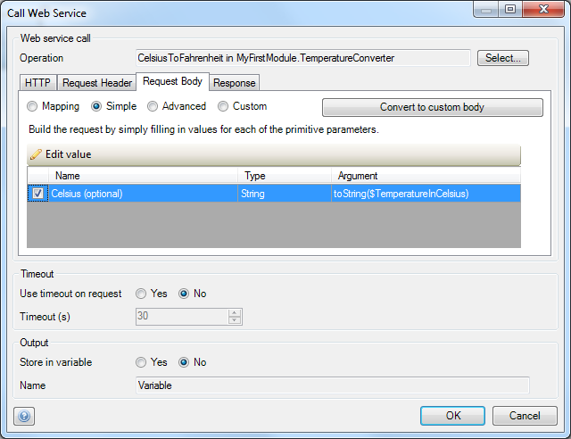
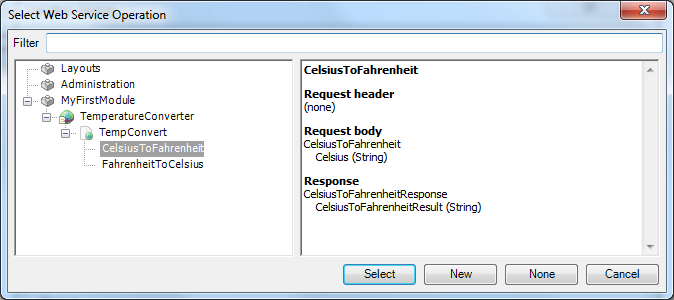
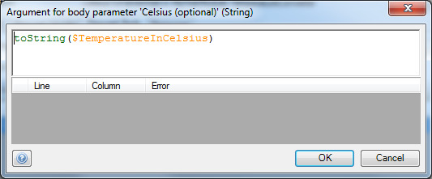
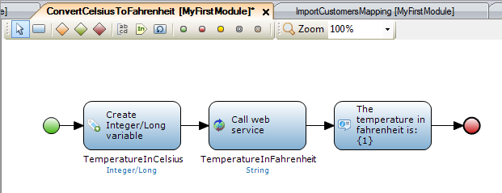

# Consuming a simple Web Service

<table><thead><tr><th class="confluenceTh">Mendix Version</th><th class="confluenceTh">Create Date</th><th colspan="1" class="confluenceTh">Modified Date</th></tr></thead><tbody><tr><td class="confluenceTd">5.21</td><td class="confluenceTd">Sep 24, 2014 14:40</td><td colspan="1" class="confluenceTd">Nov 17, 2015 13:48</td></tr></tbody></table>

Mendix is "The App Platform for the Enterprise" and in enterprise software it is not likely that you work in a [green field](https://en.wikipedia.org/wiki/Greenfield_project). In almost every situation you will need to integrate with existing systems. Mendix supports many ways of integration and this how-to focuses on how you can consume web services with Mendix. For this how-to we'll be using an example web service of w3schools. Please note that this is a very simple web service that converts temperatures from Celsius to Fahrenheit and backwards. The converted temperature will be returned as a string value that can be stored in a variable directly. If you want to invoke a web service that returns a complex XML message you can use XML-to-Domain mappings explained in this [how-to](Importing+XML+documents).

## Table of Contents

## 
1\. Importing a WSDL

A WSDL describes the operations of a web service and can be imported in the Mendix Business Modeler. After importing the WSDL you can invoke the operations of the web service instantly within the Microflow editor.

1.  Right click a module in the project explorer and select **Add > Document** from the menu. You can also use shortcut **Ctrl+N**.
    
2.  Select **Consumed web service** as document type and select a module or folder as target location.
    
3.  Click **OK** and enter a name for the new consumed web service, e.g. _TemperatureConverter_.
4.  Click **OK** again. You should now see the consumed web service editor.
    
5.  Enter [http://www.w3schools.com/webservices/tempconvert.asmx?WSDL](http://www.w3schools.com/webservices/tempconvert.asmx?WSDL) as URL and click **Import**. You will see a popup asking you to select a web service port.
    
6.  Click **OK** to select the default. The Business Modeler should now import the operations: **CelsiusToFahrenheit** and **FahrenheitToCelcius**.
    
7.  Click **OK** to save the consumed web service.

## 2\. Creating logic to call web service

1.  Right click a module in the project explorer and select **Add > Document** from the menu. You can also use shortcut **Ctrl+N**.
    
2.  Select **Microflow** as document type and select a module or folder as target location.
    
3.  Click **OK** and enter a name for the new microflow, e.g. _ConvertCelsiusToFahrenheit_.
4.  Click **OK** again. You should now see an empty microflow.
    
5.  Open the toolbox. It should be on the bottom right of the Business Modeler.
    
6.  If you can't find the toolbox, you can re-open it from the view menu.
    
7.  Drag a **Create variable** activity from the toolbox to the line between the start and end event. This inserts a new activity.
8.  Double click the new activity to open the properties editor.
    
9.  Select **_Integer/Long_** as data type.
10.  Enter **100 **as value.
11.  Use **TemperatureInCelsius** as output variable name.
12.  Click **OK.** The microflow should look like this:
    
13.  Drag a **Call web service** activity from the toolbox to the line between the start and end event. This inserts a new activity.
14.  Double click the new activity to open the properties editor.
    
15.  Click **Select...** to open the web service operation selector.
    
16.  Click 'CelsiusToFahrenheit' and click 'Select'.
17.  Double click to input parameter 'Celsius (optional)'.
    
18.  Enter **toString($TemperatureInCelsius)**as expression. The web service operation expects a string value, that's why you need to use the toString function.
19.  Click **OK.
    **
20.  Make sure that you store the result in a variable.
21.  Name the variable **TemperatureInFahrenheit**.
22.  Click **OK**, the microflow should now look like this:
    
23.  Drag a **Show message** activity from the toolbox to the line between the start and end event. This inserts a new activity.
24.  Double click the new activity to open the properties editor.
    
25.  Select **Information** as type.
26.  Enter **The temperature in fahrenheit is: {1}**as template. The _{1} _functions as a placeholder for the parameters below.
27.  Create a new parameter and enter **_$TemperatureInFahrenheit_** as expression. This is the return value of the web service operation.
    
28.  Click **OK**.
29.  Click **OK** again to save the **Show message activity** properties. The microflow should now look like this:
    
30.  Create a menu item that triggers this microflow. If you don't know how to create a menu item take a look at this [how-to](Setting+Up+the+Navigation+Structure).
31.  Deploy the application and trigger the microflow to call the web service operation. You should see a message with the converted temperature.

## 3\. Related content

*   [Security](Security)

