<table><thead><tr><th class="confluenceTh">Mendix Version</th><th class="confluenceTh">Create Date</th><th colspan="1" class="confluenceTh">Modified Date</th></tr></thead><tbody><tr><td class="confluenceTd">5.18</td><td class="confluenceTd">Dec 15, 2014 16:00</td><td colspan="1" class="confluenceTd">Nov 30, 2015 11:26</td></tr></tbody></table>

In this how-to you will build your first application and deploy it to the cloud. Before you continue with this how-to, make sure that you are logged in to Mendix. You can log in at [http://www.mendix.com/](http://www.mendix.com/). If you do not have an account, you can sign up here: [http://www.mendix.com/try-now/](http://www.mendix.com/try-now/).

**After this how-to you will know:**

*   How to create an App in Mendix.
*   How to deploy an App with Mendix.
*   How to create overview and detail pages.

## 1\. Preparation

Before starting this how-to, please make sure you have completed the following steps:

*   Create an account with Mendix [here](http://www.mendix.com/try-now/).
*   Download and install the Mendix Business Modeler [here](https://appstore.home.mendix.com/link/modelers).

## 2\. Create a collaboration project

With Mendix you can manage requirements, build applications under version control and deploy them into the cloud. Normally you would use multiple different environments for this, but Mendix is truly your one-stop-shop for enterprise application development. To manage your applications from idea to deployment we use projects. In this step you'll learn how to create a project yourself.

1.  Go to [http://home.mendix.com/](http://home.mendix.com/).
2.  Click on **CREATE NEW APP**.
    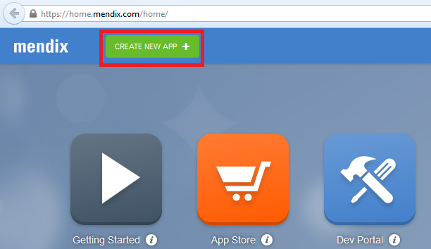 

    You should now choose your starting point:
    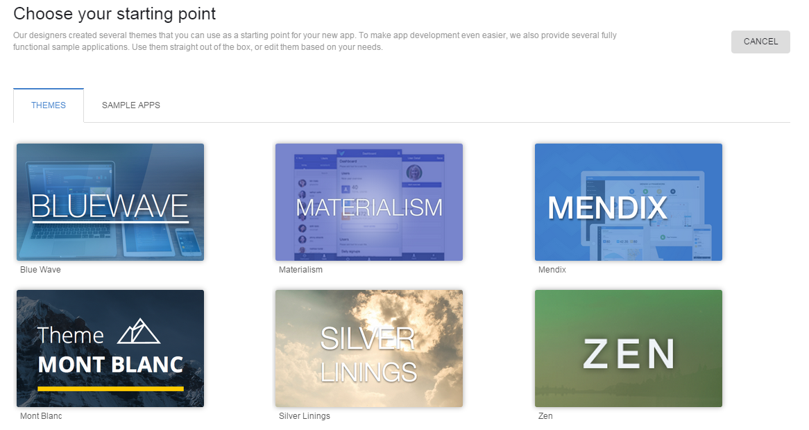
3.  Select **Blue Wave** as theme.
4.  Click on the **USE THIS THEME** button.
    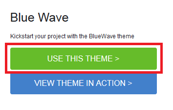 
5.  Fill in a **name** for your new app.
    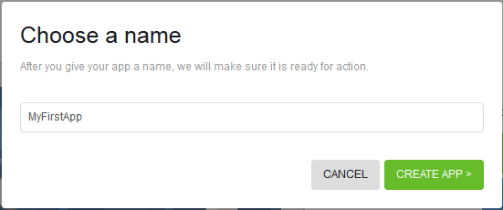
6.  Click on **CREATE APP**.
7.  You've now created your first project. Here you can invite co-workers, share ideas, manage requirements, and deploy and monitor your application. Version control is still empty but we'll fix that in the next step. 

## 3\. Open the project in Business Modeler

1.  Click on **Edit in Modeler**.
    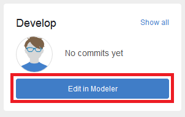

    The project will be opened in the Mendix Busines Modeler.

## 4\. Create a basic data layer

1.  Expand the module **MyFirstModule** in the project explorer on the left side of the Business Modeler.
2.  Double click **Domain Model**. This opens the Domain Model document on the right side.
    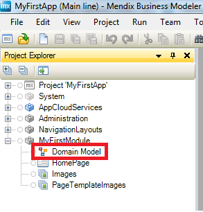 
3.  Create an domain model like this. If you don't know how to create an entity, take a look at [this](Creating+a+basic+data+layer) how-to.
    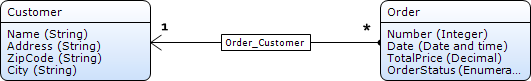

## 5\. Create 'Customer' overview and detail pages

1.  Create an overview and detail page to manage objects of the entity _Customer_. If you don't know how to create those pages, take a look at [this](Creating+your+first+two+Overview+and+Detail+pages) how-to.
    Your overview page should look like this:
    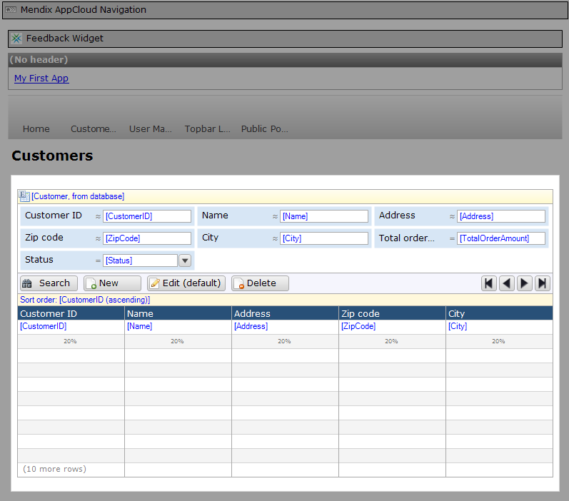
    Your detail page should look like this:
    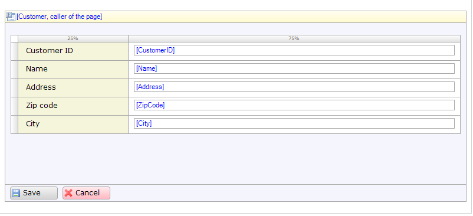

## 6\. Create 'Order' overview and detail pages

1.  Create an overview and detail page to manage objects of the entity _Order_. If you don't know how to create those pages, take a look at [this](Creating+your+first+two+Overview+and+Detail+pages) how-to.
    Your overview page should look like this:
    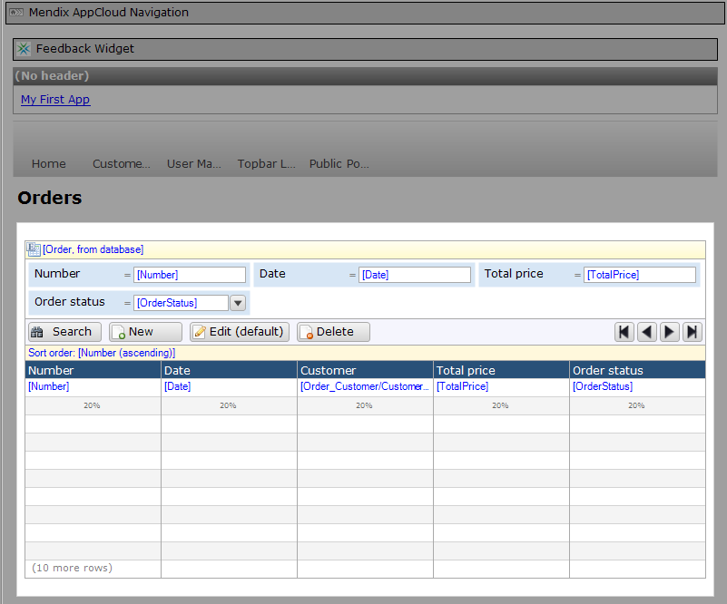
    Your detail page should look like this:
    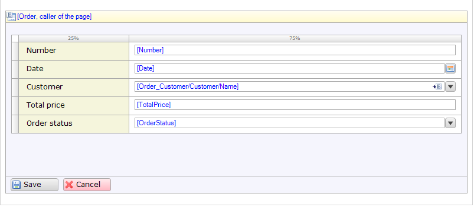

## 7\. Create menu items

1.  Create a menu item to access the customer overview page. If you don't know how to create menu items, take a look at this [how-to](Setting+Up+the+Navigation+Structure).
2.  Create a menu item to access the order overview page.

## 8\. Deploy application to the cloud

1.  Click the **Save All** icon (CTRL+SHIFT+S) to save all files.
    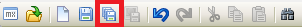
2.  Click **Run in Sandbox** to deploy the application to the cloud. The Business Modeler automatically commits the changes to the Team Server (version control).
    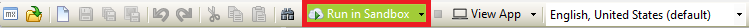
3.  As soon as the deployment process is complete, click 'View App' to open the application in your browser.
    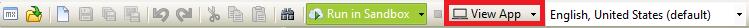

## 9\. Related content

*   [How to build a simple HRM app](How+to+build+a+simple+HRM+app)
*   [Create and Deploy Your First App](Create+and+Deploy+Your+First+App)
*   [Build a simple HRM app 4: Enrich the GUI with Filter Options](Build+a+simple+HRM+app+4+Enrich+the+GUI+with+Filter+Options)
*   [Build a simple HRM app 5: Smarten up your app with business logic](Build+a+simple+HRM+app+5+Smarten+up+your+app+with+business+logic)
*   [Build a simple HRM app 1: Create, manage and deploy the app](Build+a+simple+HRM+app+1+Create+manage+and+deploy+the+app)
*   [Build a simple HRM app 2: First steps in building a rich GUI](Build+a+simple+HRM+app+2+First+steps+in+building+a+rich+GUI)
*   [Build a simple HRM app 3: Show related data in the GUI](Build+a+simple+HRM+app+3+Show+related+data+in+the+GUI)
*   [Testing microflows using the UnitTesting module](Testing+microflows+using+the+UnitTesting+module)
