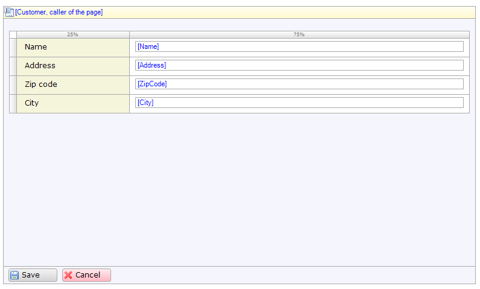
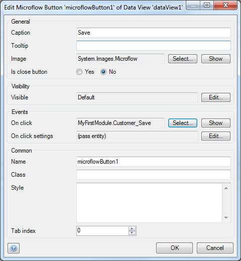
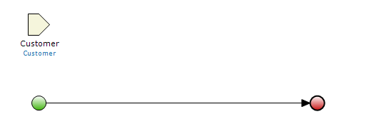
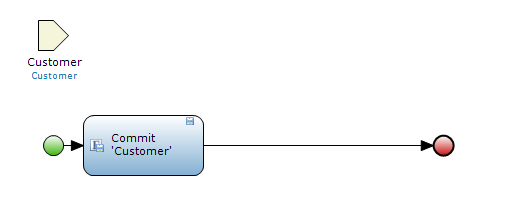
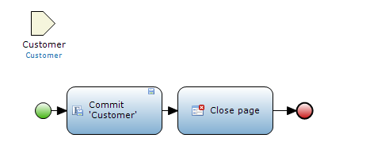

# Creating a Custom Save Button

<table><thead><tr><th class="confluenceTh">Mendix Version</th><th class="confluenceTh">Create Date</th><th colspan="1" class="confluenceTh">Modified Date</th></tr></thead><tbody><tr><td class="confluenceTd">5</td><td class="confluenceTd">Dec 15, 2014 16:08</td><td colspan="1" class="confluenceTd">Sep 02, 2015 11:30</td></tr></tbody></table>

Mendix uses visual models to define the logic of your application, we call those models Microflows. A Microflow is a visual way of expressing what traditionally would be written in code. This how-to explains how you can create a custom save button on a detail page by utilizing Microflows.

## 1\. Preparation

Before you start with this how-to please complete the following prerequisites:

*   Create a basic domain model with [this how-to](Creating+a+basic+data+layer)
*   Create overview and detail pages for the Customer object using [this how-to](Creating+your+first+two+Overview+and+Detail+pages)
*   Create a menu item to access the customer overview page using [this how-to](Setting+Up+the+Navigation+Structure)

## 2\. Replacing the Default Save Button with a Custom one

1.  Open the **customer detail** page. It should look similar to this:
    
2.  Select the **Save** button and remove it by pressing the delete button.
3.  Right click the **Cancel** button and select **Microflow** from the **Add button left** menu.
    
4.  Double click the new Microflow button to open its **properties:**
    
5.  Change the caption to _Save._
6.  Change the image to an image of your choice.
7.  Click **Select...** in the **Events** section to add a new microflow with the name _Customer_Save_.
8.  Save the new Microflow button by clicking **OK**.

## 3\. Re-creating the Default Save Behavior

1.  Right click the new Microflow button and select **Go to microflow** to open the new Microflow
    

    The Microflow should look like this:
    
2.  Open the **toolbox.** It should be on the bottom right of the Business Modeler.
    
3.  If you can't find the toolbox, you can re-open it from the view menu.
    
4.  Drag a **Commit object(s)** action from the toolbox to the line between the green start and red end event. This inserts a commit action activity.
5.  Double click the new activity to open its **properties.**
    
6.  Select **Customer** as input variable and click **OK**. The Microflow should now look like this:
    
7.  Drag a **Close page** action from the toolbox to the line between the green start and red end event. This inserts a close page action activity.

    You have now re-created the default save behavior. The Microflow should look like this:
    

## 4\. Extending the Microflow with Your Own Functionality

1.  Drag a **Show message** action from the toolbox to the line between the start and end event. This inserts a show message action activity.
2.  Double click the new activity to open its **properties:**
    
3.  Select the type of message.
4.  Enter a message as **Template value**.
5.  Click **OK** to save the properties. The Microflow should now look like this:
    

## 5\. Related content

*   [Defining access rules using XPath](/howto50/Defining+access+rules+using+XPath)
*   [Triggering Logic using Microflows](/howto50/Triggering+Logic+using+Microflows)
*   [Creating a Custom Save Button](/howto50/Creating+a+Custom+Save+Button)
*   [Extending Your Application with Custom Java](/howto50/Extending+Your+Application+with+Custom+Java)

Learn more using the following links:

*   [Button Widgets](/refguide5/Button+Widgets)
*   [Save button](/refguide5/Save+button)
*   [Microflow Activities](/refguide5/Activities)

