<table><thead><tr><th class="confluenceTh">Mendix Version</th><th class="confluenceTh">Create Date</th><th colspan="1" class="confluenceTh">Modified Date</th></tr></thead><tbody><tr><td class="confluenceTd">5.20.0</td><td class="confluenceTd">Aug 05, 2014 16:15</td><td colspan="1" class="confluenceTd">Oct 23, 2015 14:49</td></tr></tbody></table>

This how-to explains how you can create overview and detail pages in Mendix. 

## 1. Preparation

*   Before you can create those pages you need to setup a basic data structure using [this](Creating+a+basic+data+layer) how-to.
    

## 2\. Creating an Overview Page

This section will explain how you can add a new overview page to your project.

1.  Right click the module and select **Add > ****Page**.
    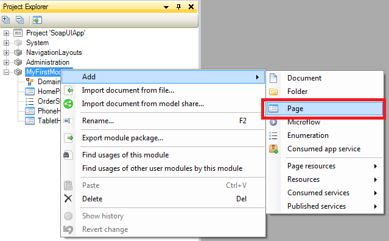

2.  Click on **Responsive**.
3.  Enter _CustomerOverview_as **Page name**.
4.  Select _Sidebar_Full_Responsive_ as navigation layout.
5.  Click on **Blank**.
6.  Select **Blank Page Template**.
    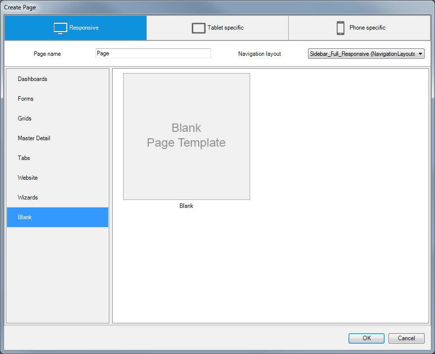
7.  Click once on **Data Grid** in the menu bar of the page builder to select the Data Grid widget.
    
8.  Click once in the page editor to create the Data grid widget.
    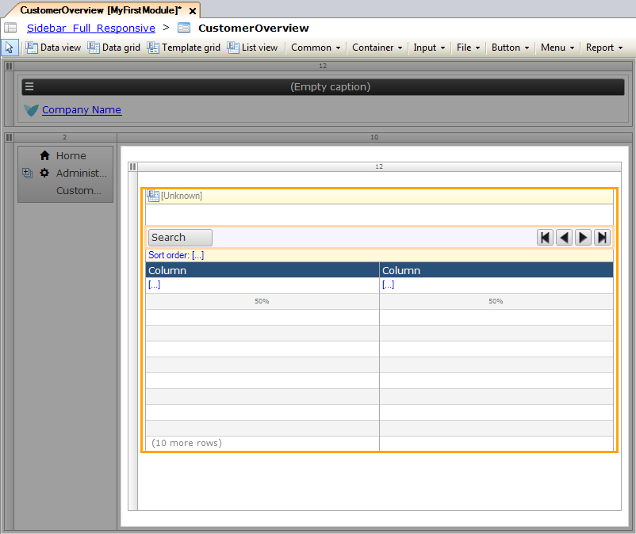
9.  Right click the data grid.
10.  Click **Select Entity** in the context menu.
    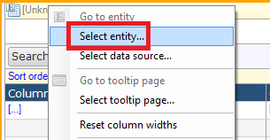
11.  Select the _Customer_ entity in the Data Source Selector and click **Select**.
    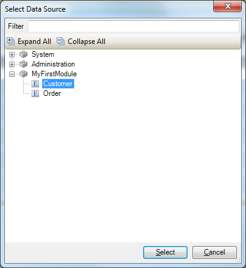
12.  Click **OK** to auto-fill the data grid with search fields and columns.
    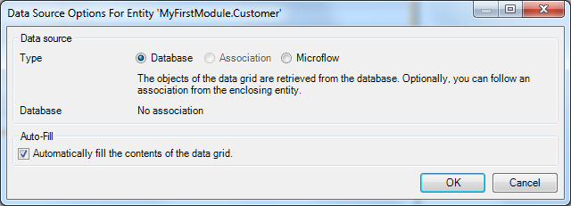

    You should now have an overview page like this:
    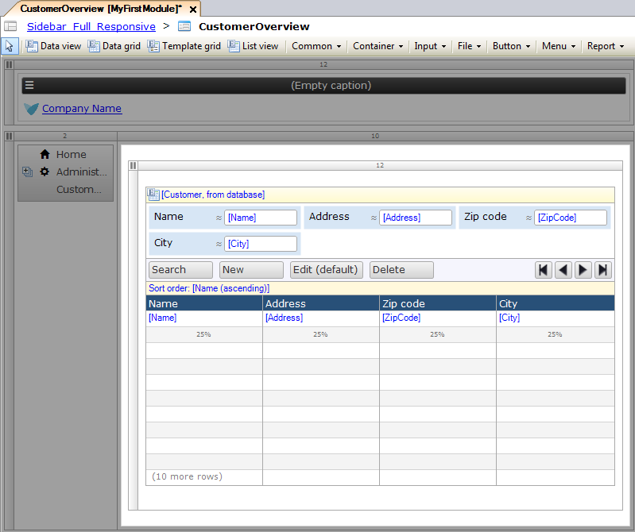

## 3\. Creating a Detail Page

1.  Right click the **New** button of the data grid on the overview page
2.  Select **Generate page**.
    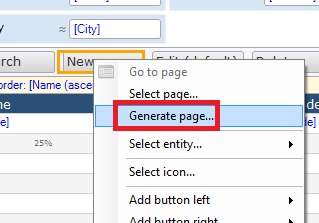
3.  Select _PopupLayout_ as navigation layout.
4.  Select _Form basic horizontal_ and click **OK**.
    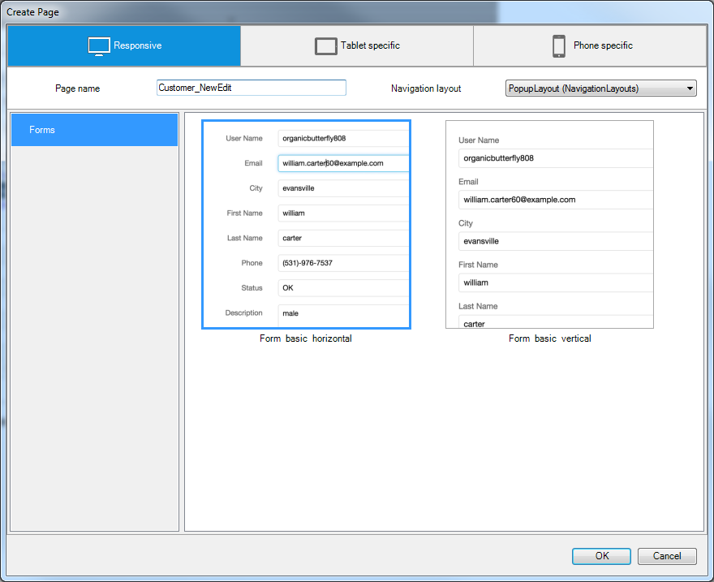 
5.  Right click the **New** button of the data grid in the overview page again
6.  Select **Go to page**.
    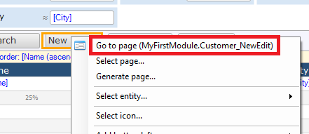
    You should now have a detail page like this:
    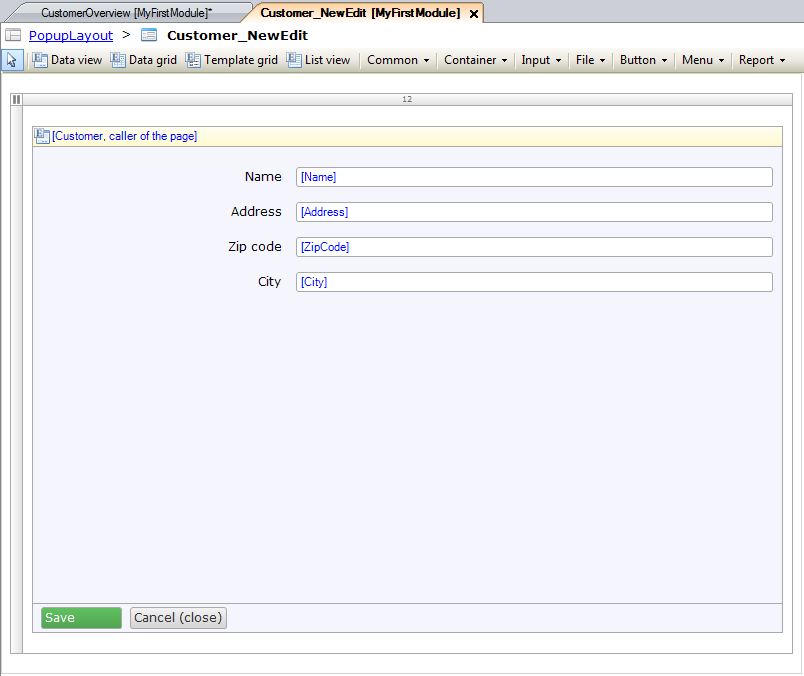

## 4\. Navigation and Security

1.  Now create a navigation item for your overview page to start using it. If you don't know how to setup the navigation structure, take a look at [this](Setting+Up+the+Navigation+Structure) how-to.
2.  If you switched on security for this application you need to configure page access on both the overview and detail pages. If you don't know how to configure page access, take a look at [this](Creating+a+secure+app) how-to.

## 5\. Related content

How-to's

*   [Scout and Windows 10 Workaround](Scout+and+Windows+10+Workaround)
*   [Scout and Windows 10 Workaround](/howto6/Scout+and+Windows+10+Workaround)
*   [Filtering Data on an Overview Page](Filtering+Data+on+an+Overview+Page)
*   [Layouts and Snippets](Layouts+and+Snippets)
*   [Layouts and Snippets](/howto6/Layouts+and+Snippets)
*   [Filtering Data on an Overview Page](/howto6/Filtering+Data+on+an+Overview+Page)
*   [Setup Mendix UI Framework with just CSS](Setup+Mendix+UI+Framework+with+just+CSS)
*   [Setting Up the Navigation Structure](Setting+Up+the+Navigation+Structure)
*   [Creating your first two Overview and Detail pages](Creating+your+first+two+Overview+and+Detail+pages)
*   [Setup Mendix UI Framework](Setup+Mendix+UI+Framework)

Reference Guide

*   [Page](/refguide5/Page)

