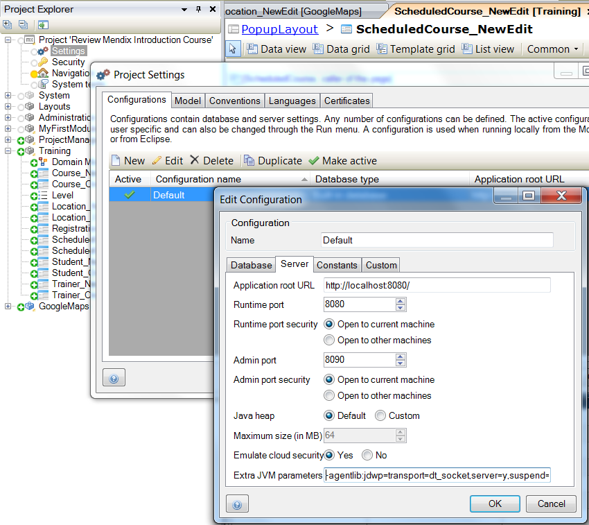

<table><thead><tr><th class="confluenceTh">Mendix Version</th><th class="confluenceTh">Create Date</th><th colspan="1" class="confluenceTh">Modified Date</th></tr></thead><tbody><tr><td class="confluenceTd">5</td><td class="confluenceTd">Nov 17, 2014 11:01</td><td colspan="1" class="confluenceTd">Nov 17, 2015 13:54</td></tr></tbody></table>


To debug Java Actions used in a Mendix Microflow you need to make some configuration changes to the way you start the Mendix runtime.
This How-to will explain you how to manage this.

# Table of contents

## 1\. Editing the Server Configuration with extra JVM parameters

Within this part of the how to you will learn how to configure the security at prototype/demo level. Be aware that this level of security is only applicable for development/demo purposes. This level is available for quick development of demo applications. It simulates security, without more complex configuration of the data access. When deploying to the Mendix cloud, production security is mandatory.

1\. Open the project settings.

2\. Edit the configuration.

3\. Go to the Server tab and add the following line to the 'Extra JVM parameters':

```java
-agentlib:jdwp=transport=dt_socket,server=y,suspend=n,address=5005
```



4\. Next, start your application in Mendix.
 [
 ](Debugging+Java+actions+remotely)

## 2\. Configuring remote debugging

In your Java IDE you need to configure remote debugging. The following screenshot shows the configuration in IntelliJ:


1\. Start the debugger.

2\. Place some breakpoints in your java code.

3\. Start debugging.

## 
3\. Related content

*   [Finding the Root Cause of Runtime Errors](/howto50/Finding+the+Root+Cause+of+Runtime+Errors)
*   [Clearing Warning Messages in Mendix](/howto50/Clearing+Warning+Messages+in+Mendix)
*   [Finding the Root Cause of Runtime Errors](/howto6/Finding+the+Root+Cause+of+Runtime+Errors)
*   [Clearing Warning Messages in Mendix](/howto6/Clearing+Warning+Messages+in+Mendix)
*   [Testing web services using SoapUI](/howto6/Testing+web+services+using+SoapUI)
*   [Testing web services using SoapUI](/howto50/Testing+web+services+using+SoapUI)
*   [Debugging Microflows](/howto50/Debugging+Microflows)
*   [Common Mendix SSO Errors](/howto50/Common+Mendix+SSO+Errors)
*   [Monitoring Mendix using JMX](/howto50/Monitoring+Mendix+using+JMX)
*   [Debugging Java Actions](/howto50/Debugging+Java+Actions)


*   [Getting started with Nexus maven repository manager](http://www.andrejkoelewijn.com/blog/2010/03/09/getting-started-with-nexus-maven-repository-manager/)
*   [Using eclipse to debug your tomcat web application](http://www.andrejkoelewijn.com/blog/2003/10/23/using-eclipse-to-debug-your-tomcat-web-application/)
*   [Profiling Mendix using JProfiler](http://www.andrejkoelewijn.com/blog/2014/01/15/profiling-mendix-using-jprofiler/)