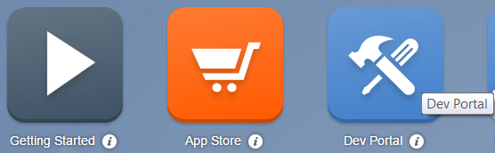
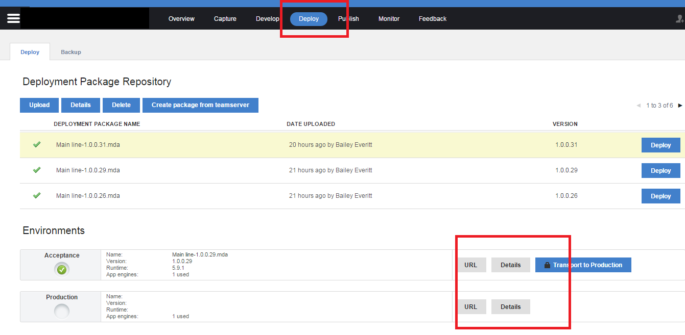
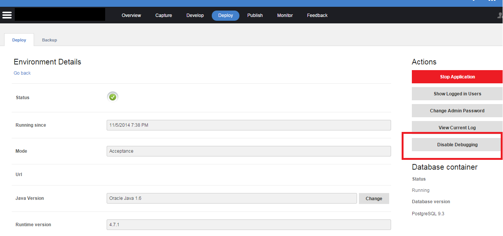
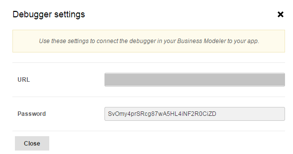
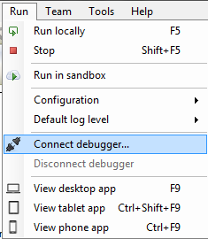
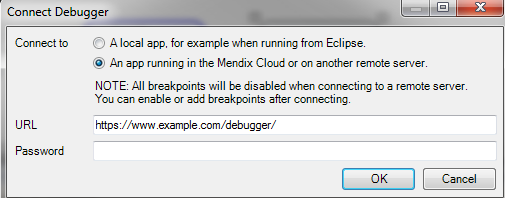

You can also debug applications that are already in the cloud, either in acceptance or production environment. In this how-to article you will learn how to connect your debugger to your cloud environment. 

## 1\. Preparation

Before you start with this how-to please complete the following prerequisites:

*   You need a Basic, Professional or Enterprise Mendix edition to use these features: [http://www.mendix.com/editions/](http://www.mendix.com/editions/)

## 2\. The Basics

To enable the cloud debugging you need to get a URL and password from the cloud and add that information to the modeler. The steps below will explain where to gather all the necessary information. 

It is not recommended to debug in production. However, if you are debugging in the cloud, be aware of the other end users in the system. The debugger will stop processes from moving on for other users.

### 2.1 Enabling Debugging in the Cloud

1.  Open a browser and go to [http://home.mendix.com](http://home.mendix.com).
2.  Login with your **Mendix ID**.
3.  Click on the **Dev Portal** and navigate to the project that you want to debug.
     
4.  Open the **Deploy** tab in your project.
5.  Go to **Details**.
    
6.  Click **Enable Debugging**.
    

The debugging settings will show up. Usually, it will be a URL such as [http://yourapp.mendixcloud.com](http://yourapp.mendixcloud.com) and a secure password that changes each time you enable and disable the debugger.

If you want to disable the debugger, simply click on Disable Debugging.



If you do not see an overview similar to the one below, then you do not have sufficient cloud permissions to deploy packages into the cloud or be able to debug in the cloud. Contact the technical contact or the project SCRUM master in your organization and project to get sufficient permissions.



### 2.2 How to enable cloud debugging in your modeler

Once you have the unique URL and password, there are two ways to connect the modeler to the cloud environment. 

#### First Method

1\. Go to **Run.**

2\. Click on **Connect debugger**...

3\. Enter the URL and password that you got from the cloud environment.

#### Second Method

1\. Go to the Debugger dock window.
2\. Click on the Connect button and enter the URL and password information in the pop up prompt.

## 3\. Related content

*   [Finding the Root Cause of Runtime Errors](Finding+the+Root+Cause+of+Runtime+Errors)
*   [Clearing Warning Messages in Mendix](Clearing+Warning+Messages+in+Mendix)
*   [Testing web services using SoapUI](Testing+web+services+using+SoapUI)
*   [Debugging Microflows](Debugging+Microflows)
*   [Common Mendix SSO Errors](Common+Mendix+SSO+Errors)
*   [Monitoring Mendix using JMX](Monitoring+Mendix+using+JMX)
*   [Debugging Java Actions](Debugging+Java+Actions)

*   [Blog post on debugging](http://www.mendix.com/tech-blog/the-ultimate-debugger/) 
*   [Blog post on cloud debugging](http://www.mendix.com/tech-blog/new-goodies-for-mendix-app-platform-users-mendix-business-modeler-4-3-release-today/)
