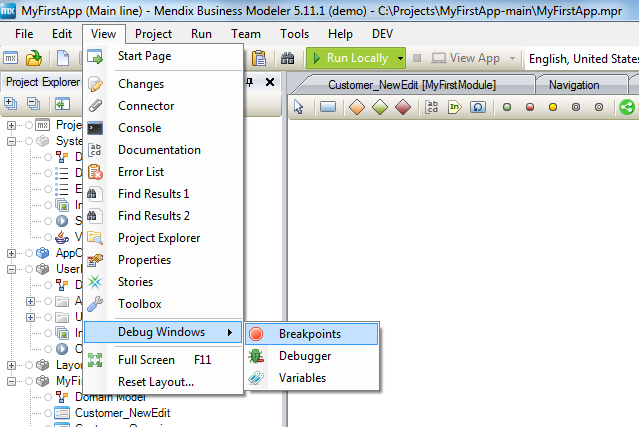
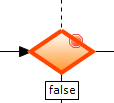
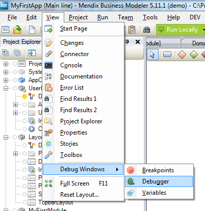
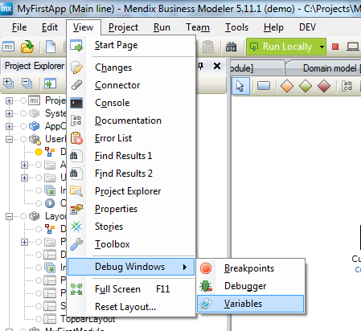
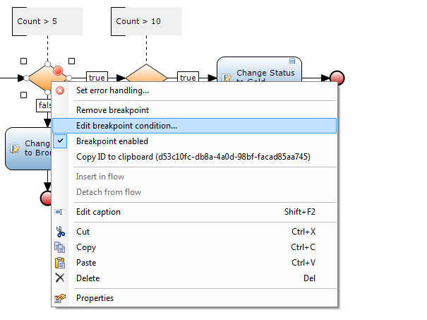
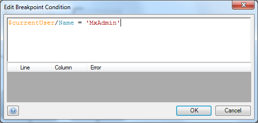

# Debugging Microflows

<table><thead><tr><th class="confluenceTh">Mendix Version</th><th class="confluenceTh">Create Date</th><th colspan="1" class="confluenceTh">Modified Date</th></tr></thead><tbody><tr><td class="confluenceTd">5.11</td><td class="confluenceTd">Dec 16, 2014 10:56</td><td colspan="1" class="confluenceTd">Oct 19, 2015 12:58</td></tr></tbody></table>


The Mendix Business Modeler has a built-in consistency checker that validates if the application you are building contains any obvious errors. This reduces the amount of technical errors during run-time dramatically, but the Business Modeler isn't able to check if your application contains functional errors. This is mainly a manual practice, but Mendix does support enough tools to make your live easy on this. If you run into a functional error in any of the Microflows, you can easily debug them with the debugger.

# Table of contents

## 1. Preparation

Before starting this how-to please complete the following prerequisites:

*   [Creating a basic data layer](Creating+a+basic+data+layer)

*   [Creating your first two Overview and Detail pages
     ](Creating+your+first+two+Overview+and+Detail+pages)

## 2\. Debugging Overview

There are three debugging windows to be aware of: **breakpoints, debugger** and **variables**. 



The breakpoints window will show all the Microflows that contain breakpoints. This makes it easier to find your breakpoints. It is best practice to remove any breakpoints after you are done troubleshooting your Microflows. You can always delete them from the breakpoints dock window.


The debugger dock window is useful when you are debugging your Microflow and it will walk you through the Microflow.


The variables dock window shows the variables involved in your Microflow and how they are changing as you step through the Microflow via the debugger window.


<div class="alert alert-warning">

It is best practice to have the debugger and variables windows at different docks. Usually the debugger should be at the bottom of your development dock and the variables can be either on the left or side dock – whichever side you prefer. The reason for this is that you want to be aware of how the variables are being changed in the Microflow. It is hard to see those changes if both windows are tabs within the same dock.

</div>

## 3\. Using Breakpoints

Breakpoints are points in a microflow where the application will halt execution. This is useful to analyze the application execution and data up to that point. You can add breakpoints at any point in your Microflow by following the steps below.

1.  Run your application locally.
2.  Open the **Microflow** that needs debugging in the Business Modeler.
3.  Right click any of the activities or splits in the Microflow and select **Add breakpoint**. This sets a breakpoint on the selected step in the Microflow, visually represented by a red stop sign.
    
    You can open an overview of all the breakpoints by going to **View > Breakpoints**:
    

    In this overview you can enable/disable and delete breakpoints. You can also configure a breakpoint condition and open the Microflow that contains the breakpoint.
    

## 4\. Debugging

1.  **Run** the application.
2.  Open the application in your browser and do whatever is needed to trigger the Microflow that you want to debug. As an end user of the application you will see progress bar on your application.  As a developer you will notice that the Mendix icon will be flashing on the windows task bar.
3.  Click the icon on the windows task bar to open the **Business Modeler**. The element with the breakpoint that interrupts this Microflow should be highlighted with a red border.
    
4.  Open the **Debugger** from the **View** menu.
    

    The Debugger can be used to go through the Microflow step-by-step.
    
5.  Click **Step into** or **Step over** to move on the next step in the Microflow.

    <div class="alert alert-info">

    The difference between 'Step into' and 'Step over' is only noticeable if you run into a 'Call Microflow' activity or 'Loop'. 'Step into' means that the debugger steps into the sub Microflow or Loop and 'Step over' just moves the debugger to the next step in the same Microflow.

    With 'Step out' you can instruct the debugger to leave the sub Microflow or Loop. It's basically the opposite of 'Step Into'.

    Clicking 'Continue' instructs the debugger to continue until it reaches another breakpoint.

    </div>

## 5\. Variable Viewer

As you are stepping through a Microflow the variables window will start to change. This overview will show you all the variables involved in the application. It will show you all the entities, references, current user information and device type information. It is useful as you are stepping through the Microflow to review the variable values and see if they are matching your expectations.

1.  Open the variable viewer from the **View** menu.
    

    The Variable Viewer can be used to inspect values of variables in the Microflow. The values are updated with every step you make in the Debugger.
    

## 6\. Breakpoint Conditions

Sometimes it's needed to configure a breakpoint in such a way that the Microflow only breaks on a certain condition. This can be achieved with breakpoint conditions. This is configured by use of Microflow expressions. Setting a breakpoint condition can be very handy if you are debugging a batch process and you only want to break at a certain value. It is strongly advised to use breakpoint conditions if you are debugging an application that is running in production. This prevents the application stopping for other users than yourself.

1.  Right click the activity or split in the Microflow with a breakpoint and select **Edit breakpoint condition...**
    
2.  Use the following expression to make sure that this breakpoint only interrupts the Microflow if you are executing it yourself. Replace 'YourUserName' with your own user name.

    ```java
    $currentUser/name = 'YourUserName'
    ```

    The expression should look like this:
    

3.  Click **OK **to save the breakpoint condition.

## 7\. Related content

*   [Finding the Root Cause of Runtime Errors](Finding+the+Root+Cause+of+Runtime+Errors)
*   [Clearing Warning Messages in Mendix](Clearing+Warning+Messages+in+Mendix)
*   [Testing web services using SoapUI](Testing+web+services+using+SoapUI)
*   [Debugging Microflows](Debugging+Microflows)
*   [Common Mendix SSO Errors](Common+Mendix+SSO+Errors)
*   [Monitoring Mendix using JMX](Monitoring+Mendix+using+JMX)
*   [Debugging Java Actions](Debugging+Java+Actions)


*   [Microflow Element Common Properties](/refguide5/Microflow+Element+Common+Properties)