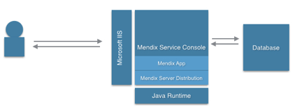
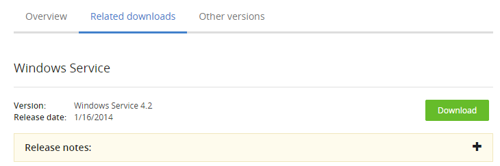
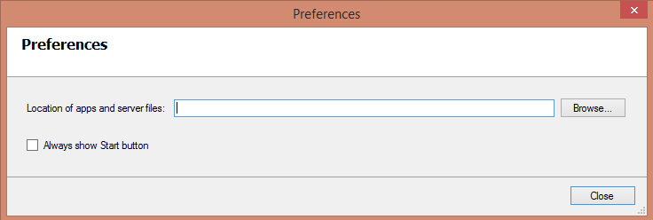
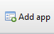
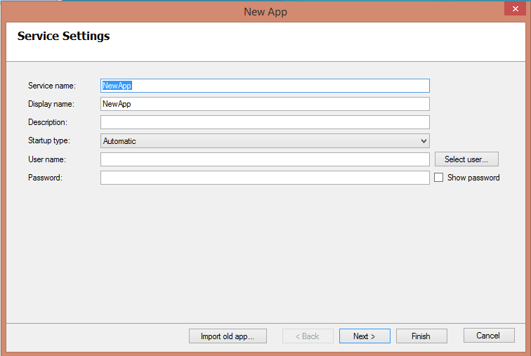
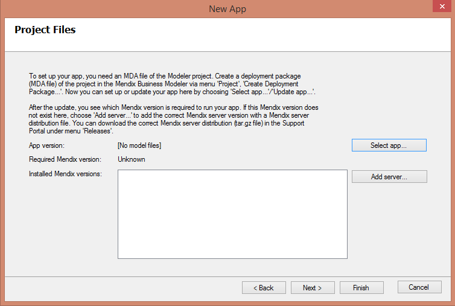
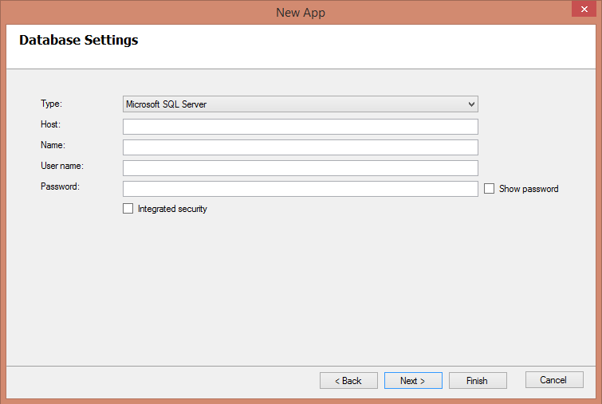

<table><thead><tr><th class="confluenceTh">Mendix Version</th><th class="confluenceTh">Create Date</th><th colspan="1" class="confluenceTh">Modified Date</th></tr></thead><tbody><tr><td class="confluenceTd">5</td><td class="confluenceTd">Mar 10, 2015 15:49</td><td colspan="1" class="confluenceTd">Nov 18, 2015 10:00</td></tr></tbody></table>


This document describes the installation and configuration of the Mendix software on a system running Microsoft Windows.

In order to set up an environment to run Mendix applications, you will need to install the Mendix software. For each Mendix application that will be run, a separate user(service) account is required. It might help to grasp the full picture before following the rest of the documentation in this section about
steps which have to be executed to manually set up a server that runs a Mendix application. The following section describes an overview of the parts of the whole setup you'll encounter in the next pages.



# Table of contents

## 1. Prerequisites

Please follow these prerequisites before starting this how-to:

*   Microsoft Windows 2003 or higher

*   .NET 3.5 SP1 or higher

*   IIS 7 or above with the following service roles enabled;

    *   IIS Management console

    *   Static content

    *   ASP.NET

*   Microsoft Application Request Routing(ARR) Installed ([http://www.iis.net/downloads/microsoft/application-request-routing](http://www.iis.net/downloads/microsoft/application-request-routing))

*   Java Runtime 6 or 7 (depending on your Mendix Server Distribution e.g. Mendix Server Distribution 4 requires Java 6, Mendix Server Distribution 5 requires Java 7)

*   Mendix Deployment Archive (MDA) of your Mendix Project

*   Mendix Server Distribution corresponding with your Business Modeler ([https://appstore.mendix.com](https://appstore.home.mendix.com/link/modelers))

*   Database with sufficient security rights

    *   Postgres 8.4 or higher

    *   Oracle Database 11g Release 2 or higher

    *   Microsoft SQL Server 2005 or higher

*   A local or domain user with the local security policy “log on as a service” set.

## 2. Installation of the Mendix Service Console

In this chapter you will download an install the Mendix Service Console.

1.  Download the latest version of the **Mendix Service Console** from our **App Store** ([http://](https://appstore.home.mendix.com/link/modelers) [appstore.mendix.com](https://appstore.home.mendix.com/link/modelers)):
    

2.  **Install** the Mendix Service Console by following the installation wizard.

3.  **Start** the Mendix Service Console after the installation.

    
    The first time you launch the application, a preferences dialog will be shown. This dialog will always be shown if no valid location is configured for all the apps and server files.

*   Enter a location for the apps and server files.
    We advise use a directory that is _not_ on the system partition, where you can easily control the security rights.

    <div class="alert alert-info">

    The location configured in step 4 is used for storing your app files and Mendix server files.
    The app directory consists of 4 subdirectories:
    - Backup: This directory will store any database changes due to model upgrades
    - Log: This directory will store all of the application log files
    - Project: This directory contains all of your application files. Within this directory you will find the directory
    data/files that contain all of your uploaded files.
    - Service: This directory contains files for configuring the Windows Services.
    Furthermore there will be a file called “Settings.yaml” which contains your application configuration.

    </div>

## 3\. Deploying a Mendix App

In this chapter you will deploy a Mendix App using the Service Console.

1.  Start the **Mendix Service Console**.

2.  Click on the **Add app** button to add a new App. A wizard will be visible to configure the new app.
     

3.  Configure the Service Settings:
    **Service name**: This name must be unique within all existing Windows services.
    **Display name**: This is the description of the app, which is visible as tooltip of the app in the left bar of the Mendix Service Console or visible as column in the list of Windows services.
    **Description**: Enter a description for the application that will be visible in the Service Console.
    **Startup type**: Select whether you want the app to start automatically when the server starts, start delayed, manual, or disable it altogether.
    **Username and password**: The app will always run under the user account given here. The service will be installed with this user account configured. (See prerequisites)
    

4.  Click **Next**.

5.  In the Project Files screen first click **Select App**.
    

6.  Now select the **MDA** file that was created in the Business Modeler and contains your application logic.

    After the installation of your MDA file, you will see which Mendix Server (Mendix Runtime) version is needed.

7.  Configure the **Database Settings** and click next:
    

    1.  **Type:** Select your database server type

    2.  **Host:** The ip-address or hostname of the database server

    3.  **Name:** Database name

    4.  **Username and password**: The database username and password

8.  **Common Configuration**: Keep the settings default. Only change these specific settings if needed for your application setup.

9.  Click **Finish**.

10.  **Start** the application.

## 4\. Configuring Microsoft Internet Information Server

In this chapter you will learn how to configure the MS IIS server.

### 4.1 Activating a Proxy in ARR

In order to use the proxy functionality within ARR you need to enable this feature within IIS.

1.  Start the **Internet Information Services Manager** (IIS Manager).
2.  Select the **Server** in the **Connections** pane.
3.  Open the **Application Request Routing** feature.
4.  Click **Server Proxy Settings** in the actions pane on the right hand side.
5.  Select **Enable proxy** click on **Apply** in the actions pane.

### 4.2 Creating a Website

1.  Start the **Internet Information Services Manager** (IIS Manager).
2.  In the Connections pane, right-click the **Sites** node in the tree, and select **Add Web Site**.
3.  In the Add Web Site dialog box, type a friendly name for your web site in the **Web site name** field.
4.  In the **Physical path** field, type the physical path of your application-project-web folder e.g. _D:\Mendix\Apps\Application\Project\Web_.
5.  Select the **protocol** for the Web site from the Type list.
6.  The default value in the IP address box field is All Unassigned. If you must specify a static IP address for the Web site, enter the address in the IP address box.
7.  Enter a port number in the **Port** field.
8.  Click **OK**.

### 4.3 Configuring the MIME Type

1.  Open the **IIS Manager** and navigate to the website you want to manage.
2.  In the **Features View**, double click **MIME Types**.
3.  In the **Actions** pane click **Add.**
4.  In the **Add MIME Type** dialog box, enter _.mxf_ in the **File name extension** field.
5.  Enter “**text/xml**” in the MIME type field.
6.  Click **OK**.

### 4.4 Configuring URL Rewrite

**Rule 1 - xas**

1.  Open the **IIS Manager** and navigate to the website you want to manage.
2.  In the **Features View**, double click **URL Rewrite**.
3.  In the **Actions** pane on the right-hand side, click **Add rule(s)…**.
4.  In the **Inbound Rules** field, enter _localhost:8080_ (if 8080 is the port your Mendix App is configured for) click **OK**.
5.  Select the **ReverseProxyInboundRule1** in Features View.
6.  In the Actions pane on the right-hand side, click **Rename**.
7.  Rename the _ReverseProxyInboundRule1_ to _xas_.
8.  Double click the _xas_ in Features View.
9.  In the **Pattern field** enter:

    ```java
    ^(xas/)(.*)
    ```

10.  In the **Rewrite URL** field enter:

    ```bash
    http://localhost:8080/{R:1}{R:2}
    ```

11.  Click **Apply**.
12.  Click **Back to Rules**.

**Rule 2 - ws**

1.  Click **Add rule(s)…**.
2.  In the **Inbound Rules** field, type _localhost:8080_ (if 8080 is the port your Mendix App is configured for) click **OK**.
3.  Select the **ReverseProxyInboundRule1** in Features View.
4.  Click **Rename**.
5.  Rename the _ReverseProxyInboundRule1_ to _ws_.
6.  Double click the _ws_ in Features View.
7.  In the Pattern field enter:

    ```java
    ^(ws/)(.*)
    ```

8.  In the **Rewrite URL** field type:

    ```bash
    http://localhost:8080/{R:1}{R:2}
    ```

9.  Click **Apply**.
10.  Click **Back to Rules**.

**Rule 3 - doc**

1.  Click **Add rule(s)…**.
2.  In the **Inbound Rules** field, type _localhost:8080_ (if 8080 is the port your Mendix App is configured for) click **OK**.
3.  Select the **ReverseProxyInboundRule1** in Features View.
4.  Click **Rename**.
5.  Rename the _ReverseProxyInboundRule1_ to _ws-doc_.
6.  Double click the _ws_ in Features View.
7.  In the Pattern field enter:

    ```java
    ^(ws-doc/)(.*)
    ```

8.  In the **Rewrite URL** field type:

    ```bash
    http://localhost:8080/{R:1}{R:2}
    ```

9.  Click **Apply**.
10.  In the Actions pane on the right-hand side, **Back to Rules**.

<div class="alert alert-info">

The reason you use the trailing slash in _^(ws-doc/)(.*)_ is because it points to an exact path, for example _/ws-doc/mydoc/1234_.

</div>

**Rule 4 - file**

1.  Click **Add rule(s)…**.
2.  In the **Inbound Rules** field, type _localhost:8080_ (if 8080 is the port your Mendix App is configured for) click **OK**.
3.  Select the **ReverseProxyInboundRule1** in Features View.
4.  Click **Rename**.
5.  Rename the _ReverseProxyInboundRule1_ to _ws-file_.
6.  Double click the _ws_ in Features View.
7.  In the Pattern field enter:

    ```java
    ^(file)(.*)
    ```

8.  In the **Rewrite URL** field type:

    ```bash
    http://localhost:8080/{R:1}{R:2}
    ```

9.  Click **Apply**.
10.  In the Actions pane on the right-hand side, **Back to Rules**.

**Rule 5 - link**

1.  Click **Add rule(s)…**.
2.  In the **Inbound Rules** field, type _localhost:8080_ (if 8080 is the port your Mendix App is configured for) click **OK**.
3.  Select the **ReverseProxyInboundRule1** in Features View.
4.  Click **Rename**.
5.  Rename the _ReverseProxyInboundRule1_ to _file_.
6.  Double click the _ws_ in Features View.
7.  In the Pattern field enter:

    ```java
    ^(link/)(.*)
    ```

8.  In the **Rewrite URL** field type:

    ```bash
    http://localhost:8080/{R:1}{R:2}
    ```

9.  Click **Apply**.
10.  In the Actions pane on the right-hand side, **Back to Rules**.

<div class="alert alert-info">

The reason you use the trailing slash in _^(link/)(.*)_ is because it points to an exact path, for example _/link/myentity/1234_.

</div>

### 4.5 Additional Request Handlers

If you need to add additional request handlers, use the following example:

1.  Click **Add rule(s)…**.
2.  In the **Inbound Rules** field, type _localhost:8080_ (if 8080 is the port your Mendix App is configured for) click **OK**.
3.  Select the **ReverseProxyInboundRule1** in Features View.
4.  Click **Rename**.
5.  Rename the _ReverseProxyInboundRule1_ to _requesthandler_.
6.  Double click the _ws_ in Features View.
7.  In the Pattern field enter:

    ```java
    ^(requesthandler)(.*)
    ```

8.  In the **Rewrite URL** field type:

    ```bash
    http://localhost:8080/{R:1}{R:2}
    ```

9.  Click **Apply**.
10.  In the Actions pane on the right-hand side, **Back to Rules**.

Replace **requesthandler** with your own request handler needed for the application.

In the application directory under Project/Web you will find the web.config file which contains the Microsoft IIS configuration for the application. The contents of this file must be similar to this example:

**web.config**
```xml
<?xml version="1.0" encoding="UTF-8"?>
<configuration>
    <system.webServer>
        <rewrite>
            <rules>
                <rule name="xas" stopProcessing="true">
                    <match url="^(xas/)(.*)" />
                    <action type="Rewrite" url="http://localhost:8080/{R:1}{R:2}" />
                </rule>
                <rule name="ws" stopProcessing="true">
                    <match url="^(ws/)(.*)" />
                    <action type="Rewrite" url="http://localhost:8080/{R:1}{R:2}" />
                </rule>
                <rule name="ws-doc" stopProcessing="true">
                    <match url="^(ws-doc/)(.*)" />
                    <action type="Rewrite" url="http://localhost:8080/{R:1}{R:2}" />
                </rule>
                <rule name="link" stopProcessing="true">
                    <match url="^(link/)(.*)" />
                    <action type="Rewrite" url="http://localhost:8080/{R:1}{R:2}" />
                </rule>
                <rule name="file" stopProcessing="true">
                    <match url="^(file)(.*)" />
                    <action type="Rewrite" url="http://localhost:8080/{R:1}{R:2}" />
                </rule>
            </rules>
        </rewrite>
        <staticContent>
            <mimeMap fileExtension=".mxf" mimeType="text/xml" />
        </staticContent>
    </system.webServer>
</configuration> 
```

## 5\. Preserve Host Header

To make sure the correct application root URL is used within your web services you must make sure the host header contains the original host header from the client request. To make sure the host header is preserved follow these steps:

1.  Click **Start**, and then click **All Programs**.
2.  Click **Accessories**, and then click **Command Prompt**.
3.  Execute the following command from the command prompt:

    ```java
    cd %windir%\system32\inetsrv
    ```

4.  Then type:

    ```java
    appcmd.exe set config -section:system.webServer/proxy /preserveHostHeader:"True" /commit:apphost
    ```

## 6\. Related content

*   [How to build a simple HRM app](How+to+build+a+simple+HRM+app)
*   [Create and Deploy Your First App](Create+and+Deploy+Your+First+App)
*   [Build a simple HRM app 1: Create, manage and deploy the app](Build+a+simple+HRM+app+1+Create+manage+and+deploy+the+app)
*   [Build a simple HRM app 2: First steps in building a rich GUI](Build+a+simple+HRM+app+2+First+steps+in+building+a+rich+GUI)
*   [Build a simple HRM app 3: Show related data in the GUI](Build+a+simple+HRM+app+3+Show+related+data+in+the+GUI)
*   [Build a simple HRM app 4: Enrich the GUI with Filter Options](Build+a+simple+HRM+app+4+Enrich+the+GUI+with+Filter+Options)
*   [Build a simple HRM app 5: Smarten up your app with business logic](Build+a+simple+HRM+app+5+Smarten+up+your+app+with+business+logic)