<table><thead><tr><th class="confluenceTh">Mendix Version</th><th class="confluenceTh">Create Date</th><th colspan="1" class="confluenceTh">Modified Date</th></tr></thead><tbody><tr><td class="confluenceTd">5.20</td><td class="confluenceTd">May 21, 2015 18:28</td><td colspan="1" class="confluenceTd">Oct 09, 2015 15:46</td></tr></tbody></table>

When working with microflows it is important to realize that we always have transactions. These transactions help is in achieving the correct result, and in case something goes wrong they also help us to keep all information in our application consistent. 

## Transactions keep your data consistent

Everything that happens in the platform happens in a transaction and, unless specified otherwise, everything is executed or nothing is executed. So if you don't specify any error handling and the microflow you are trying to execute gives an error, nothing will be executed. That means that all objects you create or changed are being reverted, you do net get the text feedback and the platform won't show the new page either. Either every single step in the microflow is successfully executed or nothing. That is the only way to keep a process and the data consistent. 

## Transactions keep the changes isolated

While updating or creating your objects you do not want any of the users to see the temporary information. As you can imagine it could give a really weird impression to the other users if they see all temporary information or even empty records because some microflow hasn't finished executing yet. 
To ensure that every user or process can only see persisted data, all data changed in a transaction is only available within that specific transaction. Non of the changes made inside that microflow will be available outside the microflow, not even to the user that initiated the microflow. Only once the microflow has successfully completed all actions will the information be available to the whole application. 

## Transactions prevent two processes from using the same object at the same time

When an object is updated, the platform will place a lock on that object for the duration of the transaction. That means that while the transaction is running, no other transactions are allowed to read or write in that same object. As soon as the transaction has finished, the lock will be released automatically and any waiting processes will continue normally. 
Please note that this isn't the same as preventing two users from editing the same object. It is still possible for two users to open the same object, and change it 10ms after each other. The the latest change will still be applied.

## Error Handling Components

<table><thead><tr><td class="confluenceTd">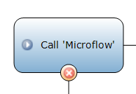</td><td class="confluenceTd"> 
<em><strong>Error handling – Custom With Rollback</strong></em>

Everything that happened up till the error will be reverted, and a new transaction will be initiated. Only the changes executed in the error handler flow will be executed.&nbsp;
</td></tr></thead><tbody><tr><td class="confluenceTd">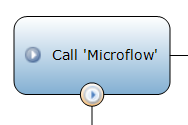</td><td class="confluenceTd">
<strong><em>&nbsp;</em> </strong><strong><em>Error handling – Custom Without Rollback</em></strong> 

Any action taken inside the microflow can be reverted, but everything that happened before the error will be kept.The microflow will continue over the custom error handler flow.&nbsp;
</td></tr><tr><td class="confluenceTd">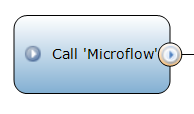</td><td class="confluenceTd">
<em><strong>Continue</strong></em>

Any action taken inside the microflow can be reverted, but everything that happened before the error will be kept.The microflow will continue as if nothing happen. <em>Avoid using this option, you should only use this in more complicated combinations of multiple error handlers. You want to make sure that you at least log the error message. If it breaks you need to know about it.&nbsp;</em>
</td></tr><tr><td class="confluenceTd">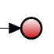</td><td class="confluenceTd"><em><strong>End event</strong></em></td></tr><tr><td class="confluenceTd"></td><td class="confluenceTd">
<em><strong>Error End Event</strong></em>

This re-throws the error to all parent microflows after executing the custom activities. The error handling on the activities calling this microflow determine how the transaction is processed further.
</td></tr></tbody></table>

Transactions

There are many different combinations of error handling and transactions we can configure. Below you'll find several If we take a look at all the different combinations of error handling and transactions that we can use. There are many more combinations possible, but this should give a clear indication of some of the possibilities. In order to help you understand how the different configurations will behave.

### Default Error Handling

With default error handling, there is always a transaction running. But since there is no custom error handling specified, the platform will create one transaction for all actions executed in the microflow. All subflows will be executed in the same transaction. The changed Order and Customer information is only available inside the transaction until the microflow transaction has completed.

 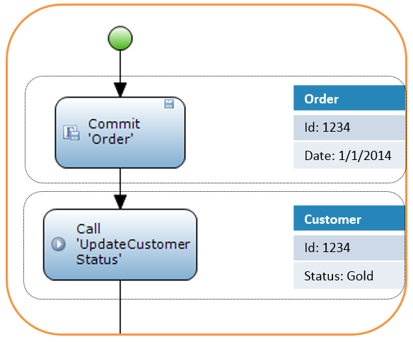   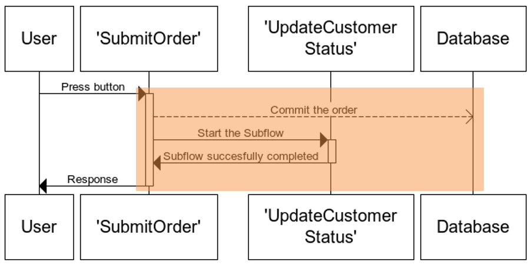

### Error Handling - Custom With Rollback

Any sub microflow initiated with error handling set to 'Custom with Rollback', will NOT initiated a new transaction, the original transaction will be re-used in the subflow. Only in case an error occurs, the transaction will be completely reverted and a new transaction will be initiated so the custom error flow can continue using that new transaction.

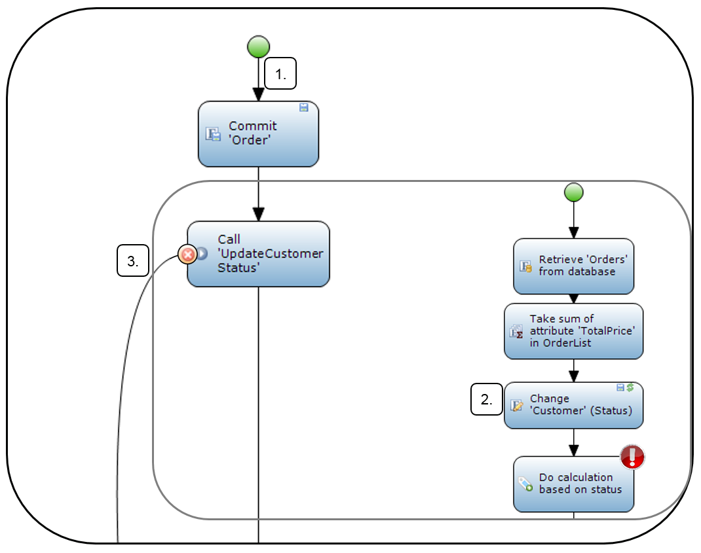   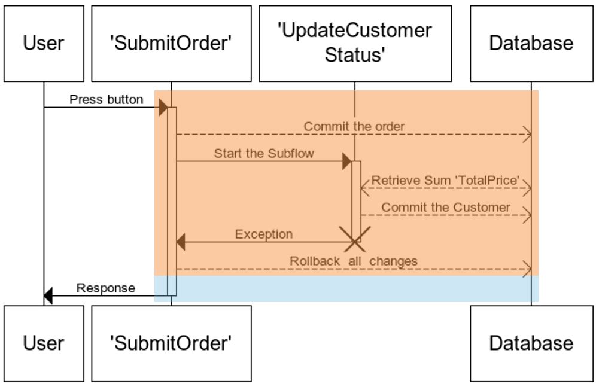    

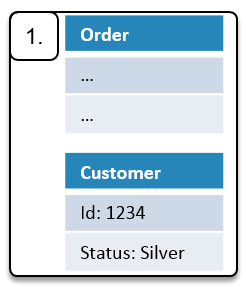    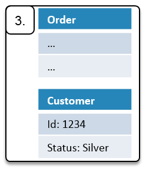   

_Because you are switching transactions it is not recommended to merge back to the original process, this will result in inconsistent data. If you use error handling with rollback in a subflow you should make sure that all parent flows are configured to use error handling continue, and preferable that you re-throw the exception after running your custom actions._

### Error Handling - Custom Without Rollback

A sub microflow with error handling set to 'Custom without Rollback', will always create a sub transaction. All actions within the parent microflow will be persisted, what happens inside the sub microflow is determined by the sub microflow. If no custom error handling is specified in the sub microflow only the changes in the sub microflow can be reverted in case of an error. 

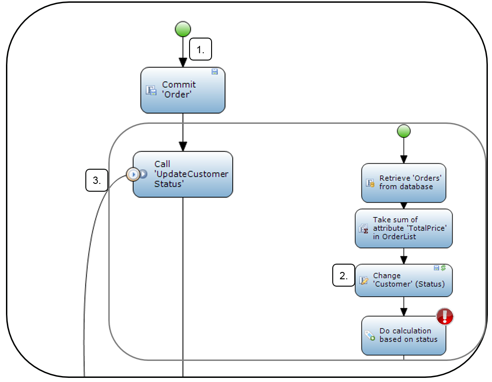     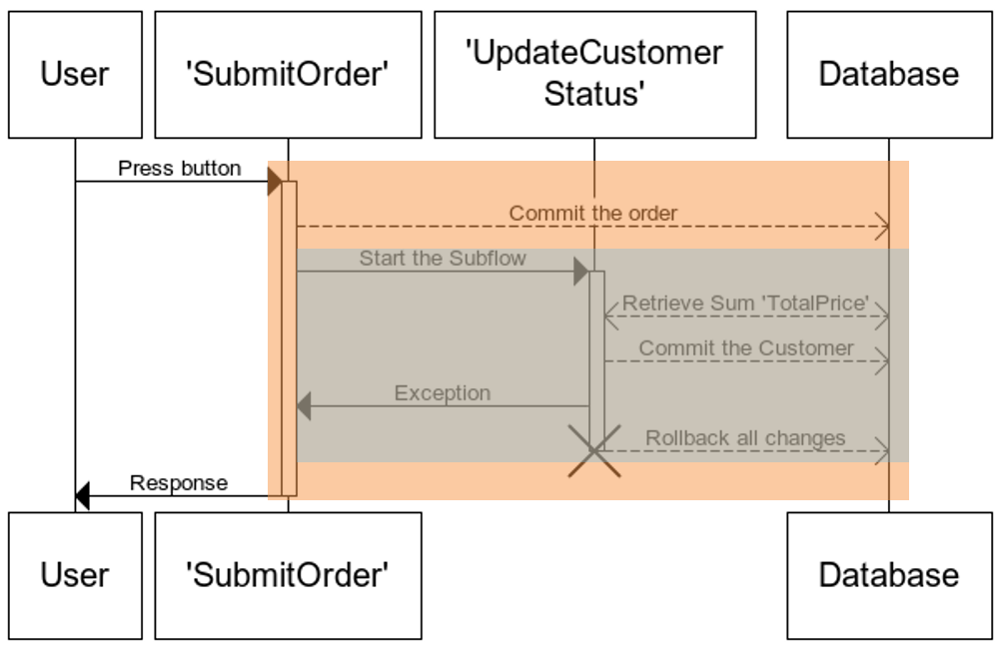     

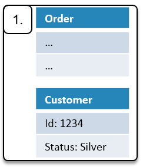 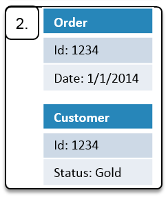  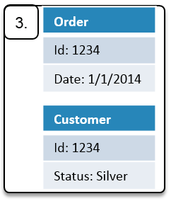  

## Combinations of different types of Error Handling

Most of the time you will be using a single activity with custom error handling. However if you are developing more complicated processes where you are sending data outside of the application it is important to realize what happens in case of an error later in the process. For example you don't want to send out notifications about a status change, if an error occurs and therefore reverts the change.

Especially when interacting with other systems you need to think about how you want to process the errors. The best solution depends on the exact desire you have, do you want to continue, skip/revert the record you are working on, keep the changes you have made so far but stop the process. All of this can be done, as long as you know what you want to achieve. The instructions below will show you a couple of examples on how you can use the different combinations of error handling options. 

_**_**Rollback in parent flow, Rollback in subflow**_
**_

<table><thead><tr><td class="confluenceTd">&nbsp;</td><td class="confluenceTd"><em><strong>Initial transaction,</strong>&nbsp;This transaction is initiated when the microflow started. Custom error handling with Rollback does not initiated any transactions. Therefore the microflow is executed, but all actions both in the Parent and Sub flow will be reverted. None of the changes made anywhere in this transaction will be applied.</em></td></tr></thead><tbody><tr><td class="confluenceTd">&nbsp;</td><td class="confluenceTd"><strong><em>Transaction initiated by custom with rollback activity,&nbsp;</em> </strong><em>After catching the exception a new transaction is initiated to executed the remainder of the microflow activities.&nbsp;</em><em> </em></td></tr></tbody></table>

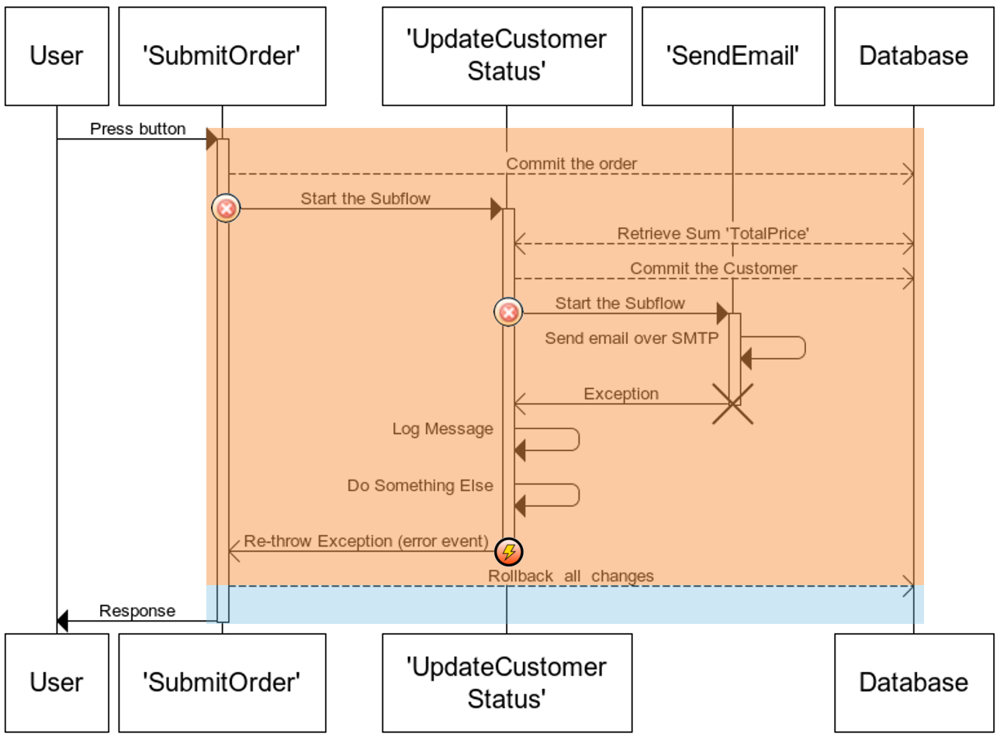

_**Rollback in parent flow, Continue in subflow**_

<table><thead><tr><td class="confluenceTd">&nbsp;</td><td class="confluenceTd"><em><strong>Initial transaction,</strong>&nbsp;This transaction is initiated when the microflow started. This transaction will be completely reverted, because the subflow re-throws the exception. None of the changes made during this transaction will be persisted </em><em>(If the subflow wasn't rethrowing the exception, all changes except the send email would have been persisted in the database.</em></td></tr></thead><tbody><tr><td class="confluenceTd">&nbsp;</td><td class="confluenceTd"><strong><em>Transaction initiated by custom with rollback activity,&nbsp;</em> </strong><em>After catching the exception a new transaction is initiated to executed the remainder of the microflow activities.</em><strong><em> </em></strong></td></tr><tr><td class="confluenceTd">&nbsp;</td><td class="confluenceTd"><strong><em>Transaction initiated by subflow,&nbsp;</em> </strong><em>At the start of the subflow a new transaction is initiated. Any changes made in this transaction will be reverted because the activities in the 'SendEmail' subflow use default error handling.&nbsp;</em></td></tr></tbody></table>

 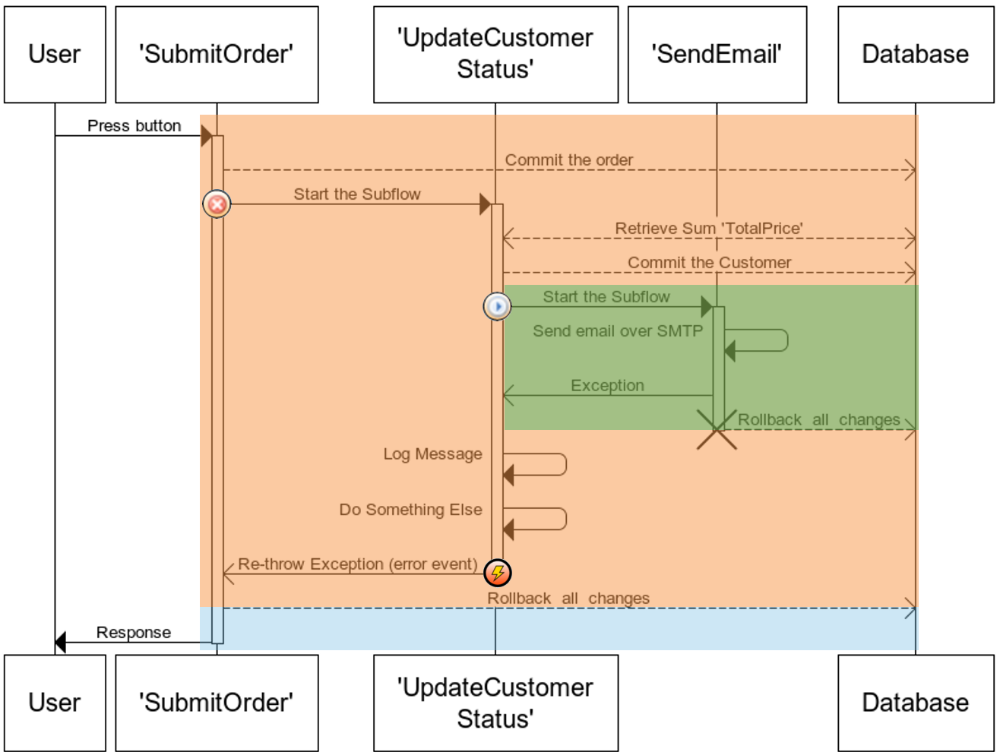

_**Continue in parent flow, Rollback in subflow**_

<table><thead><tr><td class="confluenceTd">&nbsp;</td><td class="confluenceTd"><em><strong>Initial transaction,</strong>&nbsp;This transaction is initiated when the microflow started. This transaction will complete successfully and any changes made during this transaction will be persisted.</em></td></tr></thead><tbody><tr><td class="confluenceTd">&nbsp;</td><td class="confluenceTd"><strong><em>Transaction initiated by subflow,&nbsp;</em> </strong><em>At the start of the subflow a new transaction is initiated. All changes in this transaction will be reverted because of the custom error handler 'with Rollback'.&nbsp; As a result the change on the Customer will not be applied.&nbsp;</em></td></tr><tr><td class="confluenceTd">&nbsp;</td><td class="confluenceTd"><em><strong>Transaction initiated after the exception was caught by the error handler,&nbsp;</strong>This transaction is initiated, and after executing some actions it will re-throw the original exception. These changes will be persisted, this is because of the error handling on the initial sub-microflow call.&nbsp;</em></td></tr></tbody></table>

 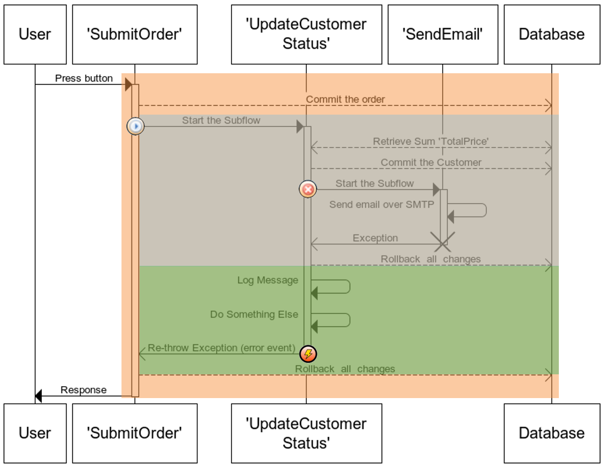

_**Continue in parent flow, Continue in subflow**_

<table><thead><tr><td class="confluenceTd">&nbsp;</td><td class="confluenceTd"><em><strong>Initial transaction,</strong>&nbsp;Nothing will be reverted, the only difference compared to successful execution is that no email will be send, and the process will finish using the error flow instead of the normal process flow.&nbsp;</em></td></tr></thead><tbody><tr><td class="confluenceTd">&nbsp;</td><td class="confluenceTd"><strong><em>Transaction initiated by subflow,&nbsp;</em> </strong><em>At the start of the subflow a new transaction is initiated. All changes in this transaction will be kept because the 'SendEmail' subflow is configured to continue without rollback. Even though the exception is re-thrown, the initial microflow call is configured for custom without rollback, therefore none of the changes will be reverted. The process will just take the error flow instead of the default flow. </em></td></tr><tr><td class="confluenceTd">&nbsp;</td><td class="confluenceTd"><strong><em>Transaction initiated by subflow,&nbsp;</em> </strong><em>At the start of the subflow a new transaction is initiated. Any changes made in this transaction will be reverted because the activities in the 'SendEmail' subflow use default error handling.&nbsp;</em></td></tr></tbody></table>

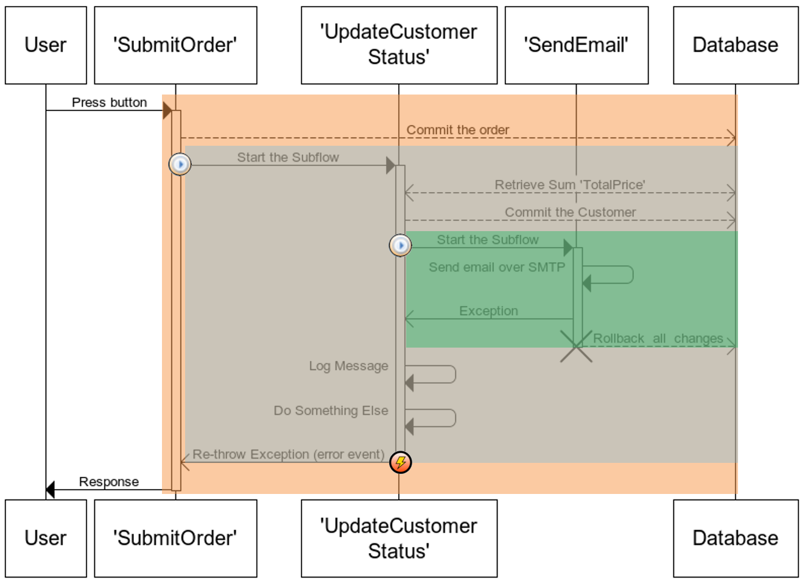

## Best-practices

Always use a log activity to print the error message & stack trace!
Never use the continue option, since that doesn't give you the option to print any info. The platform will just ignore the error.
Always add custom error handling on integration or email activities
Don’t over-do it.   You could specify a lot of complicated error handling combinations. This makes it much more difficult (and slower) for the platform to evaluate the microflow. And also makes it much more difficult to predict the exact behavior in case of an exception.

## Related articles

*   [Defining access rules using XPath](Defining+access+rules+using+XPath)
*   [Triggering Logic using Microflows](Triggering+Logic+using+Microflows)
*   [Creating a Custom Save Button](Creating+a+Custom+Save+Button)
*   [Extending Your Application with Custom Java](Extending+Your+Application+with+Custom+Java)
*   [Working With Lists in a Microflow](Working+With+Lists+in+a+Microflow)

